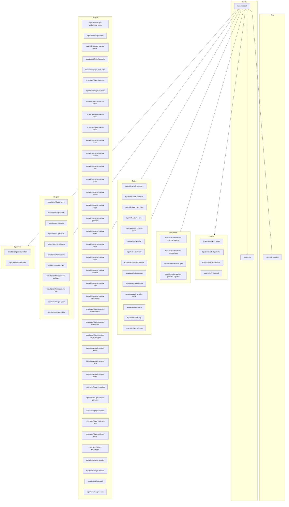

[](https://particles.js.org)

# tsParticles All Bundle

[](https://www.jsdelivr.com/package/npm/@tsparticles/all) [](https://www.npmjs.com/package/@tsparticles/all) [](https://www.npmjs.com/package/@tsparticles/all) [](https://github.com/sponsors/matteobruni)

[tsParticles](https://github.com/tsparticles/tsparticles) all bundle loads all the features to a `@tsparticles/engine` instance.

**Included Packages**

- [tsparticles (and all its dependencies)](https://github.com/tsparticles/tsparticles/tree/main/bundles/full)
- [@tsparticles/engine](https://github.com/tsparticles/tsparticles/tree/main/engine)
- [@tsparticles/effect-bubble](https://github.com/tsparticles/tsparticles/tree/main/effects/bubble)
- [@tsparticles/effect-particles](https://github.com/tsparticles/tsparticles/tree/main/effects/particles)
- [@tsparticles/effect-shadow](https://github.com/tsparticles/tsparticles/tree/main/effects/shadow)
- [@tsparticles/effect-trail](https://github.com/tsparticles/tsparticles/tree/main/effects/trail)
- [@tsparticles/interaction-external-particle](https://github.com/tsparticles/tsparticles/tree/main/interactions/external/particle)
- [@tsparticles/interaction-external-pop](https://github.com/tsparticles/tsparticles/tree/main/interactions/external/pop)
- [@tsparticles/interaction-light](https://github.com/tsparticles/tsparticles/tree/main/interactions/light)
- [@tsparticles/interaction-particles-repulse](https://github.com/tsparticles/tsparticles/tree/main/interactions/particles/repulse)
- [@tsparticles/path-branches](https://github.com/tsparticles/tsparticles/tree/main/paths/branches)
- [@tsparticles/path-brownian](https://github.com/tsparticles/tsparticles/tree/main/paths/brownian)
- [@tsparticles/path-curl-noise](https://github.com/tsparticles/tsparticles/tree/main/paths/curlNoise)
- [@tsparticles/path-curves](https://github.com/tsparticles/tsparticles/tree/main/paths/curves)
- [@tsparticles/path-fractal-noise](https://github.com/tsparticles/tsparticles/tree/main/paths/fractalNoise)
- [@tsparticles/path-grid](https://github.com/tsparticles/tsparticles/tree/main/paths/grid)
- [@tsparticles/path-levy](https://github.com/tsparticles/tsparticles/tree/main/paths/levy)
- [@tsparticles/path-perlin-noise](https://github.com/tsparticles/tsparticles/tree/main/paths/perlinNoise)
- [@tsparticles/path-polygon](https://github.com/tsparticles/tsparticles/tree/main/paths/polygon)
- [@tsparticles/path-random](https://github.com/tsparticles/tsparticles/tree/main/paths/random)
- [@tsparticles/path-simplex-noise](https://github.com/tsparticles/tsparticles/tree/main/paths/simplexNoise)
- [@tsparticles/path-spiral](https://github.com/tsparticles/tsparticles/tree/main/paths/spiral)
- [@tsparticles/path-svg](https://github.com/tsparticles/tsparticles/tree/main/paths/svg)
- [@tsparticles/path-zig-zag](https://github.com/tsparticles/tsparticles/tree/main/paths/zigZag)
- [@tsparticles/plugin-background-mask](https://github.com/tsparticles/tsparticles/tree/main/plugins/backgroundMask)
- [@tsparticles/plugin-blend](https://github.com/tsparticles/tsparticles/tree/main/plugins/blend)
- [@tsparticles/plugin-canvas-mask](https://github.com/tsparticles/tsparticles/tree/main/plugins/canvasMask)
- [@tsparticles/plugin-easing-back](https://github.com/tsparticles/tsparticles/tree/main/plugins/easings/back)
- [@tsparticles/plugin-easing-bounce](https://github.com/tsparticles/tsparticles/tree/main/plugins/easings/bounce)
- [@tsparticles/plugin-easing-circ](https://github.com/tsparticles/tsparticles/tree/main/plugins/easings/circ)
- [@tsparticles/plugin-easing-cubic](https://github.com/tsparticles/tsparticles/tree/main/plugins/easings/cubic)
- [@tsparticles/plugin-easing-elastic](https://github.com/tsparticles/tsparticles/tree/main/plugins/easings/elastic)
- [@tsparticles/plugin-easing-expo](https://github.com/tsparticles/tsparticles/tree/main/plugins/easings/expo)
- [@tsparticles/plugin-easing-gaussian](https://github.com/tsparticles/tsparticles/tree/main/plugins/easings/gaussian)
- [@tsparticles/plugin-easing-linear](https://github.com/tsparticles/tsparticles/tree/main/plugins/easings/linear)
- [@tsparticles/plugin-easing-quart](https://github.com/tsparticles/tsparticles/tree/main/plugins/easings/quart)
- [@tsparticles/plugin-easing-quint](https://github.com/tsparticles/tsparticles/tree/main/plugins/easings/quint)
- [@tsparticles/plugin-easing-sigmoid](https://github.com/tsparticles/tsparticles/tree/main/plugins/easings/sigmoid)
- [@tsparticles/plugin-easing-sine](https://github.com/tsparticles/tsparticles/tree/main/plugins/easings/sine)
- [@tsparticles/plugin-easing-smoothstep](https://github.com/tsparticles/tsparticles/tree/main/plugins/easings/smoothstep)
- [@tsparticles/plugin-emitters-shape-canvas](https://github.com/tsparticles/tsparticles/tree/main/plugins/emitters/shape/canvas)
- [@tsparticles/plugin-emitters-shape-path](https://github.com/tsparticles/tsparticles/tree/main/plugins/emitters/shape/path)
- [@tsparticles/plugin-emitters-shape-polygon](https://github.com/tsparticles/tsparticles/tree/main/plugins/emitters/shape/polygon)
- [@tsparticles/plugin-export-image](https://github.com/tsparticles/tsparticles/tree/main/plugins/exports/image)
- [@tsparticles/plugin-export-json](https://github.com/tsparticles/tsparticles/tree/main/plugins/exports/json)
- [@tsparticles/plugin-export-video](https://github.com/tsparticles/tsparticles/tree/main/plugins/exports/video)
- [@tsparticles/plugin-hsv-color](https://github.com/tsparticles/tsparticles/tree/main/plugins/colors/hsvColor)
- [@tsparticles/plugin-hwb-color](https://github.com/tsparticles/tsparticles/tree/main/plugins/colors/hwbColor)
- [@tsparticles/plugin-infection](https://github.com/tsparticles/tsparticles/tree/main/plugins/infection)
- [@tsparticles/plugin-lab-color](https://github.com/tsparticles/tsparticles/tree/main/plugins/colors/labColor)
- [@tsparticles/plugin-lch-color](https://github.com/tsparticles/tsparticles/tree/main/plugins/colors/lchColor)
- [@tsparticles/plugin-manual-particles](https://github.com/tsparticles/tsparticles/tree/main/plugins/manualParticles)
- [@tsparticles/plugin-motion](https://github.com/tsparticles/tsparticles/tree/main/plugins/motion)
- [@tsparticles/plugin-named-color](https://github.com/tsparticles/tsparticles/tree/main/plugins/colors/namedColor)
- [@tsparticles/plugin-oklab-color](https://github.com/tsparticles/tsparticles/tree/main/plugins/colors/oklabColor)
- [@tsparticles/plugin-oklch-color](https://github.com/tsparticles/tsparticles/tree/main/plugins/colors/oklchColor)
- [@tsparticles/plugin-poisson-disc](https://github.com/tsparticles/tsparticles/tree/main/plugins/poissonDisc)
- [@tsparticles/plugin-polygon-mask](https://github.com/tsparticles/tsparticles/tree/main/plugins/polygonMask)
- [@tsparticles/plugin-responsive](https://github.com/tsparticles/tsparticles/tree/main/plugins/responsive)
- [@tsparticles/plugin-sounds](https://github.com/tsparticles/tsparticles/tree/main/plugins/sounds)
- [@tsparticles/plugin-themes](https://github.com/tsparticles/tsparticles/tree/main/plugins/themes)
- [@tsparticles/plugin-trail](https://github.com/tsparticles/tsparticles/tree/main/plugins/trail)
- [@tsparticles/plugin-zoom](https://github.com/tsparticles/tsparticles/tree/main/plugins/zoom)
- [@tsparticles/shape-arrow](https://github.com/tsparticles/tsparticles/tree/main/shapes/arrow)
- [@tsparticles/shape-cards](https://github.com/tsparticles/tsparticles/tree/main/shapes/cards)
- [@tsparticles/shape-cog](https://github.com/tsparticles/tsparticles/tree/main/shapes/cog)
- [@tsparticles/shape-heart](https://github.com/tsparticles/tsparticles/tree/main/shapes/heart)
- [@tsparticles/shape-infinity](https://github.com/tsparticles/tsparticles/tree/main/shapes/infinity)
- [@tsparticles/shape-matrix](https://github.com/tsparticles/tsparticles/tree/main/shapes/matrix)
- [@tsparticles/shape-path](https://github.com/tsparticles/tsparticles/tree/main/shapes/path)
- [@tsparticles/shape-rounded-polygon](https://github.com/tsparticles/tsparticles/tree/main/shapes/polygon)
- [@tsparticles/shape-rounded-rect](https://github.com/tsparticles/tsparticles/tree/main/shapes/rect)
- [@tsparticles/shape-spiral](https://github.com/tsparticles/tsparticles/tree/main/shapes/spiral)
- [@tsparticles/shape-squircle](https://github.com/tsparticles/tsparticles/tree/main/shapes/squircle)
- [@tsparticles/updater-gradient](https://github.com/tsparticles/tsparticles/tree/main/updaters/gradient)
- [@tsparticles/updater-orbit](https://github.com/tsparticles/tsparticles/tree/main/updaters/orbit)

## Dependency Graph



## Quick checklist

1. Install `@tsparticles/engine` (or use the CDN bundle below)
2. Call the package loader function(s) before `tsParticles.load(...)`
3. Apply the package options in your `tsParticles.load(...)` config

## How to use it

### CDN / Vanilla JS / jQuery

The CDN/Vanilla version JS has two different files:

- One is a bundle file with all the scripts included in a single file
- One is a file including just the `loadAll` function to load the tsParticles all preset, all dependencies must be
  included manually

#### Bundle

Including the `tsparticles.all.bundle.min.js` file will work exactly like `v1`, you can start using the `tsParticles`
instance in the same way.

This is the easiest usage, since it's a single file with the some of the `v1` features.

All new features will be added as external packages, this bundle is recommended for migrating from `v1` easily.

#### Not Bundle

This installation requires more work since all dependencies must be included in the page. Some lines above are all
specified in the **Included Packages** section.

### Usage

Once the scripts are loaded you can set up `tsParticles` like this:

```javascript
(async () => {
  await loadAll(tsParticles);

  await tsParticles.load({
    id: "tsparticles",
    options: {
      /* options */
    },
  });
})();
```

### React.js / Preact / Inferno

_The syntax for `React.js`, `Preact` and `Inferno` is the same_.

This sample uses the class component syntax, but you can use hooks as well (if the library supports it).

_Class Components_

```typescript jsx
import React from "react";
import Particles from "react-particles";
import type { Engine } from "@tsparticles/engine";
import { loadAll } from "@tsparticles/all";

export class ParticlesContainer extends PureComponent<unknown> {
  // this customizes the component tsParticles installation
  async customInit(engine: Engine) {
    // this adds the bundle to tsParticles
    await loadAll(engine);
  }

  render() {
    const options = {
      /* custom options */
    };

    return <Particles options={options} init={this.customInit} />;
  }
}
```

_Hooks / Functional Components_

```typescript jsx
import React, { useCallback } from "react";
import Particles from "react-particles";
import type { Engine } from "@tsparticles/engine";
import { loadAll } from "@tsparticles/all";

export function ParticlesContainer(props: unknown) {
  // this customizes the component tsParticles installation
  const customInit = useCallback(async (engine: Engine) => {
    // this adds the bundle to tsParticles
    await loadAll(engine);
  });

  const options = {
    /* custom options */
  };

  return <Particles options={options} init={this.customInit} />;
}
```

### Vue (2.x and 3.x)

_The syntax for `Vue.js 2.x` and `3.x` is the same_

```vue
<Particles id="tsparticles" :particlesInit="particlesInit" :options="options" />
```

```js
const options = {
  /* custom options */
};

async function particlesInit(engine: Engine) {
  await loadAll(engine);
}
```

### Angular

```html
<ng-particles [id]="id" [options]="options" [particlesInit]="particlesInit"></ng-particles>
```

```ts
const options = {
  /* custom options */
};

async function particlesInit(engine: Engine): void {
  await loadAll(engine);
}
```

### Svelte

```sveltehtml

<Particles
    id="tsparticles"
    options={options}
    particlesInit="{particlesInit}"
/>
```

```js
let options = {
  /* custom options */
};

let particlesInit = async engine => {
  await loadAll(engine);
};
```

## Common pitfalls

- Calling `tsParticles.load(...)` before `loadAll(...)`
- Verify required peer packages before enabling advanced options
- Change one option group at a time to isolate regressions quickly

## Related docs

- All packages catalog: <https://github.com/tsparticles/tsparticles>
- Main docs: <https://particles.js.org/docs/>
