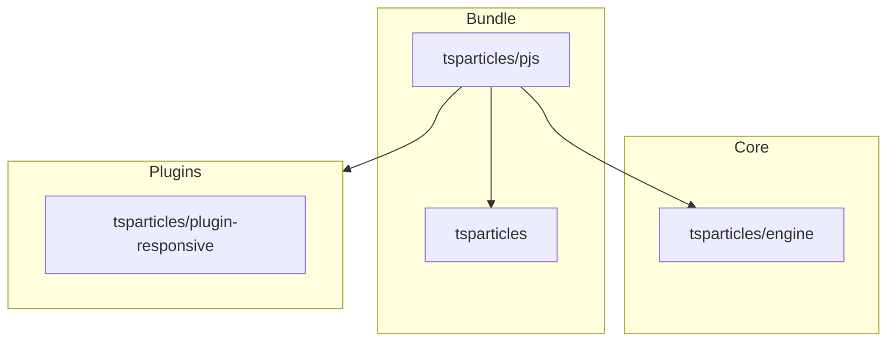

[](https://particles.js.org)

# tsParticles Particles.js Compatibility Package

[](https://www.jsdelivr.com/package/npm/@tsparticles/particles.js) [](https://www.npmjs.com/package/@tsparticles/particles.js) [](https://www.npmjs.com/package/@tsparticles/particles.js) [](https://github.com/sponsors/matteobruni)

[tsParticles](https://github.com/tsparticles/tsparticles) particles.js compatibility library.

**Included Packages**

- [tsparticles (and all its dependencies)](https://github.com/tsparticles/tsparticles/tree/main/bundles/full)
- [@tsparticles/engine](https://github.com/tsparticles/tsparticles/tree/main/engine)
- [@tsparticles/plugin-responsive](https://github.com/tsparticles/tsparticles/tree/main/plugins/responsive)

## Dependency Graph



## Quick checklist

1. Install `@tsparticles/engine` (or use the CDN bundle below)
2. Call the package loader function(s) before `tsParticles.load(...)`
3. Apply the package options in your `tsParticles.load(...)` config

## How to use it

### CDN / Vanilla JS / jQuery

The CDN/Vanilla version JS has two different files:

- One is a bundle file with all the scripts included in a single file
- One is a file including just the `initPjs` function to load the tsParticles/particles.js compatibility

#### Bundle

Including the `tsparticles.pjs.bundle.min.js` file will also include the tsParticles engine exports.
You need to call initPjs function awaiting it like in the samples, after that the `particlesJS` instance,
or the `Particles` object are ready to be used in the same way.

#### Not Bundle

This installation requires more work since all dependencies must be included in the page. Some lines above are all
specified in the **Included Packages** section.

### Usage

Once the scripts are loaded you can set up `particlesJS` like this:

```javascript
(async engine => {
  await initPjs(engine);

  particlesJS("tsparticles", {
    /* options */
  });
})(tsParticles);
```

#### Options

Here you can use ParticlesJS options.

### Alternative Usage

```javascript
(async engine => {
  initPjs(engine);

  Particles.init({
    /* options */
  });
})(tsParticles);
```

#### Particles Options (only for Particles.init)

| Option             | Type               | Default   | Description                                                           |
| ------------------ | ------------------ | --------- | --------------------------------------------------------------------- |
| `selector`         | string             | -         | _Required:_ The CSS selector of your canvas element                   |
| `maxParticles`     | integer            | `100`     | _Optional:_ Maximum amount of particles                               |
| `sizeVariations`   | integer            | `3`       | _Optional:_ Amount of size variations                                 |
| `speed`            | integer            | `0.5`     | _Optional:_ Movement speed of the particles                           |
| `color`            | string or string[] | `#000000` | _Optional:_ Color(s) of the particles and connecting lines            |
| `minDistance`      | integer            | `120`     | _Optional:_ Distance in `px` for connecting lines                     |
| `connectParticles` | boolean            | `false`   | _Optional:_ `true`/`false` if connecting lines should be drawn or not |
| `responsive`       | array              | `null`    | _Optional:_ Array of objects containing breakpoints and options       |

##### Responsive Options

| Option       | Type    | Default | Description                                               |
| ------------ | ------- | ------- | --------------------------------------------------------- |
| `breakpoint` | integer | -       | _Required:_ Breakpoint in `px`                            |
| `options`    | object  | -       | _Required:_ Options object, that overrides default values |

#### Methods

| Method            | Description                         |
| ----------------- | ----------------------------------- |
| `pauseAnimation`  | Pauses/stops the particle animation |
| `resumeAnimation` | Continues the particle animation    |
| `destroy`         | Destroys the plugin                 |

## Common pitfalls

- Calling `tsParticles.load(...)` before `package loader(...)`
- Verify required peer packages before enabling advanced options
- Change one option group at a time to isolate regressions quickly

## Related docs

- All packages catalog: <https://github.com/tsparticles/tsparticles>
- Main docs: <https://particles.js.org/docs/>
