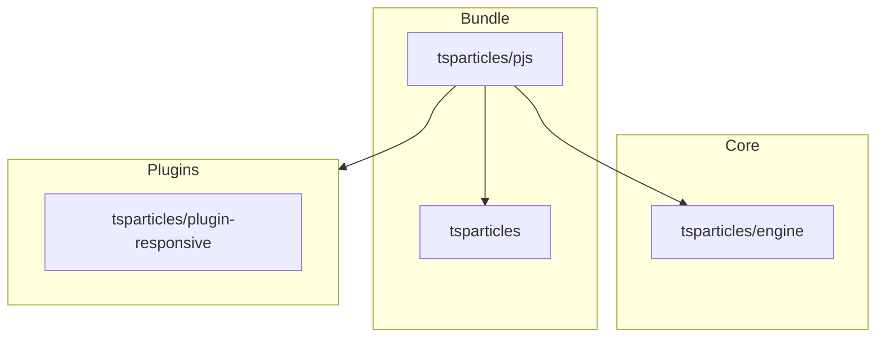

[](https://particles.js.org)

# tsParticles Particles.js Compatibility Package

[](https://www.jsdelivr.com/package/npm/@tsparticles/pjs) [](https://www.npmjs.com/package/@tsparticles/pjs) [](https://www.npmjs.com/package/@tsparticles/pjs) [](https://github.com/sponsors/matteobruni)

[tsParticles](https://github.com/tsparticles/tsparticles) particles.js compatibility library.

> [!WARNING]
> This package is legacy compatibility glue for particles.js-style APIs.
> It is considered obsolete, and it may be removed in v5.
> Prefer direct `tsParticles` APIs for new code.

**Included Packages**

- [tsparticles (and all its dependencies)](https://github.com/tsparticles/tsparticles/tree/main/bundles/full)
- [@tsparticles/engine](https://github.com/tsparticles/tsparticles/tree/main/engine)
- [@tsparticles/plugin-responsive](https://github.com/tsparticles/tsparticles/tree/main/plugins/responsive)

## Dependency Graph



## Exposed API

The package exports only one API from its main entrypoint:

```ts
import { initPjs } from "@tsparticles/pjs";
```

Signature:

```ts
initPjs(engine: Engine): Promise<void>
```

`initPjs` does not return compatibility objects directly.
It initializes compatibility and populates global objects.

## Installation

```bash
pnpm add @tsparticles/pjs @tsparticles/engine
```

## How it works

Calling `initPjs(engine)` performs these steps:

1. Checks runtime version compatibility.
2. Registers required plugins (`tsparticles` full bundle + responsive plugin).
3. Creates and exposes legacy globals:
   - `globalThis.particlesJS`
   - `globalThis.pJSDom`
   - `globalThis.Particles`

After initialization, you can use particles.js-compatible APIs.

## How to use it

### ESM / TypeScript

```ts
import { tsParticles } from "@tsparticles/engine";
import { initPjs } from "@tsparticles/pjs";

await initPjs(tsParticles);

await globalThis.particlesJS("tsparticles", {/* particles.js-style options */});
```

### CDN / Vanilla JS / jQuery

The CDN/Vanilla JS version has two files:

- One is a bundle file with all the scripts included in a single file
- One includes only `initPjs`, where dependencies must be loaded manually

After loading the bundle, call `initPjs(tsParticles)` once, then use legacy globals.

#### Bundle

Use the bundle when you want a single script with all required dependencies.

#### Not Bundle

This installation requires more work since all dependencies must be included in the page. Some lines above are all
specified in the **Included Packages** section.

### Usage

Using `particlesJS` compatibility:

```javascript
(async engine => {
  await initPjs(engine);

  particlesJS("tsparticles", {/* options */});
})(tsParticles);
```

Using `Particles` compatibility:

```javascript
(async engine => {
  await initPjs(engine);

  Particles.init({/* options */});
})(tsParticles);
```

## Compatibility globals (after `initPjs`)

| Global        | Description                                                                                          | Modern equivalent                                                           |
| ------------- | ---------------------------------------------------------------------------------------------------- | --------------------------------------------------------------------------- |
| `particlesJS` | particles.js-compatible loader function (plus `.load` and `.setOnClickHandler`)                      | `tsParticles.load`, `tsParticles.loadJSON`, `tsParticles.setOnClickHandler` |
| `pJSDom`      | array of loaded containers                                                                           | `tsParticles.dom`                                                           |
| `Particles`   | `marcbruederlin/particles.js` style wrapper (`init`, `pauseAnimation`, `resumeAnimation`, `destroy`) | direct `tsParticles.load` + container methods                               |

If you need explicit references in TS/JS code:

```ts
const particlesJSCompat = globalThis.particlesJS;
const pJSDomCompat = globalThis.pJSDom;
const particlesCompat = globalThis.Particles;
```

#### Particles Options (only for Particles.init)

| Option             | Type               | Default   | Description                                                           |
| ------------------ | ------------------ | --------- | --------------------------------------------------------------------- |
| `selector`         | string             | -         | _Required:_ The CSS selector of your canvas element                   |
| `maxParticles`     | integer            | `100`     | _Optional:_ Maximum amount of particles                               |
| `sizeVariations`   | integer            | `3`       | _Optional:_ Amount of size variations                                 |
| `speed`            | integer            | `0.5`     | _Optional:_ Movement speed of the particles                           |
| `color`            | string or string[] | `#000000` | _Optional:_ Color(s) of the particles and connecting lines            |
| `minDistance`      | integer            | `120`     | _Optional:_ Distance in `px` for connecting lines                     |
| `connectParticles` | boolean            | `false`   | _Optional:_ `true`/`false` if connecting lines should be drawn or not |
| `responsive`       | array              | `null`    | _Optional:_ Array of objects containing breakpoints and options       |

##### Responsive Options

| Option       | Type    | Default | Description                                               |
| ------------ | ------- | ------- | --------------------------------------------------------- |
| `breakpoint` | integer | -       | _Required:_ Breakpoint in `px`                            |
| `options`    | object  | -       | _Required:_ Options object, that overrides default values |

#### Methods

| Method            | Description                         |
| ----------------- | ----------------------------------- |
| `pauseAnimation`  | Pauses/stops the particle animation |
| `resumeAnimation` | Continues the particle animation    |
| `destroy`         | Destroys the plugin                 |

## Deprecation status

- `particlesJS`, `pJSDom`, and `Particles` are deprecated compatibility APIs.
- This package is obsolete and maintained for legacy integration only.
- It may be removed in v5, so migration to direct `tsParticles` APIs is strongly recommended.

See migration guide: [`markdown/pjsMigration.md`](../../markdown/pjsMigration.md)

## Common pitfalls

- Calling legacy globals before awaiting `initPjs(...)`
- Expecting `initPjs` to return `particlesJS`/`Particles` directly
- Mixing new `tsParticles` and legacy particles.js options in one config object

## Related docs

- All packages catalog: <https://github.com/tsparticles/tsparticles>
- Main docs: <https://particles.js.org/docs/>
