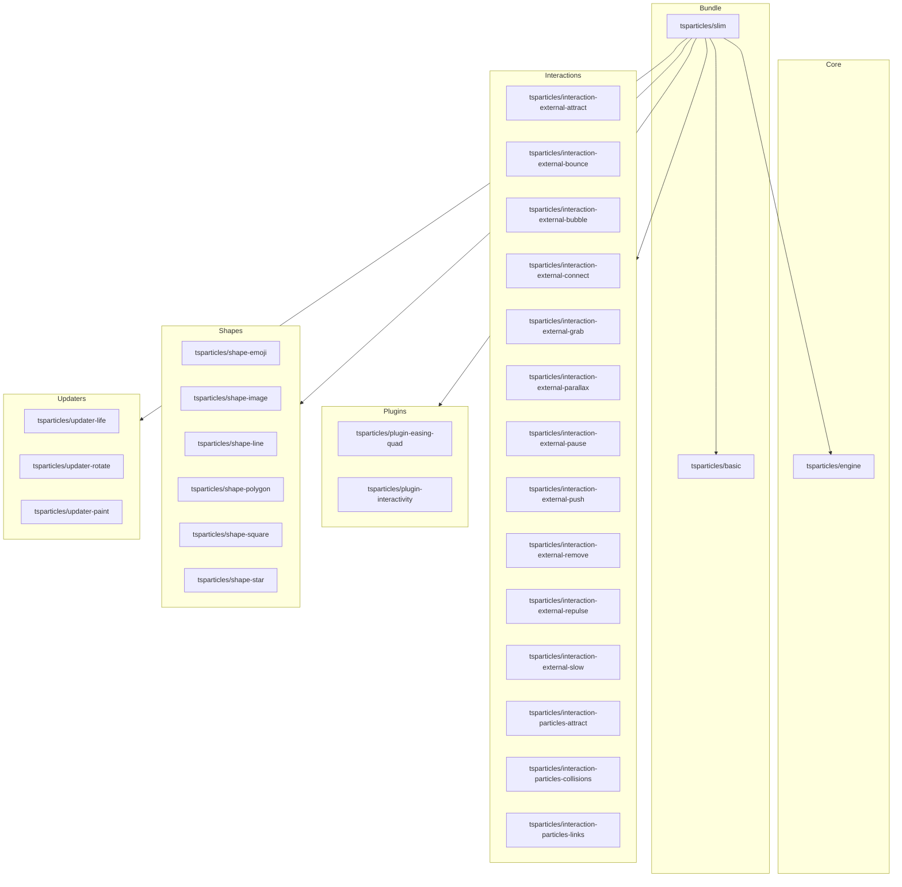

[](https://particles.js.org)

# tsParticles Slim Bundle

[](https://www.jsdelivr.com/package/npm/@tsparticles/slim) [](https://www.npmjs.com/package/@tsparticles/slim) [](https://www.npmjs.com/package/@tsparticles/slim) [](https://github.com/sponsors/matteobruni)

[tsParticles](https://github.com/tsparticles/tsparticles) slim bundle loads some of the most used features to
a `@tsparticles/engine` instance.

**Included Packages**

- [@tsparticles/basic (and all its dependencies)](https://github.com/tsparticles/tsparticles/tree/main/bundles/basic)
- [@tsparticles/engine](https://github.com/tsparticles/tsparticles/tree/main/engine)
- [@tsparticles/interaction-external-attract](https://github.com/tsparticles/tsparticles/tree/main/interactions/external/attract)
- [@tsparticles/interaction-external-bounce](https://github.com/tsparticles/tsparticles/tree/main/interactions/external/bounce)
- [@tsparticles/interaction-external-bubble](https://github.com/tsparticles/tsparticles/tree/main/interactions/external/bubble)
- [@tsparticles/interaction-external-connect](https://github.com/tsparticles/tsparticles/tree/main/interactions/external/connect)
- [@tsparticles/interaction-external-grab](https://github.com/tsparticles/tsparticles/tree/main/interactions/external/grab)
- [@tsparticles/interaction-external-parallax](https://github.com/tsparticles/tsparticles/tree/main/interactions/external/parallax)
- [@tsparticles/interaction-external-pause](https://github.com/tsparticles/tsparticles/tree/main/interactions/external/pause)
- [@tsparticles/interaction-external-push](https://github.com/tsparticles/tsparticles/tree/main/interactions/external/push)
- [@tsparticles/interaction-external-remove](https://github.com/tsparticles/tsparticles/tree/main/interactions/external/remove)
- [@tsparticles/interaction-external-repulse](https://github.com/tsparticles/tsparticles/tree/main/interactions/external/repulse)
- [@tsparticles/interaction-external-slow](https://github.com/tsparticles/tsparticles/tree/main/interactions/external/slow)
- [@tsparticles/interaction-particles-attract](https://github.com/tsparticles/tsparticles/tree/main/interactions/particles/attract)
- [@tsparticles/interaction-particles-collisions](https://github.com/tsparticles/tsparticles/tree/main/interactions/particles/collisions)
- [@tsparticles/interaction-particles-links](https://github.com/tsparticles/tsparticles/tree/main/interactions/particles/links)
- [@tsparticles/plugin-easing-quad](https://github.com/tsparticles/tsparticles/tree/main/plugins/easings/quad)
- [@tsparticles/plugin-interactivity](https://github.com/tsparticles/tsparticles/tree/main/plugins/interactivity)
- [@tsparticles/shape-image](https://github.com/tsparticles/tsparticles/tree/main/shapes/image)
- [@tsparticles/shape-line](https://github.com/tsparticles/tsparticles/tree/main/shapes/line)
- [@tsparticles/shape-polygon](https://github.com/tsparticles/tsparticles/tree/main/shapes/polygon)
- [@tsparticles/shape-square](https://github.com/tsparticles/tsparticles/tree/main/shapes/square)
- [@tsparticles/shape-star](https://github.com/tsparticles/tsparticles/tree/main/shapes/star)
- [@tsparticles/shape-emoji](https://github.com/tsparticles/tsparticles/tree/main/shapes/emoji)
- [@tsparticles/updater-life](https://github.com/tsparticles/tsparticles/tree/main/updaters/life)
- [@tsparticles/updater-rotate](https://github.com/tsparticles/tsparticles/tree/main/updaters/rotate)
- [@tsparticles/updater-paint](https://github.com/tsparticles/tsparticles/tree/main/updaters/paint)

## Dependency Graph



## Quick checklist

1. Install `@tsparticles/engine` (or use the CDN bundle below)
2. Call the package loader function(s) before `tsParticles.load(...)`
3. Apply the package options in your `tsParticles.load(...)` config

## How to use it

### CDN / Vanilla JS / jQuery

The CDN/Vanilla version JS has two different files:

- One is a bundle file with all the scripts included in a single file
- One is a file including just the `loadSlim` function to load the tsParticles slim preset, all dependencies must be
  included manually

#### Bundle

Including the `tsparticles.slim.bundle.min.js` file will work exactly like `v1`, you can start using the `tsParticles`
instance in the same way.

This is the easiest usage, since it's a single file with the some of the `v1` features.

All new features will be added as external packages, this bundle is recommended for migrating from `v1` easily.

#### Not Bundle

This installation requires more work since all dependencies must be included in the page. Some lines above are all
specified in the **Included Packages** section.

### Usage

Once the scripts are loaded you can set up `tsParticles` like this:

```javascript
(async () => {
  await loadSlim(tsParticles);

  await tsParticles.load({
    id: "tsparticles",
    options: {
      /* options */
    },
  });
})();
```

### React.js / Preact / Inferno

_The syntax for `React.js`, `Preact` and `Inferno` is the same_.

This sample uses the class component syntax, but you can use hooks as well (if the library supports it).

_Class Components_

```typescript jsx
import React from "react";
import Particles from "react-particles";
import type { Engine } from "@tsparticles/engine";
import { loadSlim } from "@tsparticles/slim";

export class ParticlesContainer extends PureComponent<unknown> {
  // this customizes the component tsParticles installation
  async customInit(engine: Engine) {
    // this adds the bundle to tsParticles
    await loadSlim(engine);
  }

  render() {
    const options = {
      /* custom options */
    };

    return <Particles options={options} init={this.customInit} />;
  }
}
```

_Hooks / Functional Components_

```typescript jsx
import React, { useCallback } from "react";
import Particles from "react-particles";
import type { Engine } from "@tsparticles/engine";
import { loadSlim } from "@tsparticles/slim";

export function ParticlesContainer(props: unknown) {
  // this customizes the component tsParticles installation
  const customInit = useCallback(async (engine: Engine) => {
    // this adds the bundle to tsParticles
    await loadSlim(engine);
  });

  const options = {
    /* custom options */
  };

  return <Particles options={options} init={this.customInit} />;
}
```

### Vue (2.x and 3.x)

_The syntax for `Vue.js 2.x` and `3.x` is the same_

```vue
<Particles id="tsparticles" :particlesInit="particlesInit" :options="options" />
```

```js
const options = {
  /* custom options */
};

async function particlesInit(engine: Engine) {
  await loadSlim(engine);
}
```

### Angular

```html
<ng-particles [id]="id" [options]="options" [particlesInit]="particlesInit"></ng-particles>
```

```ts
const options = {
  /* custom options */
};

async function particlesInit(engine: Engine): void {
  await loadSlim(engine);
}
```

### Svelte

```sveltehtml

<Particles
    id="tsparticles"
    options={options}
    particlesInit="{particlesInit}"
/>
```

```js
let options = {
  /* custom options */
};

let particlesInit = async engine => {
  await loadSlim(engine);
};
```

## Common pitfalls

- Calling `tsParticles.load(...)` before `loadSlim(...)`
- Verify required peer packages before enabling advanced options
- Change one option group at a time to isolate regressions quickly

## Related docs

- All packages catalog: <https://github.com/tsparticles/tsparticles>
- Main docs: <https://particles.js.org/docs/>
