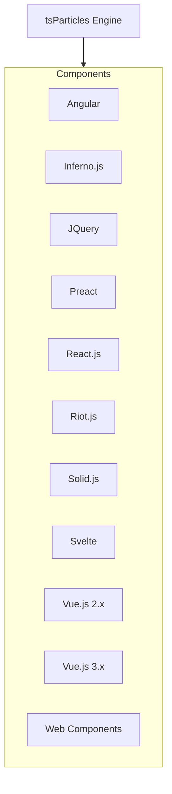
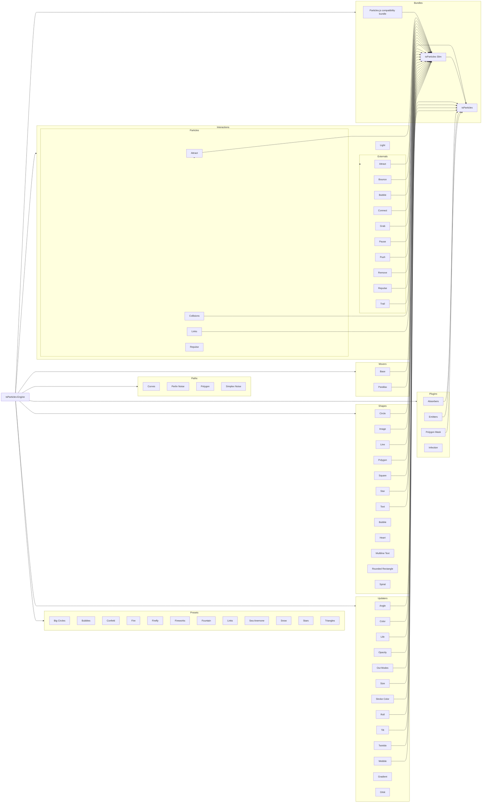

[](https://particles.js.org)

# tsParticles - TypeScript Particles

**A lightweight TypeScript library for creating particles. Dependency free (\*), browser ready and compatible with
React.js, Vue.js (2.x and 3.x), Angular, Svelte, jQuery, Preact, Inferno, Riot.js, Solid.js, and Web Components**

[](https://github.com/sponsors/matteobruni)
[](https://www.jsdelivr.com/package/npm/tsparticles)
[](https://cdnjs.com/libraries/tsparticles)
[](https://www.npmjs.com/package/tsparticles)
[](https://www.npmjs.com/package/tsparticles)
[](https://lerna.js.org/)
[](https://www.codefactor.io/repository/github/matteobruni/tsparticles)
[](https://www.codacy.com/manual/ar3s/tsparticles?utm_source=github.com&utm_medium=referral&utm_content=matteobruni/tsparticles&utm_campaign=Badge_Grade)
[](https://openbase.com/js/tsparticles?utm_source=embedded&utm_medium=badge&utm_campaign=rating-badge&utm_term=js/tsparticles)
[](https://gitpod.io/#https://github.com/matteobruni/tsparticles)
[](https://repl.it/github/matteobruni/tsparticles)

[](https://discord.gg/hACwv45Hme)
[](https://join.slack.com/t/tsparticles/shared_invite/enQtOTcxNTQxNjQ4NzkxLWE2MTZhZWExMWRmOWI5MTMxNjczOGE1Yjk0MjViYjdkYTUzODM3OTc5MGQ5MjFlODc4MzE0N2Q1OWQxZDc1YzI)
[](https://t.me/tsparticles)


[](https://www.producthunt.com/posts/tsparticles?utm_source=badge-featured&utm_medium=badge&utm_souce=badge-tsparticles")
[](https://www.buymeacoffee.com/matteobruni)

---

## Table of Contents

⚠️⚠️ \_This readme refers to **v2**
version, [read here](https://github.com/matteobruni/tsparticles/tree/v1#readme) for **v1** documentation\* ⚠️⚠️

- [Use for your website](#Do-you-want-to-use-it-on-your-website)
  - [Library installation](#Library-installation)
- [Official components for some of the most used frameworks](#Official-components-for-some-of-the-most-used-frameworks)
  - [Angular](#Angular)
  - [Inferno](#Inferno)
  - [jQuery](#jQuery)
  - [Preact](#Preact)
  - [ReactJS](#ReactJS)
  - [RiotJS](#RiotJS)
  - [SolidJS](#SolidJS)
  - [Svelte](#Svelte)
  - [VueJS 2.x](#VueJS-2x)
  - [VueJS 3.x](#VueJS-3x)
  - [Web Components](#Web-Components)
  - [WordPress](#WordPress)
- [Presets](#Presets)
  - [Big Circles](#Big-Circles)
  - [Bubbles](#Bubbles)
  - [Confetti](#Confetti)
  - [Fire](#Fire)
  - [Firefly](#Firefly)
  - [Fireworks](#Fireworks)
  - [Fountain](#fountain)
  - [Links](#links)
  - [Sea Anemone](#Sea-Anemone)
  - [Snow](#Snow)
  - [Stars](#Stars)
  - [Triangles](#Triangles)
- [Templates and Resources](#Templates-and-Resources)
- [Demo / Generator](#Demo--Generator)
  - [Characters as particles](#Characters-as-particles)
  - [Mouse hover connections](#Mouse-hover-connections)
  - [Polygon mask](#Polygon-mask)
  - [Animated stars](#Animated-stars)
  - [Nyan cat flying on scrolling stars](#Nyan-cat-flying-on-scrolling-stars)
  - [Background Mask particles](#Background-Mask-particles)
- [Video Tutorials](#Video-Tutorials)
- [Migrating from Particles.js](#Migrating-from-Particlesjs)
- [Plugins/Customizations](#PluginsCustomizations)
- [Dependency Graphs](#Dependency-Graphs)
- [Sponsors](#Sponsors)

---

## Do you want to use it on your website?

_Documentation and Development references [here](https://particles.js.org/docs/) 📖_

**This library is available on the two most popular CDNs and it's easy and ready to use, if you were using particles.js
it's even easier**.

You'll find the
instructions [below](https://github.com/matteobruni/tsparticles/blob/main/README.md#library-installation), with all the
links you need, and _don't be scared by **TypeScript**, it's just the source language_.

**The output files are just JavaScript**. 🤩

CDNs and `npm` have all the sources you need in **Javascript**, a bundle browser ready (tsparticles.engine.min.js) and
all
files splitted for `import` syntax.

**If you are interested** there are some _simple instructions_
just [below](https://github.com/matteobruni/tsparticles/blob/main/README.md#library-installation) to guide you to
migrate from the old particles.js library.

## **_Library installation_**

### **_Hosting / CDN_**

**_Please use these hosts or your own to load tsParticles on your projects_**

#### jsDelivr

[](https://www.jsdelivr.com/package/npm/tsparticles-engine)
[](https://www.jsdelivr.com/package/npm/tsparticles-slim)
[](https://www.jsdelivr.com/package/npm/tsparticles)

#### cdnjs

[](https://cdnjs.com/libraries/tsparticles)

#### unpkg

<https://unpkg.com/tsparticles-engine/> <https://unpkg.com/tsparticles-slim/> <https://unpkg.com/tsparticles/>

---

### **_npm_**

[](https://www.npmjs.com/package/tsparticles-engine) [](https://www.npmjs.com/package/tsparticles-engine)
[](https://www.npmjs.com/package/tsparticles-slim) [](https://www.npmjs.com/package/tsparticles-slim)
[](https://www.npmjs.com/package/tsparticles) [](https://www.npmjs.com/package/tsparticles)

```shell
npm install tsparticles-engine
```

### **_yarn_**

```shell
yarn add tsparticles-engine
```

#### Import and require

Starting from version 1.12.11 `import` and `require` can be used to import `tsParticles` .

Now you can write something like this

```javascript
const tsParticles = require("tsparticles-engine");

// or

import { tsParticles } from "tsparticles-engine";
```

The imported `tsParticles` is the same instance you have when including the script.

---

### **_NuGet_**

[](https://www.nuget.org/packages/tsParticles/)

---

### **_Usage_**

Load tsParticles and configure the particles:

[](https://particles.js.org)

**index.html**

```html
<div id="tsparticles"></div>

<script src="tsparticles.engine.min.js"></script>
```

**app.js**

```javascript
// @path-json can be an object or an array, the first will be loaded directly, the object from the array will be random selected
/* tsParticles.loadJSON(@dom-id, @path-json, @callback (optional)); */

tsParticles
  .loadJSON("tsparticles", "presets/default.json")
  .then((container) => {
    console.log("callback - tsparticles config loaded");
  })
  .catch((error) => {
    console.error(error);
  });

//or

/* tsParticles.load(@dom-id, @options); */

tsParticles.load("tsparticles", {
  /* options here */
});

//or

/* tsParticles.loadFromArray(@dom-id, @options, @index (optional)); */

tsParticles.loadFromArray("tsparticles", [
  {
    /* options here */
  },
  {
    /* other options here */
  },
]);
//random object

tsParticles.loadFromArray(
  "tsparticles",
  [
    {
      /* options here */
    },
    {
      /* other options here */
    },
  ],
  1
); //the second one
// Important! If the index is not in range 0...<array.length, the index will be ignored.

// after initialization this can be used.

/* tsParticles.setOnClickHandler(@callback); */

/* this will be fired from all particles loaded */

tsParticles.setOnClickHandler((event, particles) => {
  /* custom on click handler */
});

// now you can control the animations too, it's possible to pause and resume the animations
// these methods don't change the config so you're safe with all your configurations
// domItem(0) returns the first tsParticles instance loaded in the dom
const particles = tsParticles.domItem(0);

// play will start the animations, if the move is not enabled it won't enable it, it just updates the frame
particles.play();

// pause will stop the animations
particles.pause();
```

---

## Official components for some of the most used frameworks

### Angular

`ng-particles`

[](https://www.npmjs.com/package/ng-particles) [](https://www.npmjs.com/package/ng-particles)

Instructions available [here](https://github.com/matteobruni/tsparticles/blob/main/components/angular/README.md)

### Inferno

`inferno-particles`

[](https://www.npmjs.com/package/inferno-particles) [](https://www.npmjs.com/package/inferno-particles)

Instructions available [here](https://github.com/matteobruni/tsparticles/blob/main/components/inferno/README.md)

### jQuery

`jquery-particles`

[](https://www.npmjs.com/package/jquery-particles) [](https://www.npmjs.com/package/jquery-particles)

Instructions available [here](https://github.com/matteobruni/tsparticles/blob/main/components/jquery/README.md)

### Preact

`preact-particles`

[](https://www.npmjs.com/package/preact-particles) [](https://www.npmjs.com/package/preact-particles)

Instructions available [here](https://github.com/matteobruni/tsparticles/blob/main/components/preact/README.md)

### ReactJS

`react-particles`

[](https://www.npmjs.com/package/react-particles) [](https://www.npmjs.com/package/react-particles)

Instructions available [here](https://github.com/matteobruni/tsparticles/blob/main/components/react/README.md)

### RiotJS

#### `riot-particles`

[](https://www.npmjs.com/package/riot-particles) [](https://www.npmjs.com/package/riot-particles)

You can find the instructions [here](https://github.com/matteobruni/tsparticles/blob/main/components/riot/README.md)

### SolidJS

#### `solid-particles`

[](https://www.npmjs.com/package/solid-particles) [](https://www.npmjs.com/package/solid-particles)

You can find the instructions [here](https://github.com/matteobruni/tsparticles/blob/main/components/solid/README.md)

### Svelte

`svelte-particles`

[](https://www.npmjs.com/package/svelte-particles) [](https://www.npmjs.com/package/svelte-particles)

Instructions available [here](https://github.com/matteobruni/tsparticles/blob/main/components/svelte/README.md)

### VueJS 2.x

`vue2-particles`

[](https://www.npmjs.com/package/vue2-particles) [](https://www.npmjs.com/package/vue2-particles)

Instructions available [here](https://github.com/matteobruni/tsparticles/blob/main/components/vue/README.md)

### VueJS 3.x

`vue3-particles`

[](https://www.npmjs.com/package/vue3-particles) [](https://www.npmjs.com/package/vue3-particles)

Instruction available [here](https://github.com/matteobruni/tsparticles/blob/main/components/vue3/README.md)

### Web Components

#### `web-particles`

[](https://www.npmjs.com/package/web-particles) [](https://www.npmjs.com/package/web-particles)

You can find the instructions [here](https://github.com/matteobruni/tsparticles/blob/main/components/web/README.md)

### WordPress

Actually an official tsParticles plugin isn't existing, but I have a collaboration with
the `Premium Addons for Elementor` plugin collection.

<div style="float: left; margin-right: 10px;">
    
</div>
<div>
    Premium Addons for Elementor is one of the most common plugins for Elementor that offers more than 55 highly customizable Elementor Widgets and Section Add-ons. tsParticles is exclusively included in Premium Particles Section Add-on for Elementor Page Builder. <a href="https://premiumaddons.com/particles-section-addon-for-elementor-page-builder/" target="_blank">Check It Now</a>.<br />
    Use Premium Addons for Elementor Page Builder and get the chance to include tsParticles in your next WordPress website without the need to write a single line of code. <a href="https://premiumaddons.com/particles-section-addon-for-elementor-page-builder/" target="_blank">See a Live Example</a>.
</div>
<div style="clear: both;"></div>

---

## Presets

There are some presets ready to be used in this repository, and they have also a bundle file that contains everything
needed to run.

### Big Circles

[](https://www.jsdelivr.com/package/npm/tsparticles-preset-big-circles) [](https://www.npmjs.com/package/tsparticles-preset-big-circles) [](https://www.npmjs.com/package/tsparticles-preset-big-circles)

This preset loads big colored circles moving upwards on a white background.

[](https://particles.js.org/samples/presets/bigCircles)

You can find the instructions [here](https://github.com/matteobruni/tsparticles/blob/main/presets/bigCircles/README.md)

### Bubbles

[](https://www.jsdelivr.com/package/npm/tsparticles) [](https://www.npmjs.com/package/tsparticles-preset-bubbles) [](https://www.npmjs.com/package/tsparticles-preset-bubbles)

This preset loads colored bubbles coming from the bottom of the screen on a white background.

[](https://particles.js.org/samples/presets/bubbles)

You can find the instructions [here](https://github.com/matteobruni/tsparticles/blob/main/presets/bubbles/README.md)

### Confetti

[](https://www.jsdelivr.com/package/npm/tsparticles-preset-confetti) [](https://www.npmjs.com/package/tsparticles-preset-confetti) [](https://www.npmjs.com/package/tsparticles-preset-confetti)

This preset loads white and red confetti launched from the screen center on a transparent background.

[](https://particles.js.org/samples/presets/confetti)

You can find the instructions [here](https://github.com/matteobruni/tsparticles/blob/main/presets/confetti/README.md)

### Fire

[](https://www.jsdelivr.com/package/npm/tsparticles-preset-fire) [](https://www.npmjs.com/package/tsparticles-preset-fire) [](https://www.npmjs.com/package/tsparticles-preset-fire)

This preset loads a faded red to black background with particles colored like fire and ash sparks.

[](https://particles.js.org/samples/presets/fire)

You can find the instructions [here](https://github.com/matteobruni/tsparticles/blob/main/presets/fire/README.md)

### Firefly

[](https://www.jsdelivr.com/package/npm/tsparticles-preset-firefly) [](https://www.npmjs.com/package/tsparticles-preset-firefly) [](https://www.npmjs.com/package/tsparticles-preset-firefly)

This preset loads a mouse trail made with small fading particles like little fireflies.

[](https://particles.js.org/samples/presets/firefly)

You can find the instructions [here](https://github.com/matteobruni/tsparticles/blob/main/presets/firefly/README.md)

### Fireworks

[](https://www.jsdelivr.com/package/npm/tsparticles-preset-fireworks) [](https://www.npmjs.com/package/tsparticles-preset-fireworks) [](https://www.npmjs.com/package/tsparticles-preset-fireworks)

This preset loads a beautiful fireworks effect.

[](https://particles.js.org/samples/presets/fireworks)

You can find the instructions [here](https://github.com/matteobruni/tsparticles/blob/main/presets/fireworks/README.md)

### Fountain

[](https://www.jsdelivr.com/package/npm/tsparticles-preset-fountain) [](https://www.npmjs.com/package/tsparticles-preset-fountain) [](https://www.npmjs.com/package/tsparticles-preset-fountain)

[](https://particles.js.org/samples/presets/fountain)

You can find the instructions [here](https://github.com/matteobruni/tsparticles/blob/main/presets/fountain/README.md)

### Links

[](https://www.jsdelivr.com/package/npm/tsparticles-preset-links) [](https://www.npmjs.com/package/tsparticles-preset-links) [](https://www.npmjs.com/package/tsparticles-preset-links)

[](https://particles.js.org/samples/presets/links)

You can find the instructions [here](https://github.com/matteobruni/tsparticles/blob/main/presets/links/README.md)

### Sea Anemone

[](https://www.jsdelivr.com/package/npm/tsparticles-preset-sea-anemone) [](https://www.npmjs.com/package/tsparticles-preset-sea-anemone) [](https://www.npmjs.com/package/tsparticles-preset-sea-anemone)

[](https://particles.js.org/samples/presets/seaAnemone)

You can find the instructions [here](https://github.com/matteobruni/tsparticles/blob/main/presets/seaAnemone/README.md)

### Snow

[](https://www.jsdelivr.com/package/npm/tsparticles-preset-snow) [](https://www.npmjs.com/package/tsparticles-preset-snow) [](https://www.npmjs.com/package/tsparticles-preset-snow)

[](https://particles.js.org/samples/presets/snow)

You can find the instructions [here](https://github.com/matteobruni/tsparticles/blob/main/presets/snow/README.md)

### Stars

[](https://www.jsdelivr.com/package/npm/tsparticles-preset-stars) [](https://www.npmjs.com/package/tsparticles-preset-stars) [](https://www.npmjs.com/package/tsparticles-preset-stars)

[](https://particles.js.org/samples/presets/stars)

You can find the instructions [here](https://github.com/matteobruni/tsparticles/blob/main/presets/stars/README.md)

### Triangles

[](https://www.jsdelivr.com/package/npm/tsparticles-preset-triangles) [](https://www.npmjs.com/package/tsparticles-preset-triangles) [](https://www.npmjs.com/package/tsparticles-preset-triangles)

[](https://particles.js.org/samples/presets/triangles)

You can find the instructions [here](https://github.com/matteobruni/tsparticles/blob/main/presets/triangles/README.md)

---

## Templates and Resources

You can find some tsParticles related templates [here](https://github.com/tsparticles/templates). The templates are
created for _Vanilla Javascript_, _ReactJS_, _VueJS_, _Angular_, _SvelteJS_ and other frameworks.

The templates will vary, new ones can be created or older ones updated with latest features or changed to a better
style. Check them out once in a while.

If you created some good design with _tsParticles_ feel free to submit a pull request with your cool template, you'll be
credited as the template author!

<https://github.com/tsparticles/templates>

---

## **_Demo / Generator_**

<https://particles.js.org/samples>

[](https://particles.js.org/samples)

---

## **_Video Tutorials_**

You can find all video tutorials in the website here: <https://particles.js.org/video.html>

_More videos are coming soon! Check every day if there are some new contents._

---

### Characters as particles

[](https://particles.js.org/samples/#chars)

---

### Polygon mask

[](https://particles.js.org/samples/#polygonMask)

---

### Animated stars

[](https://particles.js.org/samples/#nasa)

---

### Nyan cat flying on scrolling stars

[](https://particles.js.org/samples/#nyancat2)

---

### Snow particles

[](https://particles.js.org/samples/#snow)

---

### Background Mask particles

[](https://particles.js.org/samples/#background)

---

**particles.json**

You can find some config samples [here](https://github.com/matteobruni/tsparticles/tree/main/website/presets) 📖

---

## **_Options_**

You can find all options
available [here](https://particles.js.org/docs/interfaces/Options_Interfaces_IOptions.IOptions.html) 📖

## Want to see it in action and try it?

I've created a tsParticles collection on [CodePen](https://codepen.io/collection/DPOage) 😮 or you can checkout
my [profile](https://codepen.io/matteobruni)

Otherwise, there's the demo page link below. Just click/tap the Coronavirus below, don't be scared. **It's safe** 😷.

[](https://particles.js.org/samples/#virus)

Want to see ever more demos? Clone the repository on your computer and follow these instructions

```shell
$ yarn
$ npx lerna bootstrap
$ npx lerna run build
$ cd demo/vanilla
$ yarn start
```

**Boom! 💥** <http://localhost:3000> and you can checkout other demos.

_If you are brave enough_ you can switch to the `dev` branch for trying the features under development.

---

## Migrating from Particles.js

**tsParticles** has a package that makes this library 100% compatible with the _particles.js_ configuration.

[](https://www.jsdelivr.com/package/npm/tsparticles-particles.js) [](https://www.npmjs.com/package/tsparticles-particles.js) [](https://www.npmjs.com/package/tsparticles-particles.js)

Seriously, you just need to change the script from particles.js to the bundled compatibility package, et-voilà, **you're
ready** 🧙!

You can read more **[here](https://dev.to/matteobruni/migrating-from-particles-js-to-tsparticles-2a6m)**

Want to know 5 reasons to do the
switch? [Read here](https://dev.to/matteobruni/5-reasons-to-use-tsparticles-and-not-particles-js-1gbe)

_Below you can find all the information you need to install tsParticles and its new syntax._

---

## Plugins/Customizations

tsParticles now supports some customizations 🥳.

**You can create your own plugins**

_Read more [here](https://particles.js.org/docs/modules/Core_Interfaces_IPlugin.html)..._

---

## Dependency Graphs





---

<p>  
    <a href="https://www.jetbrains.com/?from=tsParticles">  
          
    </a>  
    <a href="https://www.jetbrains.com/webstorm/?from=tsParticles">  
          
    </a>  
</p>

### Huge thanks to [JetBrains](https://www.jetbrains.com/?from=tsParticles) for the 2020-2022 Open Source Licenses!

[JetBrains WebStorm](https://www.jetbrains.com/webstorm/?from=tsParticles) is used to maintain this project.

---

## Sponsors

<p>
  <a href="https://www.codacy.com">
    
  </a>
</p>

[Codacy](https://www.codacy.com) is a code quality platform that helps you to detect and fix code quality issues in your
code.

**Automate code reviews on your commits and pull requests**

Check your code quality and keep track of your technical debt for more than 40 programming languages. Seamlessly
integrated within your development workflow.
