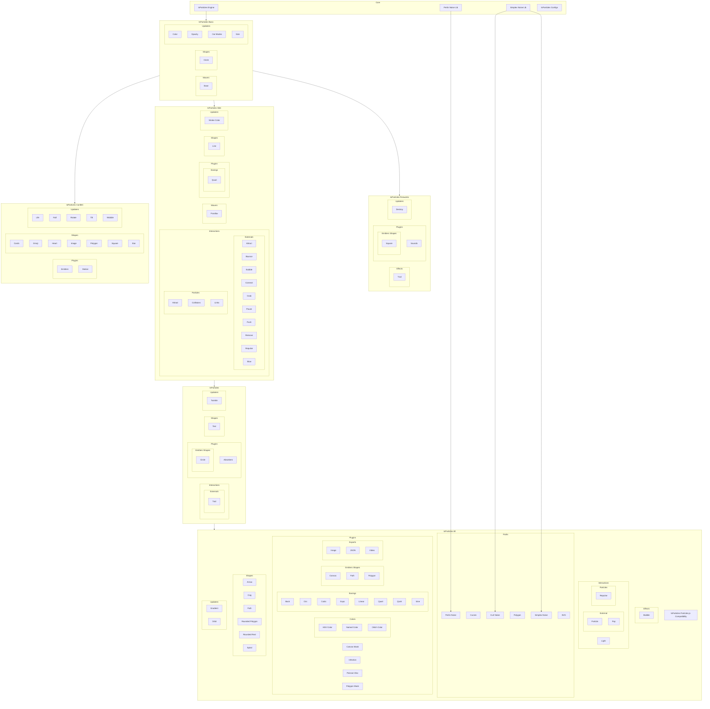

[](https://particles.js.org)

# tsParticles - TypeScript Particles

**A lightweight TypeScript library for creating particles. Dependency free (\*), browser ready and compatible with
React.js, Vue.js (2.x and 3.x), Angular, Svelte, jQuery, Preact, Inferno, Riot.js, Solid.js, and Web Components**

[](https://github.com/sponsors/matteobruni)
[](https://www.jsdelivr.com/package/npm/tsparticles)
[](https://cdnjs.com/libraries/tsparticles)
[](https://www.npmjs.com/package/tsparticles)
[](https://www.npmjs.com/package/tsparticles)
[](https://lerna.js.org/)
[](https://www.codefactor.io/repository/github/tsparticles/tsparticles)
[](https://www.codacy.com/manual/ar3s/tsparticles?utm_source=github.com&utm_medium=referral&utm_content=tsparticles/tsparticles&utm_campaign=Badge_Grade)
[](https://openbase.com/js/tsparticles?utm_source=embedded&utm_medium=badge&utm_campaign=rating-badge&utm_term=js/tsparticles)
[](https://gitpod.io/#https://github.com/tsparticles/tsparticles)
[](https://repl.it/github/tsparticles/tsparticles)

[](https://discord.gg/hACwv45Hme)
[](https://t.me/tsparticles)
[](https://www.reddit.com/r/tsParticles/)

[](https://www.producthunt.com/posts/tsparticles?utm_source=badge-featured&utm_medium=badge&utm_souce=badge-tsparticles")
[](https://www.buymeacoffee.com/matteobruni)

---

## Table of Contents

- [tsParticles - TypeScript Particles](#tsparticles---typescript-particles)
- [Table of Contents](#table-of-contents)
- [Do you want to use it on your website?](#do-you-want-to-use-it-on-your-website)
- [**_Library installation_**](#library-installation)
- [**_Hosting / CDN_**](#hosting--cdn)
- [jsDelivr](#jsdelivr)
- [cdnjs](#cdnjs)
- [unpkg](#unpkg)
- [**_npm_**](#npm)
- [**_yarn_**](#yarn)
- [**_pnpm_**](#pnpm)
- [Import and require](#import-and-require)
- [**_Usage_**](#usage)
- [Official components for some of the most used frameworks](#official-components-for-some-of-the-most-used-frameworks)
- [Angular](#angular)
- [`@tsparticles/angular`](#@tsparticles/angular)
- [Astro](#astro)
- [`astro-particles`](#astro-particles)
- [Ember.js](#emberjs)
- [`ember-tsparticles`](#ember-tsparticles)
- [Inferno](#inferno)
- [`inferno-particles`](#inferno-particles)
- [jQuery](#jquery)
- [`jquery-particles`](#jquery-particles)
- [Preact](#preact)
- [`preact-particles`](#preact-particles)
- [ReactJS](#reactjs)
- [`@tsparticles/react`](#tsparticlesreact)
- [RiotJS](#riotjs)
- [`riot-particles`](#riot-particles)
- [SolidJS](#solidjs)
- [`solid-particles`](#solid-particles)
- [Svelte](#svelte)
- [`@tsparticles/svelte`](#@tsparticles/svelte)
- [VueJS 2.x](#vuejs-2x)
- [`@tsparticles/vue2`](#tsparticlesvue2)
- [VueJS 3.x](#vuejs-3x)
- [`@tsparticles/vue3`](#tsparticlesvue3)
- [Web Components](#web-components)
- [`web-particles`](#web-particles)
- [WordPress](#wordpress)
- [`@tsparticles/wordpress`](#@tsparticles/wordpress)
- [Elementor](#elementor)
- [Presets](#presets)
- [Big Circles](#big-circles)
- [Bubbles](#bubbles)
- [Confetti](#confetti)
- [Fire](#fire)
- [Firefly](#firefly)
- [Fireworks](#fireworks)
- [Fountain](#fountain)
- [Links](#links)
- [Sea Anemone](#sea-anemone)
- [Snow](#snow)
- [Stars](#stars)
- [Triangles](#triangles)
- [Templates and Resources](#templates-and-resources)
- [**_Demo / Generator_**](#demo--generator)
- [**_Video Tutorials_**](#video-tutorials)
- [Characters as particles](#characters-as-particles)
- [Polygon mask](#polygon-mask)
- [Animated stars](#animated-stars)
- [Nyan cat flying on scrolling stars](#nyan-cat-flying-on-scrolling-stars)
- [Snow particles](#snow-particles)
- [Background Mask particles](#background-mask-particles)
- [**_Options_**](#options)
- [Want to see it in action and try it?](#want-to-see-it-in-action-and-try-it)
- [Migrating from Particles.js](#migrating-from-particlesjs)
- [Plugins/Customizations](#pluginscustomizations)
- [Dependency Graph](#dependency-graph)
- [Sponsors](#sponsors)
- [Huge thanks to JetBrains for the 2020-2022 Open Source Licenses!](#huge-thanks-to-jetbrains-for-the-2020-2022-open-source-licenses)

---

## Do you want to use it on your website?

_Documentation and Development references [here](https://particles.js.org/docs/) 📖_

**This library is available on two of the most popular CDNs and it's easy and ready to use, if you were using
particles.js
it's even easier**.

You'll find the
instructions [below](https://github.com/tsparticles/tsparticles/blob/main/README.md#library-installation), with all the
links you need, and _don't be scared by **TypeScript**, it's just the source language_.

**The output files are just JavaScript**. 🤩

CDNs and `npm` have all the sources you need in **Javascript**, a bundle browser ready (tsparticles.engine.min.js), and
all
files splitted for `import` syntax.

**If you are interested** there are some _simple instructions_
just [below](https://github.com/tsparticles/tsparticles/blob/main/README.md#library-installation) to guide you to
migrate from the old particles.js library.

## **_Library installation_**

### **_Hosting / CDN_**

**_Please use these hosts or your own to load tsParticles on your projects_**

#### jsDelivr

[](https://www.jsdelivr.com/package/npm/@tsparticles/confetti)
[](https://www.jsdelivr.com/package/npm/@tsparticles/engine)
[](https://www.jsdelivr.com/package/npm/@tsparticles/fireworks)
[](https://www.jsdelivr.com/package/npm/@tsparticles/basic)
[](https://www.jsdelivr.com/package/npm/@tsparticles/slim)
[](https://www.jsdelivr.com/package/npm/tsparticles)
[](https://www.jsdelivr.com/package/npm/@tsparticles/all)

#### cdnjs

[](https://cdnjs.com/libraries/tsparticles)

#### unpkg

<https://unpkg.com/@tsparticles/confetti/> <https://unpkg.com/@tsparticles/engine/> <https://unpkg.com/@tsparticles/fireworks/> <https://unpkg.com/@tsparticles/basic/> <https://unpkg.com/@tsparticles/slim/> <https://unpkg.com/tsparticles/> <https://unpkg.com/@tsparticles/all/>

---

### **_npm_**

_tsParticles Confetti_

[](https://www.npmjs.com/package/@tsparticles/confetti) [](https://www.npmjs.com/package/@tsparticles/confetti)

_tsParticles Engine_

[](https://www.npmjs.com/package/@tsparticles/engine) [](https://www.npmjs.com/package/@tsparticles/engine)

_tsParticles Fireworks_

[](https://www.npmjs.com/package/@tsparticles/fireworks) [](https://www.npmjs.com/package/@tsparticles/fireworks)

_tsParticles Basic_

[](https://www.npmjs.com/package/@tsparticles/basic) [](https://www.npmjs.com/package/@tsparticles/basic)

_tsParticles Slim_

[](https://www.npmjs.com/package/@tsparticles/slim) [](https://www.npmjs.com/package/@tsparticles/slim)

_tsParticles_

[](https://www.npmjs.com/package/tsparticles) [](https://www.npmjs.com/package/tsparticles)

_tsParticles All_

[](https://www.npmjs.com/package/@tsparticles/all) [](https://www.npmjs.com/package/@tsparticles/all)

```shell
npm install @tsparticles/engine
```

### **_yarn_**

```shell
yarn add @tsparticles/engine
```

### **_pnpm_**

```shell
pnpm install @tsparticles/engine
```

#### Import and require

```javascript
const tsParticles = require("@tsparticles/engine");

// or

import { tsParticles } from "@tsparticles/engine";
```

The imported `tsParticles` is the same instance you have when including the script in the page using the `<script>` tag.

---

### **_Usage_**

Load tsParticles and configure the particles:

[](https://particles.js.org)
[](https://confetti.js.org)

**index.html**

```html
<div id="tsparticles"></div>

<script src="tsparticles.engine.min.js"></script>
```

**app.js**

```javascript
// @path-json can be an object or an array, the first will be loaded directly, and the object from the array will be randomly selected
/* tsParticles.load(@params); */

tsParticles
  .load({
    id: "tsparticles",
    url: "presets/default.json",
  })
  .then((container) => {
    console.log("callback - tsparticles config loaded");
  })
  .catch((error) => {
    console.error(error);
  });

//or

tsParticles.load({
  id: "tsparticles",
  options: {
    /* options here */
  },
});

//or

tsParticles.load({
  id: "tsparticles",
  options: [
    {
      /* options here */
    },
    {
      /* other options here */
    },
  ],
});
//random object

tsParticles.load({
  id: "tsparticles",
  options: [
    {
      /* options here */
    },
    {
      /* other options here */
    },
  ],
  index: 1,
}); //the second one
// Important! If the index is not in range 0...<array.length, the index will be ignored.

// after initialization this can be used.

/* tsParticles.setOnClickHandler(@callback); */

/* this will be fired from all particles loaded */

tsParticles.setOnClickHandler((event, particles) => {
  /* custom on click handler */
});

// now you can control the animations too, it's possible to pause and resume the animations
// these methods don't change the config so you're safe with all your configurations
// domItem(0) returns the first tsParticles instance loaded in the dom
const particles = tsParticles.domItem(0);

// play will start the animations, if the move is not enabled it won't enable it, it just updates the frame
particles.play();

// pause will stop the animations
particles.pause();
```

---

## Official components for some of the most used frameworks

### Angular

#### `@tsparticles/angular`

[](https://www.npmjs.com/package/@tsparticles/angular) [](https://www.npmjs.com/package/@tsparticles/angular)

Instructions available [here](https://github.com/tsparticles/angular/#readme)

### Astro

#### `astro-particles`

[](https://www.npmjs.com/package/astro-particles) [](https://www.npmjs.com/package/astro-particles)

Instructions available [here](https://github.com/tsparticles/astro/#readme)

### Ember.js

#### `ember-tsparticles`

[](https://www.npmjs.com/package/ember-tsparticles) [](https://www.npmjs.com/package/ember-tsparticles)

Instructions available [here](https://github.com/tsparticles/ember/#readme)

### Inferno

#### `inferno-particles`

[](https://www.npmjs.com/package/inferno-particles) [](https://www.npmjs.com/package/inferno-particles)

Instructions available [here](https://github.com/tsparticles/inferno/#readme)

### jQuery

#### `jquery-particles`

[](https://www.npmjs.com/package/jquery-particles) [](https://www.npmjs.com/package/jquery-particles)

Instructions available [here](https://github.com/tsparticles/jquery/#readme)

### Preact

#### `preact-particles`

[](https://www.npmjs.com/package/preact-particles) [](https://www.npmjs.com/package/preact-particles)

Instructions available [here](https://github.com/tsparticles/preact/#readme)

### ReactJS

#### `@tsparticles/react`

[](https://www.npmjs.com/package/@tsparticles/react) [](https://www.npmjs.com/package/@tsparticles/react)

Instructions available [here](https://github.com/tsparticles/react/#readme)

### RiotJS

#### `riot-particles`

[](https://www.npmjs.com/package/riot-particles) [](https://www.npmjs.com/package/riot-particles)

You can find the instructions [here](https://github.com/tsparticles/riot/#readme)

### SolidJS

#### `solid-particles`

[](https://www.npmjs.com/package/solid-particles) [](https://www.npmjs.com/package/solid-particles)

You can find the instructions [here](https://github.com/tsparticles/solid/#readme)

### Svelte

#### `@tsparticles/svelte`

[](https://www.npmjs.com/package/@tsparticles/svelte) [](https://www.npmjs.com/package/@tsparticles/svelte)

Instructions available [here](https://github.com/tsparticles/svelte/#readme)

### VueJS 2.x

#### `@tsparticles/vue2`

[](https://www.npmjs.com/package/@tsparticles/vue2) [](https://www.npmjs.com/package/@tsparticles/vue2)

Instructions available [here](https://github.com/tsparticles/vue2/#readme)

### VueJS 3.x

#### `@tsparticles/vue3`

[](https://www.npmjs.com/package/@tsparticles/vue3) [](https://www.npmjs.com/package/@tsparticles/vue3)

Instruction available [here](https://github.com/tsparticles/vue3/#readme)

### Web Components

#### `web-particles`

[](https://www.npmjs.com/package/web-particles) [](https://www.npmjs.com/package/web-particles)

You can find the instructions [here](https://github.com/tsparticles/webcomponents/#readme)

### WordPress

#### `@tsparticles/wordpress`

[](https://www.npmjs.com/package/@tsparticles/wordpress) [](https://www.npmjs.com/package/@tsparticles/wordpress) [](https://wordpress.org/plugins/tsparticles-block/) [](https://wordpress.org/plugins/tsparticles-block/)

The plugin page hosted on WordPress.org can be
found [here](https://wordpress.org/plugins/tsparticles-block/#description)

### Elementor

Actually, an official tsParticles plugin isn't existing, but I have a collaboration with
the `Premium Addons for Elementor` plugin collection.

<div style="float: left; margin-right: 10px;">
    
</div>
<div>
    Premium Addons for Elementor is one of the most common plugins for Elementor that offers more than 55 highly customizable Elementor Widgets and Section Add-ons. tsParticles is exclusively included in Premium Particles Section Add-on for Elementor Page Builder. <a href="https://premiumaddons.com/particles-section-addon-for-elementor-page-builder/" target="_blank">Check It Now</a>.<br />
    Use Premium Addons for Elementor Page Builder and get the chance to include tsParticles in your next WordPress website without the need to write a single line of code. <a href="https://premiumaddons.com/particles-section-addon-for-elementor-page-builder/" target="_blank">See a Live Example</a>.
</div>
<div style="clear: both;"></div>

---

## Presets

There are some presets ready to be used in [this repository](https://github.com/tsparticles/presets), and they also have a bundle file that contains everything
needed to run.

### Big Circles

[](https://www.jsdelivr.com/package/npm/@tsparticles/preset-big-circles) [](https://www.npmjs.com/package/@tsparticles/preset-big-circles) [](https://www.npmjs.com/package/@tsparticles/preset-big-circles)

This preset loads big colored circles moving upwards on a white background.

[](https://particles.js.org/samples/presets/bigCircles)

You can find the instructions [here](https://github.com/tsparticles/presets/tree/main/presets/bigCircles#readme)

### Bubbles

[](https://www.jsdelivr.com/package/npm/tsparticles) [](https://www.npmjs.com/package/@tsparticles/preset-bubbles) [](https://www.npmjs.com/package/@tsparticles/preset-bubbles)

This preset loads colored bubbles coming from the bottom of the screen on a white background.

[](https://particles.js.org/samples/presets/bubbles)

You can find the instructions [here](https://github.com/tsparticles/presets/tree/main/presets/bubbles#readme)

### Confetti

[](https://www.jsdelivr.com/package/npm/@tsparticles/preset-confetti) [](https://www.npmjs.com/package/@tsparticles/preset-confetti) [](https://www.npmjs.com/package/@tsparticles/preset-confetti)

This preset loads white and red confetti launched from the screen center on a transparent background.

[](https://particles.js.org/samples/presets/confetti)

You can find the instructions [here](https://github.com/tsparticles/presets/tree/main/presets/confetti#readme)

### Fire

[](https://www.jsdelivr.com/package/npm/@tsparticles/preset-fire) [](https://www.npmjs.com/package/@tsparticles/preset-fire) [](https://www.npmjs.com/package/@tsparticles/preset-fire)

This preset loads a faded red to a black background with particles colored like fire and ash sparks.

[](https://particles.js.org/samples/presets/fire)

You can find the instructions [here](https://github.com/tsparticles/presets/tree/main/presets/fire#readme)

### Firefly

[](https://www.jsdelivr.com/package/npm/@tsparticles/preset-firefly) [](https://www.npmjs.com/package/@tsparticles/preset-firefly) [](https://www.npmjs.com/package/@tsparticles/preset-firefly)

This preset loads a mouse trail made with small fading particles like little fireflies.

[](https://particles.js.org/samples/presets/firefly)

You can find the instructions [here](https://github.com/tsparticles/presets/tree/main/presets/firefly#readme)

### Fireworks

[](https://www.jsdelivr.com/package/npm/@tsparticles/preset-fireworks) [](https://www.npmjs.com/package/@tsparticles/preset-fireworks) [](https://www.npmjs.com/package/@tsparticles/preset-fireworks)

This preset loads a beautiful fireworks effect.

[](https://particles.js.org/samples/presets/fireworks)

You can find the instructions [here](https://github.com/tsparticles/presets/tree/main/presets/fireworks#readme)

### Fountain

[](https://www.jsdelivr.com/package/npm/@tsparticles/preset-fountain) [](https://www.npmjs.com/package/@tsparticles/preset-fountain) [](https://www.npmjs.com/package/@tsparticles/preset-fountain)

[](https://particles.js.org/samples/presets/fountain)

You can find the instructions [here](https://github.com/tsparticles/presets/tree/main/presets/fountain#readme)

### Links

[](https://www.jsdelivr.com/package/npm/@tsparticles/preset-links) [](https://www.npmjs.com/package/@tsparticles/preset-links) [](https://www.npmjs.com/package/@tsparticles/preset-links)

[](https://particles.js.org/samples/presets/links)

You can find the instructions [here](https://github.com/tsparticles/presets/tree/main/presets/links#readme)

### Sea Anemone

[](https://www.jsdelivr.com/package/npm/@tsparticles/preset-sea-anemone) [](https://www.npmjs.com/package/@tsparticles/preset-sea-anemone) [](https://www.npmjs.com/package/@tsparticles/preset-sea-anemone)

[](https://particles.js.org/samples/presets/seaAnemone)

You can find the instructions [here](https://github.com/tsparticles/presets/tree/main/presets/seaAnemone#readme)

### Snow

[](https://www.jsdelivr.com/package/npm/@tsparticles/preset-snow) [](https://www.npmjs.com/package/@tsparticles/preset-snow) [](https://www.npmjs.com/package/@tsparticles/preset-snow)

[](https://particles.js.org/samples/presets/snow)

You can find the instructions [here](https://github.com/tsparticles/presets/tree/main/presets/snow#readme)

### Stars

[](https://www.jsdelivr.com/package/npm/@tsparticles/preset-stars) [](https://www.npmjs.com/package/@tsparticles/preset-stars) [](https://www.npmjs.com/package/@tsparticles/preset-stars)

[](https://particles.js.org/samples/presets/stars)

You can find the instructions [here](https://github.com/tsparticles/presets/tree/main/presets/stars#readme)

### Triangles

[](https://www.jsdelivr.com/package/npm/@tsparticles/preset-triangles) [](https://www.npmjs.com/package/@tsparticles/preset-triangles) [](https://www.npmjs.com/package/@tsparticles/preset-triangles)

[](https://particles.js.org/samples/presets/triangles)

You can find the instructions [here](https://github.com/tsparticles/presets/tree/main/presets/triangles#readme)

---

## Templates and Resources

You can find some tsParticles related templates [here](https://github.com/tsparticles/templates). The templates are
created for _Vanilla Javascript_, _ReactJS_, _VueJS_, _Angular_, _SvelteJS_, and other frameworks.

The templates will vary, new ones can be created or older ones updated with the latest features or changed to a better
style. Check them out once in a while.

If you created some good design with _tsParticles_ feel free to submit a pull request with your cool template, you'll be
credited as the template author!

<https://github.com/tsparticles/templates>

---

## **_Demo / Generator_**

<https://particles.js.org/samples>

[](https://particles.js.org/samples)

---

## **_Video Tutorials_**

You can find all video tutorials on the website here: <https://particles.js.org/video.html>

_More videos are coming soon! Check every day if there are some new contents._

---

### Characters as particles

[](https://particles.js.org/samples/#chars)

---

### Polygon mask

[](https://particles.js.org/samples/#polygonMask)

---

### Animated stars

[](https://particles.js.org/samples/#nasa)

---

### Nyan cat flying on scrolling stars

[](https://particles.js.org/samples/#nyancat2)

---

### Snow particles

[](https://particles.js.org/samples/#snow)

---

### Background Mask particles

[](https://particles.js.org/samples/#background)

---

**particles.json**

You can find some config samples [here](https://github.com/tsparticles/website/tree/main/presets) 📖

---

## **_Options_**

You can find all options
available [here](https://particles.js.org/docs/interfaces/tsParticles_Engine.Options_Interfaces_IOptions.IOptions.html)
📖

## Want to see it in action and try it?

I've created a tsParticles collection on [CodePen](https://codepen.io/collection/DPOage) 😮 or you can check out
my [profile](https://codepen.io/matteobruni)

Otherwise, there's the demo page link below.

[](https://particles.js.org/samples/)

Want to see even more demos? Clone the repository on your computer and follow these instructions

```shell
$ pnpm i
$ pnpm run build
$ cd demo/vanilla
$ pnpm start
```

**Boom! 💥** <http://localhost:3000> and you can check out other demos.

_If you are brave enough_ you can switch to the `dev` branch for trying the features under development.

---

## Migrating from Particles.js

**tsParticles** has a package that makes this library 100% compatible with the _particles.js_ configuration.

[](https://www.jsdelivr.com/package/npm/@tsparticles/particles.js) [](https://www.npmjs.com/package/@tsparticles/particles.js) [](https://www.npmjs.com/package/@tsparticles/particles.js)

Seriously, you just need to change the script from particles.js to the bundled compatibility package, et-voilà, **you're
ready** 🧙!

You can read more **[here](https://dev.to/matteobruni/migrating-from-particles-js-to-tsparticles-2a6m)**

Want to know 5 reasons to do the
switch? [Read here](https://dev.to/matteobruni/5-reasons-to-use-tsparticles-and-not-particles-js-1gbe)

_Below you can find all the information you need to install tsParticles and its new syntax._

---

## Plugins/Customizations

tsParticles now supports some customizations 🥳.

**You can create your own plugins**

_Read more [here](https://particles.js.org/docs/modules/Core_Interfaces_IPlugin.html)..._

---

## Dependency Graph



---

<p>  
    <a href="https://www.jetbrains.com/?from=tsParticles">  
          
    </a>  
    <a href="https://www.jetbrains.com/webstorm/?from=tsParticles">  
          
    </a>  
</p>

## Sponsors

### JetBrains

Huge thanks to [JetBrains](https://www.jetbrains.com/?from=tsParticles) for the 2020-2022 Open Source Licenses!

[JetBrains WebStorm](https://www.jetbrains.com/webstorm/?from=tsParticles) is used to maintain this project.
