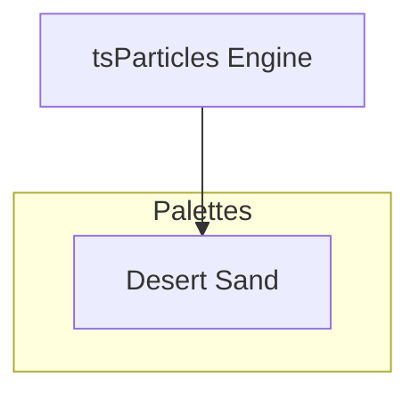

[](https://particles.js.org)

# tsParticles Desert Sand Palette

[](https://www.jsdelivr.com/package/npm/@tsparticles/palette-desert-sand) [](https://www.npmjs.com/package/@tsparticles/palette-desert-sand) [](https://www.npmjs.com/package/@tsparticles/palette-desert-sand) [](https://github.com/sponsors/matteobruni)

[tsParticles](https://github.com/tsparticles/tsparticles) palette for desert sand.

[](https://discord.gg/hACwv45Hme) [](https://t.me/tsparticles)

[](https://www.producthunt.com/posts/tsparticles?utm_source=badge-featured&utm_medium=badge&utm_souce=badge-tsparticles") <a href="https://www.buymeacoffee.com/matteobruni"></a>

## Sample

[](https://particles.js.org/samples/palettes/desert-sand)

## Colors

<table>
  <tbody>
    <tr>
      <td align="center">
        <svg width="32" height="32" viewBox="0 0 32 32" xmlns="http://www.w3.org/2000/svg" role="img" aria-label="#221100"><rect width="32" height="32" fill="#221100" /></svg><br />
        <code>#221100</code>
      </td>
      <td align="center">
        <svg width="32" height="32" viewBox="0 0 32 32" xmlns="http://www.w3.org/2000/svg" role="img" aria-label="#663300"><rect width="32" height="32" fill="#663300" /></svg><br />
        <code>#663300</code>
      </td>
      <td align="center">
        <svg width="32" height="32" viewBox="0 0 32 32" xmlns="http://www.w3.org/2000/svg" role="img" aria-label="#995522"><rect width="32" height="32" fill="#995522" /></svg><br />
        <code>#995522</code>
      </td>
      <td align="center">
        <svg width="32" height="32" viewBox="0 0 32 32" xmlns="http://www.w3.org/2000/svg" role="img" aria-label="#CC8833"><rect width="32" height="32" fill="#CC8833" /></svg><br />
        <code>#CC8833</code>
      </td>
      <td align="center">
        <svg width="32" height="32" viewBox="0 0 32 32" xmlns="http://www.w3.org/2000/svg" role="img" aria-label="#DDAA55"><rect width="32" height="32" fill="#DDAA55" /></svg><br />
        <code>#DDAA55</code>
      </td>
    </tr>
    <tr>
      <td align="center">
        <svg width="32" height="32" viewBox="0 0 32 32" xmlns="http://www.w3.org/2000/svg" role="img" aria-label="#EECCAA"><rect width="32" height="32" fill="#EECCAA" /></svg><br />
        <code>#EECCAA</code>
      </td>
      <td align="center">
        <svg width="32" height="32" viewBox="0 0 32 32" xmlns="http://www.w3.org/2000/svg" role="img" aria-label="#F5E8D0"><rect width="32" height="32" fill="#F5E8D0" /></svg><br />
        <code>#F5E8D0</code>
      </td>
    </tr>
    <tr>
      <td colspan="5" align="center">
        <svg width="40" height="40" viewBox="0 0 40 40" xmlns="http://www.w3.org/2000/svg" role="img" aria-label="#1a1208"><rect width="40" height="40" fill="#1a1208" /></svg><br />
        <strong>Background</strong><br />
        <code>#1a1208</code>
      </td>
    </tr>
    <tr>
      <td colspan="5" align="center">
        <strong>Blend mode:</strong> <code>source-over</code> | <strong>Fill:</strong> <code>true</code>
      </td>
    </tr>
  </tbody>
</table>

## Quick checklist

1. Install `@tsparticles/engine` (or use the CDN bundle below)
2. Load a base package (for example `@tsparticles/basic`) and call `loadDesertSandPalette` before `tsParticles.load(...)`
3. Apply the palette plus a minimal particles configuration in your options

A palette defines colors, not complete behavior, so pair it with a runtime package and particle options.

## How to use it

### CDN / Vanilla JS / jQuery

```html
<script src="https://cdn.jsdelivr.net/npm/@tsparticles/basic@4/tsparticles.basic.bundle.min.js"></script>
<script src="https://cdn.jsdelivr.net/npm/@tsparticles/palette-desert-sand@4/tsparticles.palette.desert-sand.min.js"></script>
```

### Usage

Once the scripts are loaded you can set up `tsParticles` like this:

```javascript
(async engine => {
  await loadBasic(engine);
  await loadDesertSandPalette(engine);

  const options = {
    particles: {
      number: { value: 200 },
      shape: { type: "circle" },
      size: { value: { min: 10, max: 15 } },
      move: {
        enable: true,
        speed: 2,
      },
    },
    palette: "desert-sand",
  };

  await engine.load({
    id: "tsparticles",
    options,
  });
})(tsParticles);
```

#### Customization

**Important ⚠️**
You can override all the options defining the properties like in any standard `tsParticles` installation.

```javascript
tsParticles.load({
  id: "tsparticles",
  options: {
    particles: {
      shape: {
        type: "square", // starting from v2, this require the square shape script
      },
    },
    palette: "desert-sand",
  },
});
```

Like in the sample above, the circles will be replaced by squares.

### Frameworks with a tsParticles component library

Checkout the documentation in the component library repository and call the `loadDesertSandPalette` function instead of `loadFull`, `loadSlim` or similar functions.

The options shown above are valid for all the component libraries.

## Common pitfalls

- Calling `tsParticles.load(...)` before `loadDesertSandPalette(...)`
- Verify required peer packages before enabling advanced options
- Change one option group at a time to isolate regressions quickly

## Related docs

- Presets and palettes catalog: <https://github.com/tsparticles/palettes>
- Main docs: <https://particles.js.org/docs/>

---


