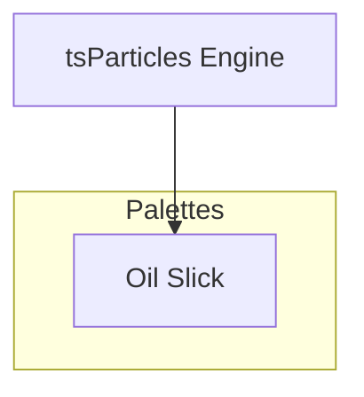

[](https://particles.js.org)

# tsParticles Oil Slick Palette

[](https://www.jsdelivr.com/package/npm/@tsparticles/palette-oil-slick) [](https://www.npmjs.com/package/@tsparticles/palette-oil-slick) [](https://www.npmjs.com/package/@tsparticles/palette-oil-slick) [](https://github.com/sponsors/matteobruni)

[tsParticles](https://github.com/tsparticles/tsparticles) palette for oil slick.

[](https://discord.gg/hACwv45Hme) [](https://t.me/tsparticles)

[](https://www.producthunt.com/posts/tsparticles?utm_source=badge-featured&utm_medium=badge&utm_souce=badge-tsparticles") <a href="https://www.buymeacoffee.com/matteobruni"></a>

## Sample

[](https://particles.js.org/samples/palettes/oil-slick)

## Colors

<table>
  <tbody>
    <tr>
      <td align="center">
        <svg width="32" height="32" viewBox="0 0 32 32" xmlns="http://www.w3.org/2000/svg" role="img" aria-label="#220033"><rect width="32" height="32" fill="#220033" /></svg><br />
        <code>#220033</code>
      </td>
      <td align="center">
        <svg width="32" height="32" viewBox="0 0 32 32" xmlns="http://www.w3.org/2000/svg" role="img" aria-label="#550055"><rect width="32" height="32" fill="#550055" /></svg><br />
        <code>#550055</code>
      </td>
      <td align="center">
        <svg width="32" height="32" viewBox="0 0 32 32" xmlns="http://www.w3.org/2000/svg" role="img" aria-label="#006633"><rect width="32" height="32" fill="#006633" /></svg><br />
        <code>#006633</code>
      </td>
      <td align="center">
        <svg width="32" height="32" viewBox="0 0 32 32" xmlns="http://www.w3.org/2000/svg" role="img" aria-label="#00AA66"><rect width="32" height="32" fill="#00AA66" /></svg><br />
        <code>#00AA66</code>
      </td>
      <td align="center">
        <svg width="32" height="32" viewBox="0 0 32 32" xmlns="http://www.w3.org/2000/svg" role="img" aria-label="#AACC00"><rect width="32" height="32" fill="#AACC00" /></svg><br />
        <code>#AACC00</code>
      </td>
    </tr>
    <tr>
      <td align="center">
        <svg width="32" height="32" viewBox="0 0 32 32" xmlns="http://www.w3.org/2000/svg" role="img" aria-label="#FF9900"><rect width="32" height="32" fill="#FF9900" /></svg><br />
        <code>#FF9900</code>
      </td>
      <td align="center">
        <svg width="32" height="32" viewBox="0 0 32 32" xmlns="http://www.w3.org/2000/svg" role="img" aria-label="#CC0044"><rect width="32" height="32" fill="#CC0044" /></svg><br />
        <code>#CC0044</code>
      </td>
    </tr>
    <tr>
      <td colspan="5" align="center">
        <svg width="40" height="40" viewBox="0 0 40 40" xmlns="http://www.w3.org/2000/svg" role="img" aria-label="#0a0810"><rect width="40" height="40" fill="#0a0810" /></svg><br />
        <strong>Background</strong><br />
        <code>#0a0810</code>
      </td>
    </tr>
    <tr>
      <td colspan="5" align="center">
        <strong>Blend mode:</strong> <code>overlay</code> | <strong>Fill:</strong> <code>false</code>
      </td>
    </tr>
  </tbody>
</table>

## Quick checklist

1. Install `@tsparticles/engine` (or use the CDN bundle below)
2. Load a base package (for example `@tsparticles/basic`) and call `loadOilSlickPalette` before `tsParticles.load(...)`
3. Apply the palette plus a minimal particles configuration in your options

A palette defines colors, not complete behavior, so pair it with a runtime package and particle options.

## How to use it

### CDN / Vanilla JS / jQuery

```html
<script src="https://cdn.jsdelivr.net/npm/@tsparticles/basic@4/tsparticles.basic.bundle.min.js"></script>
<script src="https://cdn.jsdelivr.net/npm/@tsparticles/palette-oil-slick@4/tsparticles.palette.oil-slick.min.js"></script>
```

### Usage

Once the scripts are loaded you can set up `tsParticles` like this:

```javascript
(async engine => {
  await loadBasic(engine);
  await loadOilSlickPalette(engine);

  const options = {
    particles: {
      number: { value: 200 },
      shape: { type: "circle" },
      size: { value: { min: 10, max: 15 } },
      move: {
        enable: true,
        speed: 2,
      },
    },
    palette: "oil-slick",
  };

  await engine.load({
    id: "tsparticles",
    options,
  });
})(tsParticles);
```

#### Customization

**Important ⚠️**
You can override all the options defining the properties like in any standard `tsParticles` installation.

```javascript
tsParticles.load({
  id: "tsparticles",
  options: {
    particles: {
      shape: {
        type: "square", // starting from v2, this require the square shape script
      },
    },
    palette: "oil-slick",
  },
});
```

Like in the sample above, the circles will be replaced by squares.

### Frameworks with a tsParticles component library

Checkout the documentation in the component library repository and call the `loadOilSlickPalette` function instead of `loadFull`, `loadSlim` or similar functions.

The options shown above are valid for all the component libraries.

## Common pitfalls

- Calling `tsParticles.load(...)` before `loadOilSlickPalette(...)`
- Verify required peer packages before enabling advanced options
- Change one option group at a time to isolate regressions quickly

## Related docs

- Presets and palettes catalog: <https://github.com/tsparticles/palettes>
- Main docs: <https://particles.js.org/docs/>

---


