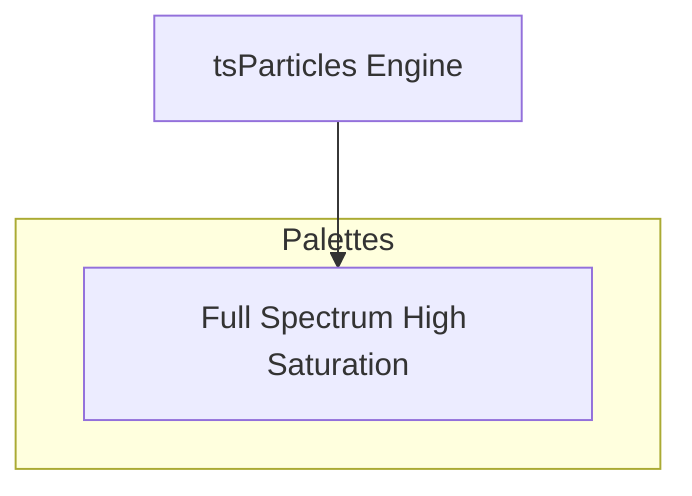

[](https://particles.js.org)

# tsParticles Full Spectrum High Saturation Palette

[](https://www.jsdelivr.com/package/npm/@tsparticles/palette-full-spectrum) [](https://www.npmjs.com/package/@tsparticles/palette-full-spectrum) [](https://www.npmjs.com/package/@tsparticles/palette-full-spectrum) [](https://github.com/sponsors/matteobruni)

[tsParticles](https://github.com/tsparticles/tsparticles) palette for full spectrum - high saturation.

[](https://discord.gg/hACwv45Hme) [](https://t.me/tsparticles)

[](https://www.producthunt.com/posts/tsparticles?utm_source=badge-featured&utm_medium=badge&utm_souce=badge-tsparticles") <a href="https://www.buymeacoffee.com/matteobruni"></a>

## Sample

[](https://particles.js.org/samples/palettes/full-spectrum)

## Colors

<table>
  <tbody>
    <tr>
      <td align="center">
        <svg width="32" height="32" viewBox="0 0 32 32" xmlns="http://www.w3.org/2000/svg" role="img" aria-label="#FF0000"><rect width="32" height="32" fill="#FF0000" /></svg><br />
        <code>#FF0000</code>
      </td>
      <td align="center">
        <svg width="32" height="32" viewBox="0 0 32 32" xmlns="http://www.w3.org/2000/svg" role="img" aria-label="#FF1A00"><rect width="32" height="32" fill="#FF1A00" /></svg><br />
        <code>#FF1A00</code>
      </td>
      <td align="center">
        <svg width="32" height="32" viewBox="0 0 32 32" xmlns="http://www.w3.org/2000/svg" role="img" aria-label="#FF3300"><rect width="32" height="32" fill="#FF3300" /></svg><br />
        <code>#FF3300</code>
      </td>
      <td align="center">
        <svg width="32" height="32" viewBox="0 0 32 32" xmlns="http://www.w3.org/2000/svg" role="img" aria-label="#FF4D00"><rect width="32" height="32" fill="#FF4D00" /></svg><br />
        <code>#FF4D00</code>
      </td>
      <td align="center">
        <svg width="32" height="32" viewBox="0 0 32 32" xmlns="http://www.w3.org/2000/svg" role="img" aria-label="#FF6600"><rect width="32" height="32" fill="#FF6600" /></svg><br />
        <code>#FF6600</code>
      </td>
    </tr>
    <tr>
      <td align="center">
        <svg width="32" height="32" viewBox="0 0 32 32" xmlns="http://www.w3.org/2000/svg" role="img" aria-label="#FF8000"><rect width="32" height="32" fill="#FF8000" /></svg><br />
        <code>#FF8000</code>
      </td>
      <td align="center">
        <svg width="32" height="32" viewBox="0 0 32 32" xmlns="http://www.w3.org/2000/svg" role="img" aria-label="#FF9900"><rect width="32" height="32" fill="#FF9900" /></svg><br />
        <code>#FF9900</code>
      </td>
      <td align="center">
        <svg width="32" height="32" viewBox="0 0 32 32" xmlns="http://www.w3.org/2000/svg" role="img" aria-label="#FFB300"><rect width="32" height="32" fill="#FFB300" /></svg><br />
        <code>#FFB300</code>
      </td>
      <td align="center">
        <svg width="32" height="32" viewBox="0 0 32 32" xmlns="http://www.w3.org/2000/svg" role="img" aria-label="#FFCC00"><rect width="32" height="32" fill="#FFCC00" /></svg><br />
        <code>#FFCC00</code>
      </td>
      <td align="center">
        <svg width="32" height="32" viewBox="0 0 32 32" xmlns="http://www.w3.org/2000/svg" role="img" aria-label="#FFE600"><rect width="32" height="32" fill="#FFE600" /></svg><br />
        <code>#FFE600</code>
      </td>
    </tr>
    <tr>
      <td align="center">
        <svg width="32" height="32" viewBox="0 0 32 32" xmlns="http://www.w3.org/2000/svg" role="img" aria-label="#FFFF00"><rect width="32" height="32" fill="#FFFF00" /></svg><br />
        <code>#FFFF00</code>
      </td>
      <td align="center">
        <svg width="32" height="32" viewBox="0 0 32 32" xmlns="http://www.w3.org/2000/svg" role="img" aria-label="#CCFF00"><rect width="32" height="32" fill="#CCFF00" /></svg><br />
        <code>#CCFF00</code>
      </td>
      <td align="center">
        <svg width="32" height="32" viewBox="0 0 32 32" xmlns="http://www.w3.org/2000/svg" role="img" aria-label="#99FF00"><rect width="32" height="32" fill="#99FF00" /></svg><br />
        <code>#99FF00</code>
      </td>
      <td align="center">
        <svg width="32" height="32" viewBox="0 0 32 32" xmlns="http://www.w3.org/2000/svg" role="img" aria-label="#66FF00"><rect width="32" height="32" fill="#66FF00" /></svg><br />
        <code>#66FF00</code>
      </td>
      <td align="center">
        <svg width="32" height="32" viewBox="0 0 32 32" xmlns="http://www.w3.org/2000/svg" role="img" aria-label="#33FF00"><rect width="32" height="32" fill="#33FF00" /></svg><br />
        <code>#33FF00</code>
      </td>
    </tr>
    <tr>
      <td align="center">
        <svg width="32" height="32" viewBox="0 0 32 32" xmlns="http://www.w3.org/2000/svg" role="img" aria-label="#00FF00"><rect width="32" height="32" fill="#00FF00" /></svg><br />
        <code>#00FF00</code>
      </td>
      <td align="center">
        <svg width="32" height="32" viewBox="0 0 32 32" xmlns="http://www.w3.org/2000/svg" role="img" aria-label="#00FF33"><rect width="32" height="32" fill="#00FF33" /></svg><br />
        <code>#00FF33</code>
      </td>
      <td align="center">
        <svg width="32" height="32" viewBox="0 0 32 32" xmlns="http://www.w3.org/2000/svg" role="img" aria-label="#00FF66"><rect width="32" height="32" fill="#00FF66" /></svg><br />
        <code>#00FF66</code>
      </td>
      <td align="center">
        <svg width="32" height="32" viewBox="0 0 32 32" xmlns="http://www.w3.org/2000/svg" role="img" aria-label="#00FF99"><rect width="32" height="32" fill="#00FF99" /></svg><br />
        <code>#00FF99</code>
      </td>
      <td align="center">
        <svg width="32" height="32" viewBox="0 0 32 32" xmlns="http://www.w3.org/2000/svg" role="img" aria-label="#00FFCC"><rect width="32" height="32" fill="#00FFCC" /></svg><br />
        <code>#00FFCC</code>
      </td>
    </tr>
    <tr>
      <td align="center">
        <svg width="32" height="32" viewBox="0 0 32 32" xmlns="http://www.w3.org/2000/svg" role="img" aria-label="#00FFFF"><rect width="32" height="32" fill="#00FFFF" /></svg><br />
        <code>#00FFFF</code>
      </td>
      <td align="center">
        <svg width="32" height="32" viewBox="0 0 32 32" xmlns="http://www.w3.org/2000/svg" role="img" aria-label="#00CCFF"><rect width="32" height="32" fill="#00CCFF" /></svg><br />
        <code>#00CCFF</code>
      </td>
      <td align="center">
        <svg width="32" height="32" viewBox="0 0 32 32" xmlns="http://www.w3.org/2000/svg" role="img" aria-label="#0099FF"><rect width="32" height="32" fill="#0099FF" /></svg><br />
        <code>#0099FF</code>
      </td>
      <td align="center">
        <svg width="32" height="32" viewBox="0 0 32 32" xmlns="http://www.w3.org/2000/svg" role="img" aria-label="#0066FF"><rect width="32" height="32" fill="#0066FF" /></svg><br />
        <code>#0066FF</code>
      </td>
      <td align="center">
        <svg width="32" height="32" viewBox="0 0 32 32" xmlns="http://www.w3.org/2000/svg" role="img" aria-label="#0033FF"><rect width="32" height="32" fill="#0033FF" /></svg><br />
        <code>#0033FF</code>
      </td>
    </tr>
    <tr>
      <td align="center">
        <svg width="32" height="32" viewBox="0 0 32 32" xmlns="http://www.w3.org/2000/svg" role="img" aria-label="#0000FF"><rect width="32" height="32" fill="#0000FF" /></svg><br />
        <code>#0000FF</code>
      </td>
      <td align="center">
        <svg width="32" height="32" viewBox="0 0 32 32" xmlns="http://www.w3.org/2000/svg" role="img" aria-label="#3300FF"><rect width="32" height="32" fill="#3300FF" /></svg><br />
        <code>#3300FF</code>
      </td>
      <td align="center">
        <svg width="32" height="32" viewBox="0 0 32 32" xmlns="http://www.w3.org/2000/svg" role="img" aria-label="#6600FF"><rect width="32" height="32" fill="#6600FF" /></svg><br />
        <code>#6600FF</code>
      </td>
      <td align="center">
        <svg width="32" height="32" viewBox="0 0 32 32" xmlns="http://www.w3.org/2000/svg" role="img" aria-label="#9900FF"><rect width="32" height="32" fill="#9900FF" /></svg><br />
        <code>#9900FF</code>
      </td>
      <td align="center">
        <svg width="32" height="32" viewBox="0 0 32 32" xmlns="http://www.w3.org/2000/svg" role="img" aria-label="#CC00FF"><rect width="32" height="32" fill="#CC00FF" /></svg><br />
        <code>#CC00FF</code>
      </td>
    </tr>
    <tr>
      <td align="center">
        <svg width="32" height="32" viewBox="0 0 32 32" xmlns="http://www.w3.org/2000/svg" role="img" aria-label="#FF00FF"><rect width="32" height="32" fill="#FF00FF" /></svg><br />
        <code>#FF00FF</code>
      </td>
      <td align="center">
        <svg width="32" height="32" viewBox="0 0 32 32" xmlns="http://www.w3.org/2000/svg" role="img" aria-label="#FF00CC"><rect width="32" height="32" fill="#FF00CC" /></svg><br />
        <code>#FF00CC</code>
      </td>
      <td align="center">
        <svg width="32" height="32" viewBox="0 0 32 32" xmlns="http://www.w3.org/2000/svg" role="img" aria-label="#FF0099"><rect width="32" height="32" fill="#FF0099" /></svg><br />
        <code>#FF0099</code>
      </td>
      <td align="center">
        <svg width="32" height="32" viewBox="0 0 32 32" xmlns="http://www.w3.org/2000/svg" role="img" aria-label="#FF0066"><rect width="32" height="32" fill="#FF0066" /></svg><br />
        <code>#FF0066</code>
      </td>
      <td align="center">
        <svg width="32" height="32" viewBox="0 0 32 32" xmlns="http://www.w3.org/2000/svg" role="img" aria-label="#FF0033"><rect width="32" height="32" fill="#FF0033" /></svg><br />
        <code>#FF0033</code>
      </td>
    </tr>
    <tr>
      <td align="center">
        <svg width="32" height="32" viewBox="0 0 32 32" xmlns="http://www.w3.org/2000/svg" role="img" aria-label="#FF0000"><rect width="32" height="32" fill="#FF0000" /></svg><br />
        <code>#FF0000</code>
      </td>
    </tr>
    <tr>
      <td colspan="5" align="center">
        <svg width="40" height="40" viewBox="0 0 40 40" xmlns="http://www.w3.org/2000/svg" role="img" aria-label="#000000"><rect width="40" height="40" fill="#000000" /></svg><br />
        <strong>Background</strong><br />
        <code>#000000</code>
      </td>
    </tr>
    <tr>
      <td colspan="5" align="center">
        <strong>Blend mode:</strong> <code>screen</code> | <strong>Fill:</strong> <code>true</code>
      </td>
    </tr>
  </tbody>
</table>

## Quick checklist

1. Install `@tsparticles/engine` (or use the CDN bundle below)
2. Load a base package (for example `@tsparticles/basic`) and call `loadFullSpectrumPalette` before `tsParticles.load(...)`
3. Apply the palette plus a minimal particles configuration in your options

A palette defines colors, not complete behavior, so pair it with a runtime package and particle options.

## How to use it

### CDN / Vanilla JS / jQuery

```html
<script src="https://cdn.jsdelivr.net/npm/@tsparticles/basic@4/tsparticles.basic.bundle.min.js"></script>
<script src="https://cdn.jsdelivr.net/npm/@tsparticles/palette-full-spectrum@4/tsparticles.palette.full-spectrum.min.js"></script>
```

### Usage

Once the scripts are loaded you can set up `tsParticles` like this:

```javascript
(async engine => {
  await loadBasic(engine);
  await loadFullSpectrumPalette(engine);

  const options = {
    particles: {
      number: { value: 200 },
      shape: { type: "circle" },
      size: { value: { min: 10, max: 15 } },
      move: {
        enable: true,
        speed: 2,
      },
    },
    palette: "full-spectrum",
  };

  await engine.load({
    id: "tsparticles",
    options,
  });
})(tsParticles);
```

#### Customization

**Important ⚠️**
You can override all the options defining the properties like in any standard `tsParticles` installation.

```javascript
tsParticles.load({
  id: "tsparticles",
  options: {
    particles: {
      shape: {
        type: "square", // starting from v2, this require the square shape script
      },
    },
    palette: "full-spectrum",
  },
});
```

Like in the sample above, the circles will be replaced by squares.

### Frameworks with a tsParticles component library

Checkout the documentation in the component library repository and call the `loadFullSpectrumPalette` function instead of `loadFull`, `loadSlim` or similar functions.

The options shown above are valid for all the component libraries.

## Common pitfalls

- Calling `tsParticles.load(...)` before `loadFullSpectrumPalette(...)`
- Verify required peer packages before enabling advanced options
- Change one option group at a time to isolate regressions quickly

## Related docs

- Presets and palettes catalog: <https://github.com/tsparticles/palettes>
- Main docs: <https://particles.js.org/docs/>

---


