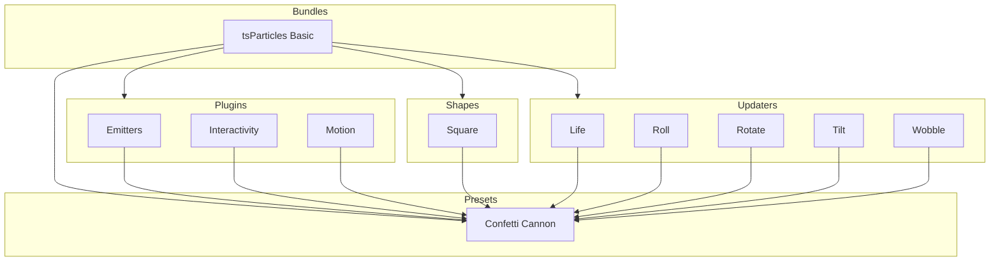

[](https://particles.js.org)

# tsParticles Confetti Cannon Preset

[](https://www.jsdelivr.com/package/npm/@tsparticles/preset-confetti-cannon) [](https://www.npmjs.com/package/@tsparticles/preset-confetti-cannon) [](https://www.npmjs.com/package/@tsparticles/preset-confetti-cannon) [](https://github.com/sponsors/matteobruni)

[tsParticles](https://github.com/tsparticles/tsparticles) preset for confetti launched from a draggable cannon, using
the [confetti palette](https://github.com/tsparticles/palettes/tree/main/palettes/confetti#readme).

[](https://discord.gg/hACwv45Hme) [](https://t.me/tsparticles)

[](https://www.producthunt.com/posts/tsparticles?utm_source=badge-featured&utm_medium=badge&utm_souce=badge-tsparticles") <a href="https://www.buymeacoffee.com/matteobruni"></a>

## Sample

[](https://particles.js.org/samples/presets/confettiCannon)

## Quick checklist

1. Install `@tsparticles/engine` (or use the CDN bundle below)
2. Call `loadConfettiCannonPreset(engine)` **before** `tsParticles.load(...)`
3. Set `preset: "confettiCannon"` in options

## How to use it

### CDN / Vanilla JS / jQuery

```html
<script src="https://cdn.jsdelivr.net/npm/@tsparticles/preset-confetti-cannon@4/tsparticles.preset.confettiCannon.bundle.min.js"></script>
```

### Usage

Once the scripts are loaded you can set up `tsParticles` like this:

```javascript
(async engine => {
  await loadConfettiCannonPreset(engine);

  await engine.load({
    options: {
      preset: "confettiCannon", // or "confetti-cannon"
    },
  });
})(tsParticles);
```

### Customization

```javascript
tsParticles.load({
  id: "tsparticles",
  options: {
    particles: {
      color: {
        value: ["#0000ff", "#00ff00"],
      },
    },
    preset: "confettiCannon", // or "confetti-cannon"
  },
});
```

Like in the sample above, the white and red colors will be replaced by blue and lime.

### Frameworks with a tsParticles component library

Checkout the documentation in the component library repository and call the `loadConfettiCannonPreset` function instead
of `loadFull`, `loadSlim` or similar functions.

The options shown above are valid for all the component libraries.

## Dependencies

This preset loads and combines the following packages:

| Package                                    | Role in this preset                           | README                                                                   |
| ------------------------------------------ | --------------------------------------------- | ------------------------------------------------------------------------ |
| `@tsparticles/basic`                       | Base runtime bundle used by the preset        | <https://www.npmjs.com/package/@tsparticles/basic>                       |
| `@tsparticles/engine`                      | tsParticles engine and preset registration    | <https://www.npmjs.com/package/@tsparticles/engine>                      |
| `@tsparticles/interaction-external-cannon` | Adds cannon launch interaction                | <https://www.npmjs.com/package/@tsparticles/interaction-external-cannon> |
| `@tsparticles/palette-confetti`            | Default confetti color palette                | <https://www.npmjs.com/package/@tsparticles/palette-confetti>            |
| `@tsparticles/plugin-interactivity`        | Enables external interaction plumbing         | <https://www.npmjs.com/package/@tsparticles/plugin-interactivity>        |
| `@tsparticles/plugin-motion`               | Handles reduced-motion accessibility settings | <https://www.npmjs.com/package/@tsparticles/plugin-motion>               |
| `@tsparticles/shape-square`                | Adds square particle shape                    | <https://www.npmjs.com/package/@tsparticles/shape-square>                |
| `@tsparticles/updater-life`                | Controls particle life-cycle stages           | <https://www.npmjs.com/package/@tsparticles/updater-life>                |
| `@tsparticles/updater-roll`                | Adds rolling spin motion                      | <https://www.npmjs.com/package/@tsparticles/updater-roll>                |
| `@tsparticles/updater-rotate`              | Adds rotation animation                       | <https://www.npmjs.com/package/@tsparticles/updater-rotate>              |
| `@tsparticles/updater-tilt`                | Adds tilt animation                           | <https://www.npmjs.com/package/@tsparticles/updater-tilt>                |
| `@tsparticles/updater-wobble`              | Adds side-to-side wobble motion               | <https://www.npmjs.com/package/@tsparticles/updater-wobble>              |

If you want to customize one specific behavior, start from the related package README above.

## Common pitfalls

- Calling `tsParticles.load(...)` before `loadConfettiCannonPreset(engine)`
- Overriding `emitters` with an empty array and expecting default cannon behavior
- Combining multiple emitter changes at once without testing incrementally

## Related docs

- All presets catalog: <https://github.com/tsparticles/presets>
- Emitter options: <https://particles.js.org/docs/classes/Plugins_Emitters_Options_Classes_Emitter.Emitter.html>
- Main tsParticles docs: <https://particles.js.org/docs/>

---


