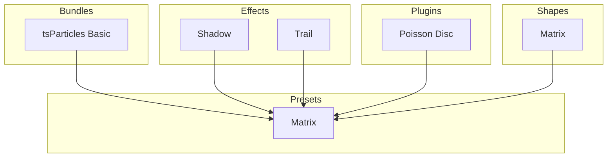

[](https://particles.js.org)

# tsParticles Matrix Preset

[](https://www.jsdelivr.com/package/npm/@tsparticles/preset-matrix) [](https://www.npmjs.com/package/@tsparticles/preset-matrix) [](https://www.npmjs.com/package/@tsparticles/preset-matrix) [](https://github.com/sponsors/matteobruni)

[tsParticles](https://github.com/tsparticles/tsparticles) preset for a Matrix-style rain animation.

[](https://discord.gg/hACwv45Hme) [](https://t.me/tsparticles)

## Quick checklist

1. Install `@tsparticles/engine` (or use the CDN bundle below)
2. Call `loadMatrixPreset(tsParticles)` **before** `tsParticles.load(...)`
3. Set `preset: "matrix"` in options

## How to use it

### CDN / Vanilla JS / jQuery

```html
<script src="https://cdn.jsdelivr.net/npm/@tsparticles/preset-matrix@4/tsparticles.preset.matrix.bundle.min.js"></script>
```

### Usage

Once the scripts are loaded you can set up `tsParticles` like this:

```javascript
(async () => {
  await loadMatrixPreset(tsParticles);

  await tsParticles.load({
    id: "tsparticles",
    options: {
      preset: "matrix",
    },
  });
})();
```

### Frameworks with a tsParticles component library

Checkout the documentation in the component library repository and call the `loadMatrixPreset` function instead
of `loadFull`, `loadSlim` or similar functions.

The options shown above are valid for all the component libraries.

## Dependencies

This preset loads and combines the following packages:

| Package                            | Role in this preset                         | README                                                           |
| ---------------------------------- | ------------------------------------------- | ---------------------------------------------------------------- |
| `@tsparticles/basic`               | Base runtime bundle used by the preset      | <https://www.npmjs.com/package/@tsparticles/basic>               |
| `@tsparticles/effect-shadow`       | Adds glow/shadow rendering around particles | <https://www.npmjs.com/package/@tsparticles/effect-shadow>       |
| `@tsparticles/engine`              | tsParticles engine and preset registration  | <https://www.npmjs.com/package/@tsparticles/engine>              |
| `@tsparticles/plugin-poisson-disc` | Applies Poisson-disc particle distribution  | <https://www.npmjs.com/package/@tsparticles/plugin-poisson-disc> |
| `@tsparticles/plugin-trail`        | Adds persistent canvas trail rendering      | <https://www.npmjs.com/package/@tsparticles/plugin-trail>        |
| `@tsparticles/shape-matrix`        | Adds matrix glyph particle shape            | <https://www.npmjs.com/package/@tsparticles/shape-matrix>        |

If you want to customize one specific behavior, start from the related package README above.

## Common pitfalls

- Calling `tsParticles.load(...)` before `loadMatrixPreset(tsParticles)`
- Using `particles.shape.type: "matrix"` without loading the matrix shape package
- Applying the shadow and trail options without loading the corresponding effect packages

## Related docs

- All presets catalog: <https://github.com/tsparticles/presets>
- Main tsParticles docs: <https://particles.js.org/docs/>

---


