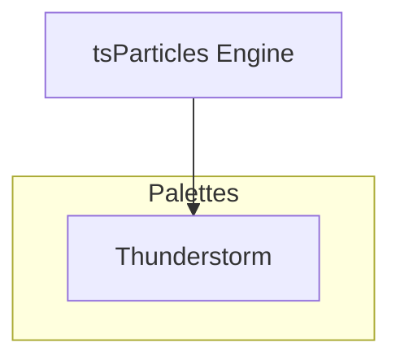

[](https://particles.js.org)

# tsParticles Thunderstorm Palette

[](https://www.jsdelivr.com/package/npm/@tsparticles/palette-thunderstorm) [](https://www.npmjs.com/package/@tsparticles/palette-thunderstorm) [](https://www.npmjs.com/package/@tsparticles/palette-thunderstorm) [](https://github.com/sponsors/matteobruni)

[tsParticles](https://github.com/tsparticles/tsparticles) palette for thunderstorm.

[](https://discord.gg/hACwv45Hme) [](https://t.me/tsparticles)

[](https://www.producthunt.com/posts/tsparticles?utm_source=badge-featured&utm_medium=badge&utm_souce=badge-tsparticles") <a href="https://www.buymeacoffee.com/matteobruni"></a>

## Sample

[](https://particles.js.org/samples/palettes/thunderstorm)

## Colors

<table>
  <tbody>
    <tr>
      <td align="center">
        <svg width="32" height="32" viewBox="0 0 32 32" xmlns="http://www.w3.org/2000/svg" role="img" aria-label="#110022"><rect width="32" height="32" fill="#110022" /></svg><br />
        <code>#110022</code>
      </td>
      <td align="center">
        <svg width="32" height="32" viewBox="0 0 32 32" xmlns="http://www.w3.org/2000/svg" role="img" aria-label="#220044"><rect width="32" height="32" fill="#220044" /></svg><br />
        <code>#220044</code>
      </td>
      <td align="center">
        <svg width="32" height="32" viewBox="0 0 32 32" xmlns="http://www.w3.org/2000/svg" role="img" aria-label="#440066"><rect width="32" height="32" fill="#440066" /></svg><br />
        <code>#440066</code>
      </td>
      <td align="center">
        <svg width="32" height="32" viewBox="0 0 32 32" xmlns="http://www.w3.org/2000/svg" role="img" aria-label="#8822AA"><rect width="32" height="32" fill="#8822AA" /></svg><br />
        <code>#8822AA</code>
      </td>
      <td align="center">
        <svg width="32" height="32" viewBox="0 0 32 32" xmlns="http://www.w3.org/2000/svg" role="img" aria-label="#AAAAFF"><rect width="32" height="32" fill="#AAAAFF" /></svg><br />
        <code>#AAAAFF</code>
      </td>
    </tr>
    <tr>
      <td align="center">
        <svg width="32" height="32" viewBox="0 0 32 32" xmlns="http://www.w3.org/2000/svg" role="img" aria-label="#DDDDFF"><rect width="32" height="32" fill="#DDDDFF" /></svg><br />
        <code>#DDDDFF</code>
      </td>
      <td align="center">
        <svg width="32" height="32" viewBox="0 0 32 32" xmlns="http://www.w3.org/2000/svg" role="img" aria-label="#FFFFFF"><rect width="32" height="32" fill="#FFFFFF" /></svg><br />
        <code>#FFFFFF</code>
      </td>
    </tr>
    <tr>
      <td colspan="5" align="center">
        <svg width="40" height="40" viewBox="0 0 40 40" xmlns="http://www.w3.org/2000/svg" role="img" aria-label="#05030d"><rect width="40" height="40" fill="#05030d" /></svg><br />
        <strong>Background</strong><br />
        <code>#05030d</code>
      </td>
    </tr>
    <tr>
      <td colspan="5" align="center">
        <strong>Blend mode:</strong> <code>screen</code> | <strong>Fill:</strong> <code>true</code>
      </td>
    </tr>
  </tbody>
</table>

## Quick checklist

1. Install `@tsparticles/engine` (or use the CDN bundle below)
2. Call the package loader function(s) before `tsParticles.load(...)`
3. Apply the package options in your `tsParticles.load(...)` config

## How to use it

### CDN / Vanilla JS / jQuery

```html
<script src="https://cdn.jsdelivr.net/npm/@tsparticles/palette-thunderstorm@3/tsparticles.palette.thunderstorm.bundle.min.js"></script>
```

### Usage

Once the scripts are loaded you can set up `tsParticles` like this:

```javascript
(async () => {
  await loadThunderstormPalette(tsParticles);

  await tsParticles.load({
    id: "tsparticles",
    options: {
      palette: "thunderstorm",
    },
  });
})();
```

#### Customization

**Important ⚠️**
You can override all the options defining the properties like in any standard `tsParticles` installation.

```javascript
tsParticles.load({
  id: "tsparticles",
  options: {
    particles: {
      shape: {
        type: "square", // starting from v2, this require the square shape script
      },
    },
    palette: "thunderstorm",
  },
});
```

Like in the sample above, the circles will be replaced by squares.

### Frameworks with a tsParticles component library

Checkout the documentation in the component library repository and call the `loadThunderstormPalette` function instead of `loadFull`, `loadSlim` or similar functions.

The options shown above are valid for all the component libraries.

## Common pitfalls

- Calling `tsParticles.load(...)` before `loadThunderstormPalette(...)`
- Verify required peer packages before enabling advanced options
- Change one option group at a time to isolate regressions quickly

## Related docs

- Presets and palettes catalog: <https://github.com/tsparticles/palettes>
- Main docs: <https://particles.js.org/docs/>

---


