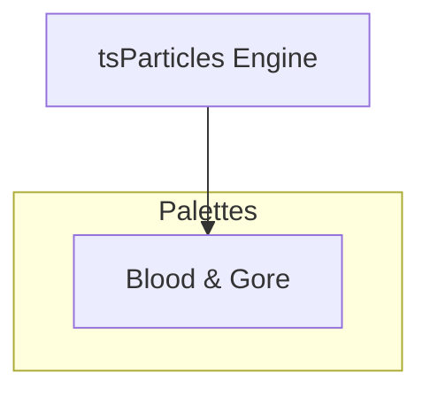

[](https://particles.js.org)

# tsParticles Blood & Gore Palette

[](https://www.jsdelivr.com/package/npm/@tsparticles/palette-blood-and-gore) [](https://www.npmjs.com/package/@tsparticles/palette-blood-and-gore) [](https://www.npmjs.com/package/@tsparticles/palette-blood-and-gore) [](https://github.com/sponsors/matteobruni)

[tsParticles](https://github.com/tsparticles/tsparticles) palette for blood & gore.

[](https://discord.gg/hACwv45Hme) [](https://t.me/tsparticles)

[](https://www.producthunt.com/posts/tsparticles?utm_source=badge-featured&utm_medium=badge&utm_souce=badge-tsparticles") <a href="https://www.buymeacoffee.com/matteobruni"></a>

## Sample

[](https://particles.js.org/samples/palettes/blood-and-gore)

## Colors

<table>
  <tbody>
    <tr>
      <td align="center">
        <svg width="32" height="32" viewBox="0 0 32 32" xmlns="http://www.w3.org/2000/svg" role="img" aria-label="#FF0000"><rect width="32" height="32" fill="#FF0000" /></svg><br />
        <code>#FF0000</code>
      </td>
      <td align="center">
        <svg width="32" height="32" viewBox="0 0 32 32" xmlns="http://www.w3.org/2000/svg" role="img" aria-label="#DD0000"><rect width="32" height="32" fill="#DD0000" /></svg><br />
        <code>#DD0000</code>
      </td>
      <td align="center">
        <svg width="32" height="32" viewBox="0 0 32 32" xmlns="http://www.w3.org/2000/svg" role="img" aria-label="#AA0000"><rect width="32" height="32" fill="#AA0000" /></svg><br />
        <code>#AA0000</code>
      </td>
      <td align="center">
        <svg width="32" height="32" viewBox="0 0 32 32" xmlns="http://www.w3.org/2000/svg" role="img" aria-label="#880000"><rect width="32" height="32" fill="#880000" /></svg><br />
        <code>#880000</code>
      </td>
      <td align="center">
        <svg width="32" height="32" viewBox="0 0 32 32" xmlns="http://www.w3.org/2000/svg" role="img" aria-label="#660000"><rect width="32" height="32" fill="#660000" /></svg><br />
        <code>#660000</code>
      </td>
    </tr>
    <tr>
      <td align="center">
        <svg width="32" height="32" viewBox="0 0 32 32" xmlns="http://www.w3.org/2000/svg" role="img" aria-label="#440000"><rect width="32" height="32" fill="#440000" /></svg><br />
        <code>#440000</code>
      </td>
      <td align="center">
        <svg width="32" height="32" viewBox="0 0 32 32" xmlns="http://www.w3.org/2000/svg" role="img" aria-label="#220000"><rect width="32" height="32" fill="#220000" /></svg><br />
        <code>#220000</code>
      </td>
    </tr>
    <tr>
      <td colspan="5" align="center">
        <svg width="40" height="40" viewBox="0 0 40 40" xmlns="http://www.w3.org/2000/svg" role="img" aria-label="#0d0000"><rect width="40" height="40" fill="#0d0000" /></svg><br />
        <strong>Background</strong><br />
        <code>#0d0000</code>
      </td>
    </tr>
    <tr>
      <td colspan="5" align="center">
        <strong>Blend mode:</strong> <code>multiply</code> | <strong>Fill:</strong> <code>true</code>
      </td>
    </tr>
  </tbody>
</table>

## Quick checklist

1. Install `@tsparticles/engine` (or use the CDN bundle below)
2. Call the package loader function(s) before `tsParticles.load(...)`
3. Apply the package options in your `tsParticles.load(...)` config

## How to use it

### CDN / Vanilla JS / jQuery

```html
<script src="https://cdn.jsdelivr.net/npm/@tsparticles/palette-blood-and-gore@3/tsparticles.palette.blood-and-gore.bundle.min.js"></script>
```

### Usage

Once the scripts are loaded you can set up `tsParticles` like this:

```javascript
(async () => {
  await loadBloodAndGorePalette(tsParticles);

  await tsParticles.load({
    id: "tsparticles",
    options: {
      palette: "blood-and-gore",
    },
  });
})();
```

#### Customization

**Important ⚠️**
You can override all the options defining the properties like in any standard `tsParticles` installation.

```javascript
tsParticles.load({
  id: "tsparticles",
  options: {
    particles: {
      shape: {
        type: "square", // starting from v2, this require the square shape script
      },
    },
    palette: "blood-and-gore",
  },
});
```

Like in the sample above, the circles will be replaced by squares.

### Frameworks with a tsParticles component library

Checkout the documentation in the component library repository and call the `loadBloodAndGorePalette` function instead of `loadFull`, `loadSlim` or similar functions.

The options shown above are valid for all the component libraries.

## Common pitfalls

- Calling `tsParticles.load(...)` before `loadBloodAndGorePalette(...)`
- Verify required peer packages before enabling advanced options
- Change one option group at a time to isolate regressions quickly

## Related docs

- Presets and palettes catalog: <https://github.com/tsparticles/presets>
- Main docs: <https://particles.js.org/docs/>

---


