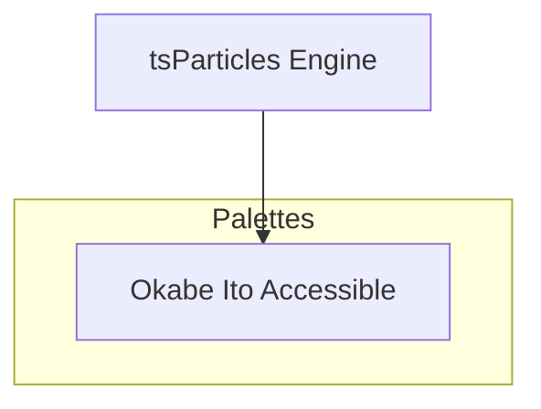

[](https://particles.js.org)

# tsParticles Okabe Ito Accessible Palette

[](https://www.jsdelivr.com/package/npm/@tsparticles/palette-okabe-ito-accessible) [](https://www.npmjs.com/package/@tsparticles/palette-okabe-ito-accessible) [](https://www.npmjs.com/package/@tsparticles/palette-okabe-ito-accessible) [](https://github.com/sponsors/matteobruni)

[tsParticles](https://github.com/tsparticles/tsparticles) palette for okabe ito accessible.

[](https://discord.gg/hACwv45Hme) [](https://t.me/tsparticles)

[](https://www.producthunt.com/posts/tsparticles?utm_source=badge-featured&utm_medium=badge&utm_souce=badge-tsparticles") <a href="https://www.buymeacoffee.com/matteobruni"></a>

## Sample

[](https://particles.js.org/samples/palettes/okabe-ito-accessible)

## Colors

<table>
  <tbody>
    <tr>
      <td align="center">
        <svg width="32" height="32" viewBox="0 0 32 32" xmlns="http://www.w3.org/2000/svg" role="img" aria-label="#E69F00"><rect width="32" height="32" fill="#E69F00" /></svg><br />
        <code>#E69F00</code>
      </td>
      <td align="center">
        <svg width="32" height="32" viewBox="0 0 32 32" xmlns="http://www.w3.org/2000/svg" role="img" aria-label="#56B4E9"><rect width="32" height="32" fill="#56B4E9" /></svg><br />
        <code>#56B4E9</code>
      </td>
      <td align="center">
        <svg width="32" height="32" viewBox="0 0 32 32" xmlns="http://www.w3.org/2000/svg" role="img" aria-label="#009E73"><rect width="32" height="32" fill="#009E73" /></svg><br />
        <code>#009E73</code>
      </td>
      <td align="center">
        <svg width="32" height="32" viewBox="0 0 32 32" xmlns="http://www.w3.org/2000/svg" role="img" aria-label="#F0E442"><rect width="32" height="32" fill="#F0E442" /></svg><br />
        <code>#F0E442</code>
      </td>
      <td align="center">
        <svg width="32" height="32" viewBox="0 0 32 32" xmlns="http://www.w3.org/2000/svg" role="img" aria-label="#0072B2"><rect width="32" height="32" fill="#0072B2" /></svg><br />
        <code>#0072B2</code>
      </td>
    </tr>
    <tr>
      <td align="center">
        <svg width="32" height="32" viewBox="0 0 32 32" xmlns="http://www.w3.org/2000/svg" role="img" aria-label="#D55E00"><rect width="32" height="32" fill="#D55E00" /></svg><br />
        <code>#D55E00</code>
      </td>
      <td align="center">
        <svg width="32" height="32" viewBox="0 0 32 32" xmlns="http://www.w3.org/2000/svg" role="img" aria-label="#CC79A7"><rect width="32" height="32" fill="#CC79A7" /></svg><br />
        <code>#CC79A7</code>
      </td>
      <td align="center">
        <svg width="32" height="32" viewBox="0 0 32 32" xmlns="http://www.w3.org/2000/svg" role="img" aria-label="#000000"><rect width="32" height="32" fill="#000000" /></svg><br />
        <code>#000000</code>
      </td>
    </tr>
    <tr>
      <td colspan="5" align="center">
        <svg width="40" height="40" viewBox="0 0 40 40" xmlns="http://www.w3.org/2000/svg" role="img" aria-label="#F7F7F7"><rect width="40" height="40" fill="#F7F7F7" /></svg><br />
        <strong>Background</strong><br />
        <code>#F7F7F7</code>
      </td>
    </tr>
    <tr>
      <td colspan="5" align="center">
        <strong>Blend mode:</strong> <code>source-over</code> | <strong>Fill:</strong> <code>true</code>
      </td>
    </tr>
  </tbody>
</table>

## Quick checklist

1. Install `@tsparticles/engine` (or use the CDN bundle below)
2. Call the package loader function(s) before `tsParticles.load(...)`
3. Apply the package options in your `tsParticles.load(...)` config

## How to use it

### CDN / Vanilla JS / jQuery

```html
<script src="https://cdn.jsdelivr.net/npm/@tsparticles/palette-okabe-ito-accessible@3/tsparticles.palette.okabe-ito-accessible.bundle.min.js"></script>
```

### Usage

Once the scripts are loaded you can set up `tsParticles` like this:

```javascript
(async () => {
  await loadOkabeItoAccessiblePalette(tsParticles);

  await tsParticles.load({
    id: "tsparticles",
    options: {
      palette: "okabe-ito-accessible",
    },
  });
})();
```

#### Customization

**Important ⚠️**
You can override all the options defining the properties like in any standard `tsParticles` installation.

```javascript
tsParticles.load({
  id: "tsparticles",
  options: {
    particles: {
      shape: {
        type: "square", // starting from v2, this require the square shape script
      },
    },
    palette: "okabe-ito-accessible",
  },
});
```

Like in the sample above, the circles will be replaced by squares.

### Frameworks with a tsParticles component library

Checkout the documentation in the component library repository and call the `loadOkabeItoAccessiblePalette` function instead of `loadFull`, `loadSlim` or similar functions.

The options shown above are valid for all the component libraries.

## Common pitfalls

- Calling `tsParticles.load(...)` before `loadOkabeItoAccessiblePalette(...)`
- Verify required peer packages before enabling advanced options
- Change one option group at a time to isolate regressions quickly

## Related docs

- Presets and palettes catalog: <https://github.com/tsparticles/palettes>
- Main docs: <https://particles.js.org/docs/>

---


