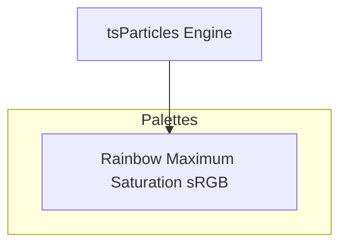

[](https://particles.js.org)

# tsParticles Rainbow Maximum Saturation sRGB Palette

[](https://www.jsdelivr.com/package/npm/@tsparticles/palette-rainbow) [](https://www.npmjs.com/package/@tsparticles/palette-rainbow) [](https://www.npmjs.com/package/@tsparticles/palette-rainbow) [](https://github.com/sponsors/matteobruni)

[tsParticles](https://github.com/tsparticles/tsparticles) palette for rainbow - maximum saturation srgb.

[](https://discord.gg/hACwv45Hme) [](https://t.me/tsparticles)

[](https://www.producthunt.com/posts/tsparticles?utm_source=badge-featured&utm_medium=badge&utm_souce=badge-tsparticles") <a href="https://www.buymeacoffee.com/matteobruni"></a>

## Sample

[](https://particles.js.org/samples/palettes/rainbow)

## Colors

<table>
  <tbody>
    <tr>
      <td align="center">
        <svg width="32" height="32" viewBox="0 0 32 32" xmlns="http://www.w3.org/2000/svg" role="img" aria-label="#FF0000"><rect width="32" height="32" fill="#FF0000" /></svg><br />
        <code>#FF0000</code>
      </td>
      <td align="center">
        <svg width="32" height="32" viewBox="0 0 32 32" xmlns="http://www.w3.org/2000/svg" role="img" aria-label="#FF1500"><rect width="32" height="32" fill="#FF1500" /></svg><br />
        <code>#FF1500</code>
      </td>
      <td align="center">
        <svg width="32" height="32" viewBox="0 0 32 32" xmlns="http://www.w3.org/2000/svg" role="img" aria-label="#FF2B00"><rect width="32" height="32" fill="#FF2B00" /></svg><br />
        <code>#FF2B00</code>
      </td>
      <td align="center">
        <svg width="32" height="32" viewBox="0 0 32 32" xmlns="http://www.w3.org/2000/svg" role="img" aria-label="#FF4000"><rect width="32" height="32" fill="#FF4000" /></svg><br />
        <code>#FF4000</code>
      </td>
      <td align="center">
        <svg width="32" height="32" viewBox="0 0 32 32" xmlns="http://www.w3.org/2000/svg" role="img" aria-label="#FF5500"><rect width="32" height="32" fill="#FF5500" /></svg><br />
        <code>#FF5500</code>
      </td>
    </tr>
    <tr>
      <td align="center">
        <svg width="32" height="32" viewBox="0 0 32 32" xmlns="http://www.w3.org/2000/svg" role="img" aria-label="#FF6A00"><rect width="32" height="32" fill="#FF6A00" /></svg><br />
        <code>#FF6A00</code>
      </td>
      <td align="center">
        <svg width="32" height="32" viewBox="0 0 32 32" xmlns="http://www.w3.org/2000/svg" role="img" aria-label="#FF8000"><rect width="32" height="32" fill="#FF8000" /></svg><br />
        <code>#FF8000</code>
      </td>
      <td align="center">
        <svg width="32" height="32" viewBox="0 0 32 32" xmlns="http://www.w3.org/2000/svg" role="img" aria-label="#FF9500"><rect width="32" height="32" fill="#FF9500" /></svg><br />
        <code>#FF9500</code>
      </td>
      <td align="center">
        <svg width="32" height="32" viewBox="0 0 32 32" xmlns="http://www.w3.org/2000/svg" role="img" aria-label="#FFAA00"><rect width="32" height="32" fill="#FFAA00" /></svg><br />
        <code>#FFAA00</code>
      </td>
      <td align="center">
        <svg width="32" height="32" viewBox="0 0 32 32" xmlns="http://www.w3.org/2000/svg" role="img" aria-label="#FFBF00"><rect width="32" height="32" fill="#FFBF00" /></svg><br />
        <code>#FFBF00</code>
      </td>
    </tr>
    <tr>
      <td align="center">
        <svg width="32" height="32" viewBox="0 0 32 32" xmlns="http://www.w3.org/2000/svg" role="img" aria-label="#FFD500"><rect width="32" height="32" fill="#FFD500" /></svg><br />
        <code>#FFD500</code>
      </td>
      <td align="center">
        <svg width="32" height="32" viewBox="0 0 32 32" xmlns="http://www.w3.org/2000/svg" role="img" aria-label="#FFEA00"><rect width="32" height="32" fill="#FFEA00" /></svg><br />
        <code>#FFEA00</code>
      </td>
      <td align="center">
        <svg width="32" height="32" viewBox="0 0 32 32" xmlns="http://www.w3.org/2000/svg" role="img" aria-label="#FFFF00"><rect width="32" height="32" fill="#FFFF00" /></svg><br />
        <code>#FFFF00</code>
      </td>
      <td align="center">
        <svg width="32" height="32" viewBox="0 0 32 32" xmlns="http://www.w3.org/2000/svg" role="img" aria-label="#EAFF00"><rect width="32" height="32" fill="#EAFF00" /></svg><br />
        <code>#EAFF00</code>
      </td>
      <td align="center">
        <svg width="32" height="32" viewBox="0 0 32 32" xmlns="http://www.w3.org/2000/svg" role="img" aria-label="#D4FF00"><rect width="32" height="32" fill="#D4FF00" /></svg><br />
        <code>#D4FF00</code>
      </td>
    </tr>
    <tr>
      <td align="center">
        <svg width="32" height="32" viewBox="0 0 32 32" xmlns="http://www.w3.org/2000/svg" role="img" aria-label="#BFFF00"><rect width="32" height="32" fill="#BFFF00" /></svg><br />
        <code>#BFFF00</code>
      </td>
      <td align="center">
        <svg width="32" height="32" viewBox="0 0 32 32" xmlns="http://www.w3.org/2000/svg" role="img" aria-label="#AAFF00"><rect width="32" height="32" fill="#AAFF00" /></svg><br />
        <code>#AAFF00</code>
      </td>
      <td align="center">
        <svg width="32" height="32" viewBox="0 0 32 32" xmlns="http://www.w3.org/2000/svg" role="img" aria-label="#95FF00"><rect width="32" height="32" fill="#95FF00" /></svg><br />
        <code>#95FF00</code>
      </td>
      <td align="center">
        <svg width="32" height="32" viewBox="0 0 32 32" xmlns="http://www.w3.org/2000/svg" role="img" aria-label="#80FF00"><rect width="32" height="32" fill="#80FF00" /></svg><br />
        <code>#80FF00</code>
      </td>
      <td align="center">
        <svg width="32" height="32" viewBox="0 0 32 32" xmlns="http://www.w3.org/2000/svg" role="img" aria-label="#6AFF00"><rect width="32" height="32" fill="#6AFF00" /></svg><br />
        <code>#6AFF00</code>
      </td>
    </tr>
    <tr>
      <td align="center">
        <svg width="32" height="32" viewBox="0 0 32 32" xmlns="http://www.w3.org/2000/svg" role="img" aria-label="#55FF00"><rect width="32" height="32" fill="#55FF00" /></svg><br />
        <code>#55FF00</code>
      </td>
      <td align="center">
        <svg width="32" height="32" viewBox="0 0 32 32" xmlns="http://www.w3.org/2000/svg" role="img" aria-label="#40FF00"><rect width="32" height="32" fill="#40FF00" /></svg><br />
        <code>#40FF00</code>
      </td>
      <td align="center">
        <svg width="32" height="32" viewBox="0 0 32 32" xmlns="http://www.w3.org/2000/svg" role="img" aria-label="#2BFF00"><rect width="32" height="32" fill="#2BFF00" /></svg><br />
        <code>#2BFF00</code>
      </td>
      <td align="center">
        <svg width="32" height="32" viewBox="0 0 32 32" xmlns="http://www.w3.org/2000/svg" role="img" aria-label="#15FF00"><rect width="32" height="32" fill="#15FF00" /></svg><br />
        <code>#15FF00</code>
      </td>
      <td align="center">
        <svg width="32" height="32" viewBox="0 0 32 32" xmlns="http://www.w3.org/2000/svg" role="img" aria-label="#00FF00"><rect width="32" height="32" fill="#00FF00" /></svg><br />
        <code>#00FF00</code>
      </td>
    </tr>
    <tr>
      <td align="center">
        <svg width="32" height="32" viewBox="0 0 32 32" xmlns="http://www.w3.org/2000/svg" role="img" aria-label="#00FF15"><rect width="32" height="32" fill="#00FF15" /></svg><br />
        <code>#00FF15</code>
      </td>
      <td align="center">
        <svg width="32" height="32" viewBox="0 0 32 32" xmlns="http://www.w3.org/2000/svg" role="img" aria-label="#00FF2A"><rect width="32" height="32" fill="#00FF2A" /></svg><br />
        <code>#00FF2A</code>
      </td>
      <td align="center">
        <svg width="32" height="32" viewBox="0 0 32 32" xmlns="http://www.w3.org/2000/svg" role="img" aria-label="#00FF40"><rect width="32" height="32" fill="#00FF40" /></svg><br />
        <code>#00FF40</code>
      </td>
      <td align="center">
        <svg width="32" height="32" viewBox="0 0 32 32" xmlns="http://www.w3.org/2000/svg" role="img" aria-label="#00FF55"><rect width="32" height="32" fill="#00FF55" /></svg><br />
        <code>#00FF55</code>
      </td>
      <td align="center">
        <svg width="32" height="32" viewBox="0 0 32 32" xmlns="http://www.w3.org/2000/svg" role="img" aria-label="#00FF6A"><rect width="32" height="32" fill="#00FF6A" /></svg><br />
        <code>#00FF6A</code>
      </td>
    </tr>
    <tr>
      <td align="center">
        <svg width="32" height="32" viewBox="0 0 32 32" xmlns="http://www.w3.org/2000/svg" role="img" aria-label="#00FF80"><rect width="32" height="32" fill="#00FF80" /></svg><br />
        <code>#00FF80</code>
      </td>
      <td align="center">
        <svg width="32" height="32" viewBox="0 0 32 32" xmlns="http://www.w3.org/2000/svg" role="img" aria-label="#00FF95"><rect width="32" height="32" fill="#00FF95" /></svg><br />
        <code>#00FF95</code>
      </td>
      <td align="center">
        <svg width="32" height="32" viewBox="0 0 32 32" xmlns="http://www.w3.org/2000/svg" role="img" aria-label="#00FFAA"><rect width="32" height="32" fill="#00FFAA" /></svg><br />
        <code>#00FFAA</code>
      </td>
      <td align="center">
        <svg width="32" height="32" viewBox="0 0 32 32" xmlns="http://www.w3.org/2000/svg" role="img" aria-label="#00FFBF"><rect width="32" height="32" fill="#00FFBF" /></svg><br />
        <code>#00FFBF</code>
      </td>
      <td align="center">
        <svg width="32" height="32" viewBox="0 0 32 32" xmlns="http://www.w3.org/2000/svg" role="img" aria-label="#00FFD5"><rect width="32" height="32" fill="#00FFD5" /></svg><br />
        <code>#00FFD5</code>
      </td>
    </tr>
    <tr>
      <td align="center">
        <svg width="32" height="32" viewBox="0 0 32 32" xmlns="http://www.w3.org/2000/svg" role="img" aria-label="#00FFEA"><rect width="32" height="32" fill="#00FFEA" /></svg><br />
        <code>#00FFEA</code>
      </td>
      <td align="center">
        <svg width="32" height="32" viewBox="0 0 32 32" xmlns="http://www.w3.org/2000/svg" role="img" aria-label="#00FFFF"><rect width="32" height="32" fill="#00FFFF" /></svg><br />
        <code>#00FFFF</code>
      </td>
      <td align="center">
        <svg width="32" height="32" viewBox="0 0 32 32" xmlns="http://www.w3.org/2000/svg" role="img" aria-label="#00EAFF"><rect width="32" height="32" fill="#00EAFF" /></svg><br />
        <code>#00EAFF</code>
      </td>
      <td align="center">
        <svg width="32" height="32" viewBox="0 0 32 32" xmlns="http://www.w3.org/2000/svg" role="img" aria-label="#00D5FF"><rect width="32" height="32" fill="#00D5FF" /></svg><br />
        <code>#00D5FF</code>
      </td>
      <td align="center">
        <svg width="32" height="32" viewBox="0 0 32 32" xmlns="http://www.w3.org/2000/svg" role="img" aria-label="#00BFFF"><rect width="32" height="32" fill="#00BFFF" /></svg><br />
        <code>#00BFFF</code>
      </td>
    </tr>
    <tr>
      <td align="center">
        <svg width="32" height="32" viewBox="0 0 32 32" xmlns="http://www.w3.org/2000/svg" role="img" aria-label="#00AAFF"><rect width="32" height="32" fill="#00AAFF" /></svg><br />
        <code>#00AAFF</code>
      </td>
      <td align="center">
        <svg width="32" height="32" viewBox="0 0 32 32" xmlns="http://www.w3.org/2000/svg" role="img" aria-label="#0095FF"><rect width="32" height="32" fill="#0095FF" /></svg><br />
        <code>#0095FF</code>
      </td>
      <td align="center">
        <svg width="32" height="32" viewBox="0 0 32 32" xmlns="http://www.w3.org/2000/svg" role="img" aria-label="#0080FF"><rect width="32" height="32" fill="#0080FF" /></svg><br />
        <code>#0080FF</code>
      </td>
      <td align="center">
        <svg width="32" height="32" viewBox="0 0 32 32" xmlns="http://www.w3.org/2000/svg" role="img" aria-label="#006AFF"><rect width="32" height="32" fill="#006AFF" /></svg><br />
        <code>#006AFF</code>
      </td>
      <td align="center">
        <svg width="32" height="32" viewBox="0 0 32 32" xmlns="http://www.w3.org/2000/svg" role="img" aria-label="#0055FF"><rect width="32" height="32" fill="#0055FF" /></svg><br />
        <code>#0055FF</code>
      </td>
    </tr>
    <tr>
      <td align="center">
        <svg width="32" height="32" viewBox="0 0 32 32" xmlns="http://www.w3.org/2000/svg" role="img" aria-label="#0040FF"><rect width="32" height="32" fill="#0040FF" /></svg><br />
        <code>#0040FF</code>
      </td>
      <td align="center">
        <svg width="32" height="32" viewBox="0 0 32 32" xmlns="http://www.w3.org/2000/svg" role="img" aria-label="#002AFF"><rect width="32" height="32" fill="#002AFF" /></svg><br />
        <code>#002AFF</code>
      </td>
      <td align="center">
        <svg width="32" height="32" viewBox="0 0 32 32" xmlns="http://www.w3.org/2000/svg" role="img" aria-label="#0015FF"><rect width="32" height="32" fill="#0015FF" /></svg><br />
        <code>#0015FF</code>
      </td>
      <td align="center">
        <svg width="32" height="32" viewBox="0 0 32 32" xmlns="http://www.w3.org/2000/svg" role="img" aria-label="#0000FF"><rect width="32" height="32" fill="#0000FF" /></svg><br />
        <code>#0000FF</code>
      </td>
      <td align="center">
        <svg width="32" height="32" viewBox="0 0 32 32" xmlns="http://www.w3.org/2000/svg" role="img" aria-label="#1500FF"><rect width="32" height="32" fill="#1500FF" /></svg><br />
        <code>#1500FF</code>
      </td>
    </tr>
    <tr>
      <td align="center">
        <svg width="32" height="32" viewBox="0 0 32 32" xmlns="http://www.w3.org/2000/svg" role="img" aria-label="#2B00FF"><rect width="32" height="32" fill="#2B00FF" /></svg><br />
        <code>#2B00FF</code>
      </td>
      <td align="center">
        <svg width="32" height="32" viewBox="0 0 32 32" xmlns="http://www.w3.org/2000/svg" role="img" aria-label="#4000FF"><rect width="32" height="32" fill="#4000FF" /></svg><br />
        <code>#4000FF</code>
      </td>
      <td align="center">
        <svg width="32" height="32" viewBox="0 0 32 32" xmlns="http://www.w3.org/2000/svg" role="img" aria-label="#5500FF"><rect width="32" height="32" fill="#5500FF" /></svg><br />
        <code>#5500FF</code>
      </td>
      <td align="center">
        <svg width="32" height="32" viewBox="0 0 32 32" xmlns="http://www.w3.org/2000/svg" role="img" aria-label="#6A00FF"><rect width="32" height="32" fill="#6A00FF" /></svg><br />
        <code>#6A00FF</code>
      </td>
      <td align="center">
        <svg width="32" height="32" viewBox="0 0 32 32" xmlns="http://www.w3.org/2000/svg" role="img" aria-label="#8000FF"><rect width="32" height="32" fill="#8000FF" /></svg><br />
        <code>#8000FF</code>
      </td>
    </tr>
    <tr>
      <td align="center">
        <svg width="32" height="32" viewBox="0 0 32 32" xmlns="http://www.w3.org/2000/svg" role="img" aria-label="#9500FF"><rect width="32" height="32" fill="#9500FF" /></svg><br />
        <code>#9500FF</code>
      </td>
      <td align="center">
        <svg width="32" height="32" viewBox="0 0 32 32" xmlns="http://www.w3.org/2000/svg" role="img" aria-label="#AA00FF"><rect width="32" height="32" fill="#AA00FF" /></svg><br />
        <code>#AA00FF</code>
      </td>
      <td align="center">
        <svg width="32" height="32" viewBox="0 0 32 32" xmlns="http://www.w3.org/2000/svg" role="img" aria-label="#BF00FF"><rect width="32" height="32" fill="#BF00FF" /></svg><br />
        <code>#BF00FF</code>
      </td>
      <td align="center">
        <svg width="32" height="32" viewBox="0 0 32 32" xmlns="http://www.w3.org/2000/svg" role="img" aria-label="#D400FF"><rect width="32" height="32" fill="#D400FF" /></svg><br />
        <code>#D400FF</code>
      </td>
      <td align="center">
        <svg width="32" height="32" viewBox="0 0 32 32" xmlns="http://www.w3.org/2000/svg" role="img" aria-label="#EA00FF"><rect width="32" height="32" fill="#EA00FF" /></svg><br />
        <code>#EA00FF</code>
      </td>
    </tr>
    <tr>
      <td align="center">
        <svg width="32" height="32" viewBox="0 0 32 32" xmlns="http://www.w3.org/2000/svg" role="img" aria-label="#FF00FF"><rect width="32" height="32" fill="#FF00FF" /></svg><br />
        <code>#FF00FF</code>
      </td>
      <td align="center">
        <svg width="32" height="32" viewBox="0 0 32 32" xmlns="http://www.w3.org/2000/svg" role="img" aria-label="#FF00EA"><rect width="32" height="32" fill="#FF00EA" /></svg><br />
        <code>#FF00EA</code>
      </td>
      <td align="center">
        <svg width="32" height="32" viewBox="0 0 32 32" xmlns="http://www.w3.org/2000/svg" role="img" aria-label="#FF00D4"><rect width="32" height="32" fill="#FF00D4" /></svg><br />
        <code>#FF00D4</code>
      </td>
      <td align="center">
        <svg width="32" height="32" viewBox="0 0 32 32" xmlns="http://www.w3.org/2000/svg" role="img" aria-label="#FF00BF"><rect width="32" height="32" fill="#FF00BF" /></svg><br />
        <code>#FF00BF</code>
      </td>
      <td align="center">
        <svg width="32" height="32" viewBox="0 0 32 32" xmlns="http://www.w3.org/2000/svg" role="img" aria-label="#FF00AA"><rect width="32" height="32" fill="#FF00AA" /></svg><br />
        <code>#FF00AA</code>
      </td>
    </tr>
    <tr>
      <td align="center">
        <svg width="32" height="32" viewBox="0 0 32 32" xmlns="http://www.w3.org/2000/svg" role="img" aria-label="#FF0095"><rect width="32" height="32" fill="#FF0095" /></svg><br />
        <code>#FF0095</code>
      </td>
      <td align="center">
        <svg width="32" height="32" viewBox="0 0 32 32" xmlns="http://www.w3.org/2000/svg" role="img" aria-label="#FF0080"><rect width="32" height="32" fill="#FF0080" /></svg><br />
        <code>#FF0080</code>
      </td>
      <td align="center">
        <svg width="32" height="32" viewBox="0 0 32 32" xmlns="http://www.w3.org/2000/svg" role="img" aria-label="#FF006A"><rect width="32" height="32" fill="#FF006A" /></svg><br />
        <code>#FF006A</code>
      </td>
      <td align="center">
        <svg width="32" height="32" viewBox="0 0 32 32" xmlns="http://www.w3.org/2000/svg" role="img" aria-label="#FF0055"><rect width="32" height="32" fill="#FF0055" /></svg><br />
        <code>#FF0055</code>
      </td>
      <td align="center">
        <svg width="32" height="32" viewBox="0 0 32 32" xmlns="http://www.w3.org/2000/svg" role="img" aria-label="#FF0040"><rect width="32" height="32" fill="#FF0040" /></svg><br />
        <code>#FF0040</code>
      </td>
    </tr>
    <tr>
      <td align="center">
        <svg width="32" height="32" viewBox="0 0 32 32" xmlns="http://www.w3.org/2000/svg" role="img" aria-label="#FF002B"><rect width="32" height="32" fill="#FF002B" /></svg><br />
        <code>#FF002B</code>
      </td>
      <td align="center">
        <svg width="32" height="32" viewBox="0 0 32 32" xmlns="http://www.w3.org/2000/svg" role="img" aria-label="#FF0015"><rect width="32" height="32" fill="#FF0015" /></svg><br />
        <code>#FF0015</code>
      </td>
    </tr>
    <tr>
      <td colspan="5" align="center">
        <svg width="40" height="40" viewBox="0 0 40 40" xmlns="http://www.w3.org/2000/svg" role="img" aria-label="#000000"><rect width="40" height="40" fill="#000000" /></svg><br />
        <strong>Background</strong><br />
        <code>#000000</code>
      </td>
    </tr>
    <tr>
      <td colspan="5" align="center">
        <strong>Blend mode:</strong> <code>screen</code> | <strong>Fill:</strong> <code>true</code>
      </td>
    </tr>
  </tbody>
</table>

## Quick checklist

1. Install `@tsparticles/engine` (or use the CDN bundle below)
2. Call the package loader function(s) before `tsParticles.load(...)`
3. Apply the package options in your `tsParticles.load(...)` config

## How to use it

### CDN / Vanilla JS / jQuery

```html
<script src="https://cdn.jsdelivr.net/npm/@tsparticles/palette-rainbow@3/tsparticles.palette.rainbow.bundle.min.js"></script>
```

### Usage

Once the scripts are loaded you can set up `tsParticles` like this:

```javascript
(async () => {
  await loadRainbowPalette(tsParticles);

  await tsParticles.load({
    id: "tsparticles",
    options: {
      palette: "rainbow",
    },
  });
})();
```

#### Customization

**Important ⚠️**
You can override all the options defining the properties like in any standard `tsParticles` installation.

```javascript
tsParticles.load({
  id: "tsparticles",
  options: {
    particles: {
      shape: {
        type: "square", // starting from v2, this require the square shape script
      },
    },
    palette: "rainbow",
  },
});
```

Like in the sample above, the circles will be replaced by squares.

### Frameworks with a tsParticles component library

Checkout the documentation in the component library repository and call the `loadRainbowPalette` function instead of `loadFull`, `loadSlim` or similar functions.

The options shown above are valid for all the component libraries.

## Common pitfalls

- Calling `tsParticles.load(...)` before `loadRainbowPalette(...)`
- Verify required peer packages before enabling advanced options
- Change one option group at a time to isolate regressions quickly

## Related docs

- Presets and palettes catalog: <https://github.com/tsparticles/palettes>
- Main docs: <https://particles.js.org/docs/>

---


