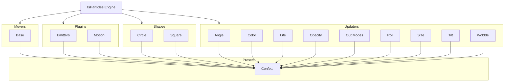

[](https://particles.js.org)

# tsParticles Confetti Preset

[](https://www.jsdelivr.com/package/npm/tsparticles-preset-confetti) [](https://www.npmjs.com/package/tsparticles-preset-confetti) [](https://www.npmjs.com/package/tsparticles-preset-confetti) [](https://github.com/sponsors/matteobruni)

[tsParticles](https://github.com/matteobruni/tsparticles) preset for white and red confetti launched from the screen
center on a transparent background.

[](https://join.slack.com/t/tsparticles/shared_invite/enQtOTcxNTQxNjQ4NzkxLWE2MTZhZWExMWRmOWI5MTMxNjczOGE1Yjk0MjViYjdkYTUzODM3OTc5MGQ5MjFlODc4MzE0N2Q1OWQxZDc1YzI) [](https://discord.gg/hACwv45Hme) [](https://t.me/tsparticles)

[](https://www.producthunt.com/posts/tsparticles?utm_source=badge-featured&utm_medium=badge&utm_souce=badge-tsparticles") <a href="https://www.buymeacoffee.com/matteobruni"></a>

## Sample

[](https://particles.js.org/samples/presets/confetti)

## How to use it

### CDN / Vanilla JS / jQuery

The first step is installing [tsParticles](https://github.com/matteobruni/tsparticles) following the instructions for
vanilla javascript in the main project [here](https://github.com/matteobruni/tsparticles)

Once added the script you need one more script to be included in your page (or you can download that
from [jsDelivr](https://www.jsdelivr.com/package/npm/tsparticles-preset-confetti):

```html
<script src="https://cdn.jsdelivr.net/npm/tsparticles-engine@2/tsparticles.engine.min.js"></script>
<script src="https://cdn.jsdelivr.net/npm/tsparticles-move-base@2/tsparticles.move.base.min.js"></script>
<script src="https://cdn.jsdelivr.net/npm/tsparticles-plugin-emitters@2/tsparticles.plugin.emitters.min.js"></script>
<script src="https://cdn.jsdelivr.net/npm/tsparticles-shape-circle@2/tsparticles.shape.circle.min.js"></script>
<script src="https://cdn.jsdelivr.net/npm/tsparticles-shape-square@2/tsparticles.shape.square.min.js"></script>
<script src="https://cdn.jsdelivr.net/npm/tsparticles-updater-angle@2/tsparticles.updater.angle.min.js"></script>
<script src="https://cdn.jsdelivr.net/npm/tsparticles-updater-color@2/tsparticles.updater.color.min.js"></script>
<script src="https://cdn.jsdelivr.net/npm/tsparticles-updater-life@2/tsparticles.updater.life.min.js"></script>
<script src="https://cdn.jsdelivr.net/npm/tsparticles-updater-opacity@2/tsparticles.updater.opacity.min.js"></script>
<script src="https://cdn.jsdelivr.net/npm/tsparticles-updater-out-modes@2/tsparticles.updater.out-modes.min.js"></script>
<script src="https://cdn.jsdelivr.net/npm/tsparticles-updater-roll@2/tsparticles.updater.roll.min.js"></script>
<script src="https://cdn.jsdelivr.net/npm/tsparticles-updater-size@2/tsparticles.updater.size.min.js"></script>
<script src="https://cdn.jsdelivr.net/npm/tsparticles-updater-tilt@2/tsparticles.updater.tilt.min.js"></script>
<script src="https://cdn.jsdelivr.net/npm/tsparticles-updater-wobble@2/tsparticles.updater.wobble.min.js"></script>
<script src="https://cdn.jsdelivr.net/npm/tsparticles-preset-confetti@2/tsparticles.preset.confetti.min.js"></script>
```

#### Bundle

A bundled script can also be used, this will include every needed plugin needed by the preset.

```html
<script src="https://cdn.jsdelivr.net/npm/tsparticles-preset-confetti@2/tsparticles.preset.confetti.bundle.min.js"></script>
```

### Usage

Once the scripts are loaded you can set up `tsParticles` like this:

```javascript
(async () => {
  await loadConfettiPreset(tsParticles); // this is required only if you are not using the bundle script

  await tsParticles.load("tsparticles", {
    preset: "confetti",
  });
})();
```

### Customization

```javascript
tsParticles.load("tsparticles", {
  particles: {
    color: {
      value: ["#0000ff", "#00ff00"],
    },
  },
  preset: "confetti",
});
```

Like in the sample above, the white and red colors will be replaced by blue and lime.

#### Cannons

The preset has a single life cannon, with a short duration. The effect is immediate and ends few seconds after, but this
can be customized too.

The confetti cannons are made using the _Emitter_ plugin, which is already
documented [here](https://particles.js.org/docs/classes/Plugins_Emitters_Options_Classes_Emitter.Emitter.html).

These are the default cannon (emitter) options:

The default emitter options are these:

```json
{
  "startCount": 50,
  "position": {
    "x": 50,
    "y": 50
  },
  "size": {
    "width": 0,
    "height": 0
  },
  "rate": {
    "delay": 0,
    "quantity": 0
  },
  "life": {
    "duration": 0.1,
    "count": 1
  }
}
```

Let's see how to create the most common types of cannon animations:

##### Long lasting Cannon

To create a long-lasting cannon, the emitter life options need some changes.

The `life.duration` needs to be increased, the value is in `seconds`, so actually it lasts one tenth of a second.

If `life.duration` is set to `0`, the cannon will last forever.

The `life.count` parameter instead can be changed as well, but the animation will last for the specified
duration, `life.count` times, if the `life.duration` is set to `0`, the `life.count` is ignored since its first life
will last forever.

###### Sample

```javascript
tsParticles.load("tsparticles", {
  emitters: {
    life: {
      duration: 0,
    },
  },
  preset: "confetti",
});
```

This will create an infinite cannon shooting confetti from the center of the canvas.

##### Immortal Cannon - Fireworks

To create a fireworks effect, or an immortal cannon, the emitter life options, again, need some changes.

The `life.duration` can be kept to the default short value, but the `life.count` is what we need to change.

For an immortal cannon we can change `life.count` to `0` and the emitter will continue respawning every `life.delay`
seconds. Actually is not specified, if you want some delay between "explosions", set this value to something greater
than `0`.

For an improved effect, the `position` as well can be customized. For randomizing it, it can be set to `{}`, and it'll
have a random position every "explosion". If a coordinate is set, that will be used everytime, as a percentage of the
canvas size.

```javascript
tsParticles.load("tsparticles", {
  emitters: {
    life: {
      count: 0,
    },
    position: {
      // uncomment only one of these lines,
      // to have explosions on the x or y axis
      // centered on the other one
      // if everything is kept commented,
      // random positions will be used everytime the cannon fires
      // x: 50,
      // y: 50
    },
  },
  preset: "confetti",
});
```

###### Multiple Cannons

Now that we have played with a single cannon, what about multiple ones?

This needs more customization since the cannons array will overwrite the existing options.

First let's start overriding the emitters (cannons) options placing an array instead of an object.

Like this:

```javascript
tsParticles.load("tsparticles", {
  emitters: [],
  preset: "confetti",
});
```

If you test this, you won't see anything, because the emitters are set to an empty array, so there's nothing to show.

Now you can add emitters to the array, using the standard tsParticles emitters options.

###### Sample

```javascript
tsParticles.load("tsparticles", {
  emitters: [
    {
      life: {
        duration: 5,
        count: 1,
      },
      position: {
        x: 0,
        y: 30,
      },
      particles: {
        move: {
          direction: "top-right",
        },
      },
    },
    {
      life: {
        duration: 5,
        count: 1,
      },
      position: {
        x: 100,
        y: 30,
      },
      particles: {
        move: {
          direction: "top-left",
        },
      },
    },
  ],
  preset: "confetti",
});
```

This samples creates two cannons, one on the left and one on the right of the canvas, at 30% of canvas height, shooting
in opposite directions.

### React.js / Preact / Inferno

_The syntax for `React.js`, `Preact` and `Inferno` is the same_.

This sample uses the class component syntax, but you can use hooks as well (if the library supports it).

```typescript jsx
import Particles from "react-particles";
import type { Engine } from "tsparticles-engine";
import { loadConfettiPreset } from "tsparticles-preset-confetti";

export class ParticlesContainer extends React.PureComponent<IProps> {
  // this customizes the component tsParticles installation
  async customInit(engine: Engine): Promise<void> {
    // this adds the preset to tsParticles, you can safely use the
    await loadConfettiPreset(engine);
  }

  render() {
    const options = {
      preset: "confetti",
    };

    return <Particles options={options} init={this.customInit} />;
  }
}
```

### Vue (2.x and 3.x)

_The syntax for `Vue.js 2.x` and `3.x` is the same_

```vue
<Particles id="tsparticles" :particlesInit="particlesInit" :options="particlesOptions" />
```

```ts
const particlesOptions = {
  preset: "confetti",
};

async function particlesInit(engine: Engine): Promise<void> {
  await loadConfettiPreset(engine);
}
```

### Angular

```html
<angular-particles [id]="id" [options]="particlesOptions" [particlesInit]="particlesInit"></angular-particles>
```

```ts
const particlesOptions = {
  preset: "confetti",
};

async function particlesInit(engine: Engine): Promise<void> {
  await loadConfettiPreset(engine);
}
```

### Svelte

```sveltehtml

<Particles
        id="tsparticles"
        options={options}
        particlesInit={particlesInit}
/>
```

```js
let particlesOptions = {
  preset: "confetti",
};

let particlesInit = async (engine) => {
  await loadConfettiPreset(engine);
};
```

### Alternative Usage

This module exports another method for using the confetti preset

```javascript
confetti("tsparticles", {
  /**
   * @deprecated use count property instead
   */
  particleCount: 50,
  /**
   * @deprecated use position property instead
   */
  origin: {
    x: 50,
    y: 50,
  },
  //------------------------------------------
  angle: 90,
  count: 50,
  position: {
    x: 50,
    y: 50,
  },
  spread: 45,
  startVelocity: 45,
  decay: 0.9,
  gravity: 1,
  drift: 0,
  ticks: 200,
  colors: ["#ffffff", "#ff0000"],
  shapes: ["square", "circle"],
  scalar: 1,
  zIndex: 100,
  disableForReducedMotion: true,
});
```

This method doesn't need to call the `loadConfettiPreset` method since it's called automatically.

#### Customization

**Important ⚠️**
You can override all the options defining the properties like in any standard `tsParticles` installation. This works
only with the classic `loadConfettiPreset` method, the `confetti` function has its own parameters.

#### Options

The `confetti` first parameter is the `tsParticles` container id and the second parameter is a single `options` object,
which has the following properties:

- `count` _Integer (default: 50)_: The number of confetti to launch. More is always fun... but be cool, there's a lot of
  math involved. (`particleCount` can be used too, but it's deprecated)
- `angle` _Number (default: 90)_: The angle in which to launch the confetti, in degrees: 90 is straight up.
- `spread` _Number (default: 45)_: How far off center the confetti can go, in degrees. 45 means the confetti will launch
  at the defined `angle` plus or minus 22.5 degrees.
- `startVelocity` _Number (default: 45)_: How fast the confetti will start going, in pixels.
- `decay` _Number (default: 0.9)_: How quickly the confetti will lose speed. Keep this number between 0 and 1, otherwise
  the confetti will gain speed. Better yet, just never change it.
- `gravity` _Number (default: 1)_: How quickly the particles are pulled down: 1 is full gravity, 0.5 is half gravity,
  etc., but there are no limits. You can even make particles go up if you'd like.
- `drift` _Number (default: 0)_: How much to the side the confetti will drift. The default is 0, meaning that they will
  fall straight down. Use a negative number for left and positive number for right.
- `ticks` _Number (default: 200)_: How many times the confetti will move. This is abstract... but play with it if the
  confetti disappear too quickly for you.
- `position` _Object_: Where to start firing confetti from. Feel free to launch off-screen if you'd like. (`origin` can
  be used too, but it's deprecated)
  - `position.x` _Number (default: 0.5)_: The `x` position on the page, with `0` being the left edge and `1` being the
    right edge.
  - `position.y` _Number (default: 0.5)_: The `y` position on the page, with `0` being the top edge and `1` being the
    bottom edge.
- `colors` _Array&lt;String&gt;_: An array of color strings, in the HEX format... you know, like `#bada55`.
- `shapes` _Array&lt;String&gt;_: An array of shapes for the confetti. The possible values are `square` and `circle`.
  The default is to use both shapes in an even mix. You can even change the mix by providing a value such
  as `['circle', 'circle', 'square']` to use two third circles and one third squares.
- `scalar` _Number (default: 1)_: Scale factor for each confetti particle. Use decimals to make the confetti smaller. Go
  on, try teeny tiny confetti, they are adorable!
- `zIndex` _Integer (default: 100)_: The confetti should be on top, after all. But if you have a crazy high page, you
  can set it even higher.
- `disableForReducedMotion` _Boolean (default: true)_: Disables confetti entirely for users
  that [prefer reduced motion](https://developer.mozilla.org/en-US/docs/Web/CSS/@media/prefers-reduced-motion).

---


