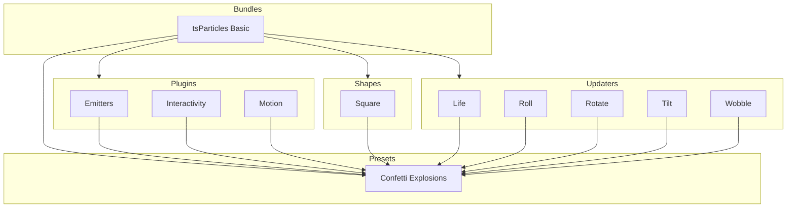

[](https://particles.js.org)

# tsParticles Confetti Explosions Preset

[](https://www.jsdelivr.com/package/npm/@tsparticles/preset-confetti-explosions) [](https://www.npmjs.com/package/@tsparticles/preset-confetti-explosions) [](https://www.npmjs.com/package/@tsparticles/preset-confetti-explosions) [](https://github.com/sponsors/matteobruni)

[tsParticles](https://github.com/tsparticles/tsparticles) preset for confetti launched from a draggable explosions, using
the [confetti palette](https://github.com/tsparticles/presets/tree/main/palettes/confetti#readme).

[](https://discord.gg/hACwv45Hme) [](https://t.me/tsparticles)

[](https://www.producthunt.com/posts/tsparticles?utm_source=badge-featured&utm_medium=badge&utm_souce=badge-tsparticles") <a href="https://www.buymeacoffee.com/matteobruni"></a>

## Sample

[](https://particles.js.org/samples/presets/confettiExplosions)

## Quick checklist

1. Install `@tsparticles/engine` (or use the CDN bundle below)
2. Call `loadConfettiExplosionsPreset(engine)` **before** `tsParticles.load(...)`
3. Set `preset: "confettiExplosions"` in options

## How to use it

### CDN / Vanilla JS / jQuery

```html
<script src="https://cdn.jsdelivr.net/npm/@tsparticles/preset-confetti-explosions@4/tsparticles.preset.confettiExplosions.bundle.min.js"></script>
```

### Usage

Once the scripts are loaded you can set up `tsParticles` like this:

```javascript
(async engine => {
  await loadConfettiExplosionsPreset(engine);

  await engine.load({
    options: {
      preset: "confettiExplosions", // or "confetti-explosions"
    },
  });
})(tsParticles);
```

### Customization

```javascript
tsParticles.load({
  id: "tsparticles",
  options: {
    particles: {
      color: {
        value: ["#0000ff", "#00ff00"],
      },
    },
    preset: "confettiExplosions", // or "confetti-explosions"
  },
});
```

Like in the sample above, the white and red colors will be replaced by blue and lime.

### Frameworks with a tsParticles component library

Checkout the documentation in the component library repository and call the `loadConfettiExplosionsPreset` function instead
of `loadFull`, `loadSlim` or similar functions.

The options shown above are valid for all the component libraries.

### Common pitfalls

- Calling `tsParticles.load(...)` before `loadConfettiExplosionsPreset(engine)`
- Overriding `emitters` with an empty array and expecting default explosion behavior
- Setting `life.count` to `1` but forgetting that `life.duration` controls how long the explosion lasts

## Related docs

- All presets catalog: <https://github.com/tsparticles/presets>
- Emitter options: <https://particles.js.org/docs/classes/Plugins_Emitters_Options_Classes_Emitter.Emitter.html>
- Main tsParticles docs: <https://particles.js.org/docs/>

---


