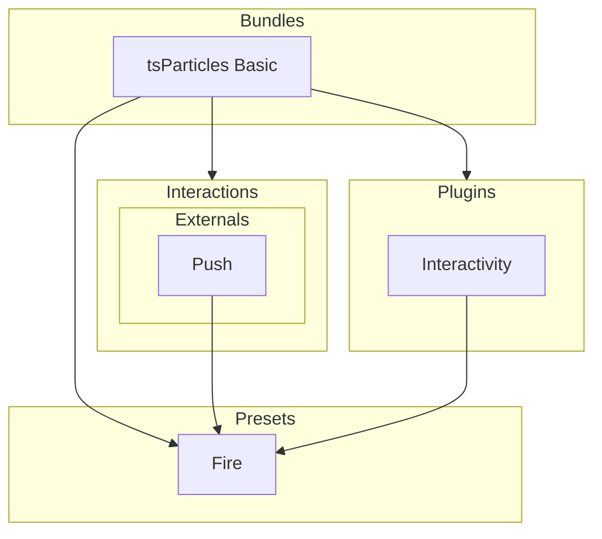

[](https://particles.js.org)

# tsParticles Fire Preset

[](https://www.jsdelivr.com/package/npm/@tsparticles/preset-fire) [](https://www.npmjs.com/package/@tsparticles/preset-fire) [](https://www.npmjs.com/package/@tsparticles/preset-fire) [](https://github.com/sponsors/matteobruni)

[tsParticles](https://github.com/tsparticles/tsparticles) preset for a faded red to black background with particles
colored like fire and ash sparks.

[](https://discord.gg/hACwv45Hme) [](https://t.me/tsparticles)

[](https://www.producthunt.com/posts/tsparticles?utm_source=badge-featured&utm_medium=badge&utm_souce=badge-tsparticles") <a href="https://www.buymeacoffee.com/matteobruni"></a>

## Sample

[](https://particles.js.org/samples/presets/fire)

## Quick checklist

1. Install `@tsparticles/engine` (or use the CDN bundle below)
2. Call `loadFirePreset(tsParticles)` **before** `tsParticles.load(...)`
3. Set `preset: "fire"` in options

## How to use it

### CDN / Vanilla JS / jQuery

```html
<script src="https://cdn.jsdelivr.net/npm/@tsparticles/preset-fire@3/tsparticles.preset.fire.bundle.min.js"></script>
```

### Usage

Once the scripts are loaded you can set up `tsParticles` like this:

```javascript
(async () => {
  await loadFirePreset(tsParticles);

  await tsParticles.load({
    id: "tsparticles",
    options: {
      preset: "fire",
    },
  });
})();
```

#### Customization

**Important ⚠️**
You can override all the options defining the properties like in any standard `tsParticles` installation.

```javascript
tsParticles.load({
  id: "tsparticles",
  options: {
    particles: {
      shape: {
        type: "square", // starting from v2, this require the square shape script
      },
    },
    preset: "fire",
  },
});
```

Like in the sample above, the circles will be replaced by squares.

### Frameworks with a tsParticles component library

Checkout the documentation in the component library repository and call the `loadFirePreset` function instead of `loadFull`, `loadSlim` or similar functions.

The options shown above are valid for all the component libraries.

## Common pitfalls

- Calling `tsParticles.load(...)` before `loadFirePreset(tsParticles)`
- Changing particle shape without loading the corresponding shape package
- Forgetting the dark radial-gradient background is part of the preset; override `background.image` if you want a different background

## Related docs

- All presets catalog: <https://github.com/tsparticles/presets>
- Color formats: <https://github.com/tsparticles/tsparticles/blob/main/markdown/Color.md>
- Main tsParticles docs: <https://particles.js.org/docs/>

---


