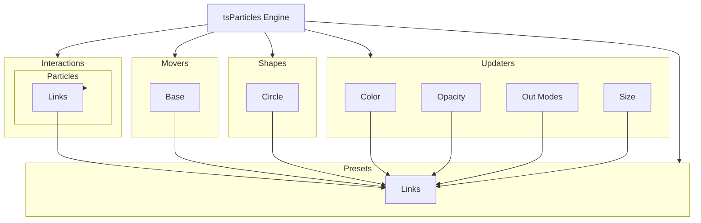

[](https://particles.js.org)

# tsParticles Links Preset

[](https://www.jsdelivr.com/package/npm/tsparticles-preset-links) [](https://www.npmjs.com/package/tsparticles-preset-links) [](https://www.npmjs.com/package/tsparticles-preset-links) [](https://github.com/sponsors/matteobruni)

[tsParticles](https://github.com/matteobruni/tsparticles) preset for creating a particles web created by link lines
between them.

[](https://join.slack.com/t/tsparticles/shared_invite/enQtOTcxNTQxNjQ4NzkxLWE2MTZhZWExMWRmOWI5MTMxNjczOGE1Yjk0MjViYjdkYTUzODM3OTc5MGQ5MjFlODc4MzE0N2Q1OWQxZDc1YzI) [](https://discord.gg/hACwv45Hme) [](https://t.me/tsparticles)

[](https://www.producthunt.com/posts/tsparticles?utm_source=badge-featured&utm_medium=badge&utm_souce=badge-tsparticles") <a href="https://www.buymeacoffee.com/matteobruni"></a>

## Sample

[](https://particles.js.org/samples/presets/links)

## How to use it

### CDN / Vanilla JS / jQuery

The first step is installing [tsParticles](https://github.com/matteobruni/tsparticles) following the instructions for
vanilla javascript in the main project [here](https://github.com/matteobruni/tsparticles)

Once installed you need one more script to be included in your page (or you can download that
from [jsDelivr](https://www.jsdelivr.com/package/npm/tsparticles-preset-links):

```html
<script src="https://cdn.jsdelivr.net/npm/tsparticles-engine@2/tsparticles.engine.min.js"></script>
<script src="https://cdn.jsdelivr.net/npm/tsparticles-interaction-particles-links@2/tsparticles.interaction.particles.links.min.js"></script>
<script src="https://cdn.jsdelivr.net/npm/tsparticles-move-base@2/tsparticles.move.base.min.js"></script>
<script src="https://cdn.jsdelivr.net/npm/tsparticles-shape-circle@2/tsparticles.shape.circle.min.js"></script>
<script src="https://cdn.jsdelivr.net/npm/tsparticles-updater-color@2/tsparticles.updater.color.min.js"></script>
<script src="https://cdn.jsdelivr.net/npm/tsparticles-updater-opacity@2/tsparticles.updater.opacity.min.js"></script>
<script src="https://cdn.jsdelivr.net/npm/tsparticles-updater-out-modes@2/tsparticles.updater.out-modes.min.js"></script>
<script src="https://cdn.jsdelivr.net/npm/tsparticles-updater-size@2/tsparticles.updater.size.min.js"></script>
<script src="https://cdn.jsdelivr.net/npm/tsparticles-preset-links@2/tsparticles.preset.links.min.js"></script>
```

This script **MUST** be placed after the `tsParticles` one.

#### Bundle

A bundled script can also be used, this will include every needed plugin needed by the preset.

```html
<script src="https://cdn.jsdelivr.net/npm/tsparticles-preset-links@2/tsparticles.preset.links.min.js"></script>
```

### Usage

Once the scripts are loaded you can set up `tsParticles` like this:

```javascript
(async () => {
  await loadLinksPreset(tsParticles); // this is required only if you are not using the bundle script

  await tsParticles.load("tsparticles", {
    preset: "links",
  });
})();
```

#### Customization

**Important ⚠️**
You can override all the options defining the properties like in any standard `tsParticles` installation.

```javascript
tsParticles.load("tsparticles", {
  particles: {
    shape: {
      type: "square", // starting from v2, this require the square shape script
    },
  },
  preset: "links",
});
```

Like in the sample above, the circles will be replaced by squares.

### React.js / Preact / Inferno

_The syntax for `React.js`, `Preact` and `Inferno` is the same_.

This sample uses the class component syntax, but you can use hooks as well (if the library supports it).

```typescript jsx
import Particles from "react-particles";
import type { Engine } from "tsparticles-engine";
import { loadLinksPreset } from "tsparticles-preset-links";

export class ParticlesContainer extends React.PureComponent<IProps> {
  // this customizes the component tsParticles installation
  async customInit(engine: Engine): Promise<void> {
    // this adds the preset to tsParticles, you can safely use the
    await loadLinksPreset(engine);
  }

  render() {
    const options = {
      preset: "links",
    };

    return <Particles options={options} init={this.customInit} />;
  }
}
```

### Vue (2.x and 3.x)

_The syntax for `Vue.js 2.x` and `3.x` is the same_

```vue
<Particles id="tsparticles" :particlesInit="particlesInit" :options="particlesOptions" />
```

```ts
const particlesOptions = {
  preset: "links",
};

async function particlesInit(engine: Engine): Promise<void> {
  await loadLinksPreset(engine);
}
```

### Angular

```html
<ng-particles [id]="id" [options]="particlesOptions" [particlesInit]="particlesInit"></ng-particles>
```

```ts
const particlesOptions = {
  preset: "links",
};

async function particlesInit(engine: Engine): Promise<void> {
  await loadLinksPreset(engine);
}
```

### Svelte

```sveltehtml

<Particles
        id="tsparticles"
        options={particlesOptions}
        particlesInit={particlesInit}
/>
```

```js
let particlesOptions = {
  preset: "links",
};

let particlesInit = async (engine) => {
  await loadLinksPreset(engine);
};
```


