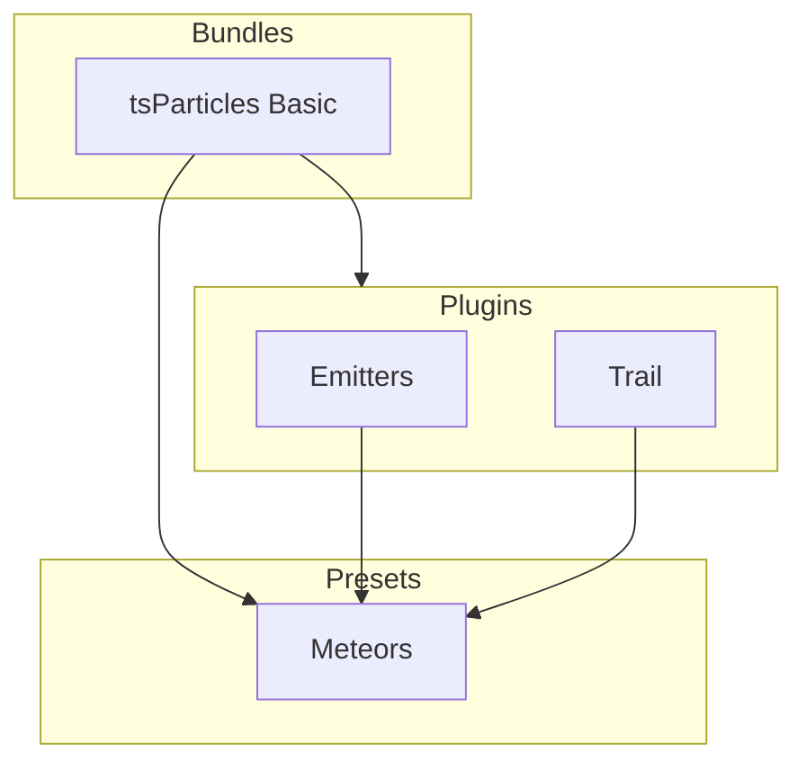

[](https://particles.js.org)

# tsParticles Meteors Preset

[](https://www.jsdelivr.com/package/npm/@tsparticles/preset-meteors) [](https://www.npmjs.com/package/@tsparticles/preset-meteors) [](https://www.npmjs.com/package/@tsparticles/preset-meteors) [](https://github.com/sponsors/matteobruni)

[tsParticles](https://github.com/tsparticles/tsparticles) preset for a meteors / shooting stars effect.

[](https://discord.gg/hACwv45Hme) [](https://t.me/tsparticles)

[](https://www.producthunt.com/posts/tsparticles?utm_source=badge-featured&utm_medium=badge&utm_souce=badge-tsparticles") <a href="https://www.buymeacoffee.com/matteobruni"></a>

## Sample

[](https://particles.js.org/samples/presets/meteors)

## Quick checklist

1. Install `@tsparticles/engine` (or use the CDN bundle below)
2. Call `loadMeteorsPreset(tsParticles)` **before** `tsParticles.load(...)`
3. Set `preset: "meteors"` in options

## How to use it

### CDN / Vanilla JS / jQuery

```html
<script src="https://cdn.jsdelivr.net/npm/@tsparticles/preset-meteors@4/tsparticles.preset.meteors.bundle.min.js"></script>
```

### Usage

Once the scripts are loaded you can set up `tsParticles` like this:

```javascript
(async () => {
  await loadMeteorsPreset(tsParticles);

  await tsParticles.load({
    id: "tsparticles",
    options: {
      preset: "meteors",
    },
  });
})();
```

#### Customization

**Important ⚠️**
You can override all the options defining the properties like in any standard `tsParticles` installation.

```javascript
tsParticles.load({
  id: "tsparticles",
  options: {
    particles: {
      shape: {
        type: "square", // starting from v2, this require the square shape script
      },
    },
    preset: "meteors",
  },
});
```

Like in the sample above, the circles will be replaced by squares.

### Frameworks with a tsParticles component library

Checkout the documentation in the component library repository and call the `loadMeteorsPreset` function instead of `loadFull`, `loadSlim` or similar functions.

The options shown above are valid for all the component libraries.

## Dependencies

This preset loads and combines the following packages:

| Package                        | Role in this preset        | README                                                       |
| ------------------------------ | -------------------------- | ------------------------------------------------------------ |
| `@tsparticles/basic`           | Base runtime bundle        | <https://www.npmjs.com/package/@tsparticles/basic>           |
| `@tsparticles/engine`          | tsParticles engine         | <https://www.npmjs.com/package/@tsparticles/engine>          |
| `@tsparticles/plugin-emitters` | Adds particle emitters     | <https://www.npmjs.com/package/@tsparticles/plugin-emitters> |
| `@tsparticles/plugin-trail`    | Adds particle trail effect | <https://www.npmjs.com/package/@tsparticles/plugin-trail>    |

If you want to customize one specific behavior, start from the related package README above.

## Common pitfalls

- Calling `tsParticles.load(...)` before `loadMeteorsPreset(tsParticles)`
- The preset relies on emitters to spawn particles; no particles will appear if the emitter configuration is overridden incorrectly

## Related docs

- All presets catalog: <https://github.com/tsparticles/presets>
- Main tsParticles docs: <https://particles.js.org/docs/>

---


