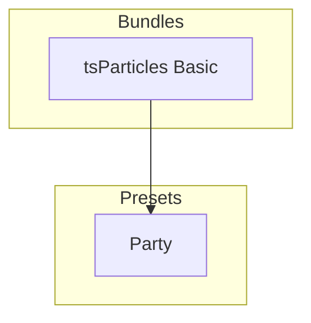

[](https://particles.js.org)

# tsParticles Party Preset

[](https://www.jsdelivr.com/package/npm/@tsparticles/preset-party) [](https://www.npmjs.com/package/@tsparticles/preset-party) [](https://www.npmjs.com/package/@tsparticles/preset-party) [](https://github.com/sponsors/matteobruni)

[tsParticles](https://github.com/tsparticles/tsparticles) preset for creating a party-like celebration effect.

[](https://discord.gg/hACwv45Hme) [](https://t.me/tsparticles)

[](https://www.producthunt.com/posts/tsparticles?utm_source=badge-featured&utm_medium=badge&utm_source=badge-tsparticles) <a href="https://www.buymeacoffee.com/matteobruni"></a>

## Sample

[](https://particles.js.org/samples/presets/party)

## Quick checklist

1. Install `@tsparticles/engine` (or use the CDN bundle below)
2. Call `loadPartyPreset(tsParticles)` **before** `tsParticles.load(...)`
3. Set `preset: "party"` in options

## How to use it

### CDN / Vanilla JS / jQuery

```html
<script src="https://cdn.jsdelivr.net/npm/@tsparticles/preset-party@4/tsparticles.preset.party.bundle.min.js"></script>
```

### Usage

Once the scripts are loaded you can set up `tsParticles` like this:

```javascript
(async () => {
  await loadPartyPreset(tsParticles);

  await tsParticles.load({
    id: "tsparticles",
    options: {
      preset: "party",
    },
  });
})();
```

#### Customization

**Important ⚠️**
You can override all the options defining the properties like in any standard `tsParticles` installation.

```javascript
tsParticles.load({
  id: "tsparticles",
  options: {
    particles: {
      shape: {
        type: "square",
      },
    },
    preset: "party",
  },
});
```

### Frameworks with a tsParticles component library

Checkout the documentation in the component library repository and call the `loadPartyPreset` function instead
of `loadFull`, `loadSlim` or similar functions.

The options shown above are valid for all the component libraries.

## Dependencies

This preset loads and combines the following packages:

| Package                         | Role in this preset                        | README                                                        |
| ------------------------------- | ------------------------------------------ | ------------------------------------------------------------- |
| `@tsparticles/basic`            | Base runtime bundle used by the preset     | <https://www.npmjs.com/package/@tsparticles/basic>            |
| `@tsparticles/engine`           | tsParticles engine and preset registration | <https://www.npmjs.com/package/@tsparticles/engine>           |
| `@tsparticles/palette-confetti` | Confetti color palette                     | <https://www.npmjs.com/package/@tsparticles/palette-confetti> |
| `@tsparticles/plugin-emitters`  | Particle emitters                          | <https://www.npmjs.com/package/@tsparticles/plugin-emitters>  |
| `@tsparticles/shape-polygon`    | Polygon and triangle shapes                | <https://www.npmjs.com/package/@tsparticles/shape-polygon>    |
| `@tsparticles/shape-ribbon`     | Ribbon shape                               | <https://www.npmjs.com/package/@tsparticles/shape-ribbon>     |
| `@tsparticles/shape-square`     | Square and edge shapes                     | <https://www.npmjs.com/package/@tsparticles/shape-square>     |
| `@tsparticles/updater-roll`     | Rolling animation                          | <https://www.npmjs.com/package/@tsparticles/updater-roll>     |
| `@tsparticles/updater-rotate`   | Rotation animation                         | <https://www.npmjs.com/package/@tsparticles/updater-rotate>   |
| `@tsparticles/updater-tilt`     | Tilt animation                             | <https://www.npmjs.com/package/@tsparticles/updater-tilt>     |
| `@tsparticles/updater-wobble`   | Wobble animation                           | <https://www.npmjs.com/package/@tsparticles/updater-wobble>   |

## Common pitfalls

- Calling `tsParticles.load(...)` before `loadPartyPreset(tsParticles)`
- Changing particle shape without loading the corresponding shape package

## Related docs

- All presets catalog: <https://github.com/tsparticles/presets>
- Color formats: <https://github.com/tsparticles/tsparticles/blob/main/markdown/Color.md>
- Main tsParticles docs: <https://particles.js.org/docs/>

---


