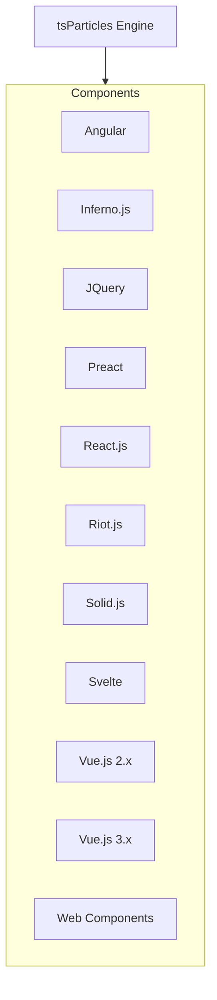
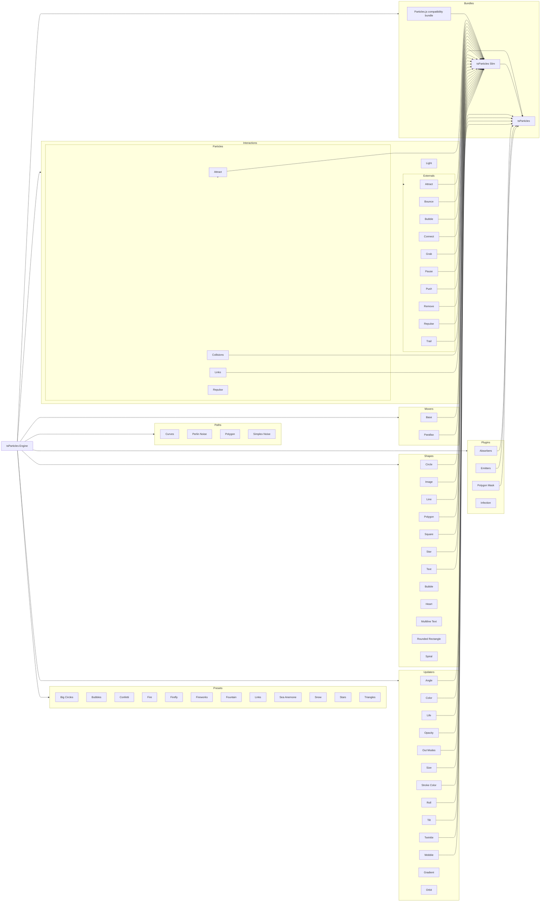

[](https://particles.js.org)

# tsParticles - TypeScript Partikkelit/Hiukkaset

**Kevyt TypeScript kirjasto partikkeleiden/hiukkasten luomiseen. Riippuvuus vapaa (\*), selain valmis ja yhteensopiva
React.js, Vue.js (2.x and 3.x), Angular, Svelte, jQuery, Preact, Inferno, Riot.js, Solid.js, sekä Web komponenttejen
kanssa**

[](https://github.com/sponsors/matteobruni)
[](https://www.jsdelivr.com/package/npm/tsparticles)
[](https://cdnjs.com/libraries/tsparticles)
[](https://www.npmjs.com/package/tsparticles)
[](https://www.npmjs.com/package/tsparticles)
[](https://lerna.js.org/)
[](https://www.codefactor.io/repository/github/matteobruni/tsparticles)
[](https://www.codacy.com/manual/ar3s/tsparticles?utm_source=github.com&utm_medium=referral&utm_content=matteobruni/tsparticles&utm_campaign=Badge_Grade)
[](https://openbase.com/js/tsparticles?utm_source=embedded&utm_medium=badge&utm_campaign=rating-badge&utm_term=js/tsparticles)
[](https://gitpod.io/#https://github.com/matteobruni/tsparticles)
[](https://repl.it/github/matteobruni/tsparticles)

[](https://discord.gg/hACwv45Hme)
[](https://join.slack.com/t/tsparticles/shared_invite/enQtOTcxNTQxNjQ4NzkxLWE2MTZhZWExMWRmOWI5MTMxNjczOGE1Yjk0MjViYjdkYTUzODM3OTc5MGQ5MjFlODc4MzE0N2Q1OWQxZDc1YzI)
[](https://t.me/tsparticles)
[](https://www.reddit.com/r/tsParticles/)

[](https://www.producthunt.com/posts/tsparticles?utm_source=badge-featured&utm_medium=badge&utm_souce=badge-tsparticles")
[](https://www.buymeacoffee.com/matteobruni)

---

## Sisällysluettelo

⚠️⚠️ _Tämä readme viittaa **v2** versioon, [täältä](https://github.com/matteobruni/tsparticles/tree/v1#readme)
löytyy version **v1** dokumentaatio_ ⚠️⚠️

- [Käyttö verkkosivullasi](#Haluatko-käyttää-tsPartikkeleita-verkkosivullasi?)
    - [Kirjaston asennus](#Kirjaston-asennus)
- [Viralliset komponentit käytetyimpiin kehyksiin (framework)](#Viralliset-komponentit-käyteyimpiin-kehyksiin-(frameworkkeihin))
    - [Angular](#Angular)
    - [Inferno](#Inferno)
    - [jQuery](#jQuery)
    - [Preact](#Preact)
    - [ReactJS](#ReactJS)
    - [RiotJS](#RiotJS)
    - [SolidJS](#SolidJS)
    - [Svelte](#Svelte)
    - [VueJS 2.x](#VueJS-2.x)
    - [VueJS 3.x](#VueJS-3.x)
    - [Web Komponentit](#Web-Komponentit)
    - [WordPress](#WordPress)
    - [Elementor](#Elementor)
- [Valmiit mallit](#Valmiit-mallit)
    - [Suuret ympyrät](#Suuret-ympyrät)
    - [Kuplat](#Kuplat)
    - [Konfetti](#Konfetti)
    - [Tuli](#Tuli)
    - [Tulikärpäset](#Tulikärpäset)
    - [Ilotulitukset](#Ilotulitukset)
    - [Suihkulähde](#Suihkulähde)
    - [Linkit](#Linkit)
    - [Merivuokko](#Merivuokko)
    - [Lumisade](#Lumisade)
    - [Tähdet](#Tähdet)
    - [Kolmiot](#Kolmiot)
- [Mallit ja Resurssit](#Mallit-ja-Resurssit)
- [Demo / Generaattori](#**_Demo-/-Generaattori_**)
    - [Hahmot partikkeleina](#Hahmot-partikkeleina)
    - [Kursorin seuraaminen](#Hiiren-hover-yhteydet)
    - [Monikulmio maski](#Monikulmio-maski)
    - [Animoidut tähdet](#Animoidut-tähdet)
    - [Nyan kissa lentää avaruudeessa](#Nyan-kissa-lentämässä-avaruudessa)
    - [Taustan maski partikkelit](#Taustan-maski-partikkelit)
- [Video Tutoriaalit](#**_Video-Tutoriaalit_**)
- [Siirtyminen Particles.js:stä](#Migrating-from-Particlesjs)
- [Lisäosat/Kustomointi](#PluginsCustomizations)
- [Riippuvuus kuvaaja](#Dependency-Graphs)
- [Sponsorit](#Sponsors)

---

## Haluatko käyttää tsPartikkeleita verkkosivullasi?

_Dokumentaatio ja kehitysviittaukset läytyvät [täältä](https://particles.js.org/docs/) 📖_

**Tämä kirjasto on saatavilla kahdessa suosituimmassa CDN:ssä, se on helppo ja käyttövalmis, jos käytit aikaisemmin
particles.js:ää käyttöönotto on vieläkin helpompaa**.

Ohjeet löytyvät [alta](https://github.com/matteobruni/tsparticles/blob/main/README.md#library-installation),
kaikkine linkkeineen, ja _elä pelkää **TypeScriptiä**, se on vain lähdekoodin kieli_.

**Buildatut lopputulokset ovat normaalia JavaScriptiä**. 🤩

CDN ja `npm` sisältävät kaikki tarvitavat **Javascript** sourcet, selain valmis paketti (tsparticles.engine.min.js)
ja kaikki tiedostot jaettu `import` syntaksissa.

**Jos olet kiinostunut** [alla](https://github.com/matteobruni/tsparticles/blob/main/README.md#library-installation)
on _yksinkertaisia ohjeita_, jotka auttavat sinua siirtymään tsPartikkeleihin vanhasta particles.js kirjastosta.

## **_Kirjaston asennus_**

### **_Hosting / CDN_**

**_Käytä näitä tai hostaa omat ladataksesi tsParticles projekteihisi_**

#### jsDelivr

[](https://www.jsdelivr.com/package/npm/tsparticles-engine)
[](https://www.jsdelivr.com/package/npm/tsparticles-slim)
[](https://www.jsdelivr.com/package/npm/tsparticles)

#### cdnjs

[](https://cdnjs.com/libraries/tsparticles)

#### unpkg

<https://unpkg.com/tsparticles-engine/> <https://unpkg.com/tsparticles-slim/> <https://unpkg.com/tsparticles/>

---

### **_npm_**

*tsParticles Engine*

[](https://www.npmjs.com/package/tsparticles-engine) [](https://www.npmjs.com/package/tsparticles-engine)

*tsParticles Slim*

[](https://www.npmjs.com/package/tsparticles-slim) [](https://www.npmjs.com/package/tsparticles-slim)

*tsParticles*

[](https://www.npmjs.com/package/tsparticles) [](https://www.npmjs.com/package/tsparticles)

```shell
npm install tsparticles-engine
```

### **_yarn_**

```shell
yarn add tsparticles-engine
```

### **_pnpm_**

```shell
pnpm install tsparticles-engine
```

#### Import ja require

Alkaen versiosta 1.12.11 `import` ja `require` voidaan käyttää `tsParticlesin` lisäämiseksi.

Voit kirjoitta esimerkisi:

```javascript
const tsParticles = require("tsparticles-engine");

// tai

import { tsParticles } from "tsparticles-engine";
```

Tuotu/Importattu `tsParticles` on sama esiintymä/instance, joka sinulla on, kun sisällytät/include skriptin.

---

### **_NuGet_**

[](https://www.nuget.org/packages/tsParticles/)

---

### **_Käyttö_**

Lataa tsParticles kirjaston ja konfiguroi partikkelit:

[](https://particles.js.org)

**index.html**

```html

<div id="tsparticles"></div>

<script src="tsparticles.engine.min.js"></script>
```

**app.js**

```javascript
// @path-json voi olla objekti tai taulukko, objekti ladataan suoraan, mutta taulukosta valitaan satunnainen objekti
/* tsParticles.loadJSON(@dom-id, @path-json, @callback (optional)); */

tsParticles
    .loadJSON("tsparticles", "presets/default.json")
    .then((container) => {
        console.log("callback - tsparticles config loaded");
    })
    .catch((error) => {
        console.error(error);
    });

//tai

/* tsParticles.load(@dom-id, @options); */

tsParticles.load("tsparticles", {
    /* asetukset tänne */
});

//tai

/* tsParticles.loadFromArray(@dom-id, @options, @index (optional)); */

tsParticles.loadFromArray("tsparticles", [
    {
        /* asetukset tänne */
    },
    {
        /* muut asetukset tänne */
    },
]);
//random objekti

tsParticles.loadFromArray(
    "tsparticles",
    [
        {
            /* asetukset tänne */
        },
        {
            /* muut asetukset tänne */
        },
    ],
    1
); //the second one
// Tärkeää! Jos indeksi ei ole välillä 0...<array.length, indeksiä ei huomioida.

// tätä voidaan käyttää alustuksen jälkee.

/* tsParticles.setOnClickHandler(@callback); */

/* tämä laukaistaan/fired  kaikista ladatuista partikkeleista */

tsParticles.setOnClickHandler((event, particles) => {
    /* kustom on click käsittelijä */
});

// Nyt voit myös hallita animaatioita kuten keskeyttää ja jatkaa niitä
// Nämä metodit eivät muuta konfiguraatiota
// domItem(0) palauttaa ensimmäisen ladatun tsParticles-instanssin dom:ista
const particles = tsParticles.domItem(0);

// aloittaa animaation suorituksen, jos liike ei ole käytössä, tämä metodi ei käynnistä liikettä, vaan vain päivittää ruudun
particles.play();

// pause lopettaa animaation suorituksen
particles.pause();
```

---

## Viralliset komponentit käyteyimpiin kehyksiin (frameworkkeihin)

### Angular

`ng-particles`

[](https://www.npmjs.com/package/ng-particles) [](https://www.npmjs.com/package/ng-particles)

Ohjeita löytyy [täältä](https://github.com/matteobruni/tsparticles/blob/main/components/angular/README.md)

### Inferno

`inferno-particles`

[](https://www.npmjs.com/package/inferno-particles) [](https://www.npmjs.com/package/inferno-particles)

Ohjeita löytyy [täältä](https://github.com/matteobruni/tsparticles/blob/main/components/inferno/README.md)

### jQuery

`jquery-particles`

[](https://www.npmjs.com/package/jquery-particles) [](https://www.npmjs.com/package/jquery-particles)

Ohjeita löytyy [täältä](https://github.com/matteobruni/tsparticles/blob/main/components/jquery/README.md)

### Preact

`preact-particles`

[](https://www.npmjs.com/package/preact-particles) [](https://www.npmjs.com/package/preact-particles)

Ohjeita löytyy [täältä](https://github.com/matteobruni/tsparticles/blob/main/components/preact/README.md)

### ReactJS

`react-particles`

[](https://www.npmjs.com/package/react-particles) [](https://www.npmjs.com/package/react-particles)

Ohjeita löytyy [täältä](https://github.com/matteobruni/tsparticles/blob/main/components/react/README.md)

### RiotJS

#### `riot-particles`

[](https://www.npmjs.com/package/riot-particles) [](https://www.npmjs.com/package/riot-particles)

Ohjeita löytyy [täältä](https://github.com/matteobruni/tsparticles/blob/main/components/riot/README.md)

### SolidJS

#### `solid-particles`

[](https://www.npmjs.com/package/solid-particles) [](https://www.npmjs.com/package/solid-particles)

Ohjeita löytyy [täältä](https://github.com/matteobruni/tsparticles/blob/main/components/solid/README.md)

### Svelte

`svelte-particles`

[](https://www.npmjs.com/package/svelte-particles) [](https://www.npmjs.com/package/svelte-particles)

Ohjeita löytyy [täältä](https://github.com/matteobruni/tsparticles/blob/main/components/svelte/README.md)

### VueJS 2.x

`vue2-particles`

[](https://www.npmjs.com/package/vue2-particles) [](https://www.npmjs.com/package/vue2-particles)

Ohjeita löytyy [täältä](https://github.com/matteobruni/tsparticles/blob/main/components/vue/README.md)

### VueJS 3.x

`vue3-particles`

[](https://www.npmjs.com/package/vue3-particles) [](https://www.npmjs.com/package/vue3-particles)

Ohjeita löytyy [täältä](https://github.com/matteobruni/tsparticles/blob/main/components/vue3/README.md)

### Web Komponentit

#### `web-particles`

[](https://www.npmjs.com/package/web-particles) [](https://www.npmjs.com/package/web-particles)

Löydät ojeet [täältä](https://github.com/matteobruni/tsparticles/blob/main/components/web/README.md)

### WordPress

#### `wordpress-particles`

[](https://www.npmjs.com/package/wordpress-particles) [](https://www.npmjs.com/package/wordpress-particles) [](https://wordpress.org/plugins/tsparticles-block/) [](https://wordpress.org/plugins/tsparticles-block/)

WordPress.org-laajennussivu löytyy [täältä](https://wordpress.org/plugins/tsparticles-block/#description)

### Elementor

Virallista tsParticles lisäosaa ei ole, mutta teen yhteistyötä `Premium Addons for Elementor` lisäosa kokoelman kanssa.

<div style="float: left; margin-right: 10px;">
    
</div>
<div>
    Premium Addons for Elementor is one of the most common plugins for Elementor that offers more than 55 highly customizable Elementor Widgets and Section Add-ons. tsParticles is exclusively included in Premium Particles Section Add-on for Elementor Page Builder. <a href="https://premiumaddons.com/particles-section-addon-for-elementor-page-builder/" target="_blank">Check It Now</a>.<br />
    Use Premium Addons for Elementor Page Builder and get the chance to include tsParticles in your next WordPress website without the need to write a single line of code. <a href="https://premiumaddons.com/particles-section-addon-for-elementor-page-builder/" target="_blank">See a Live Example</a>.
</div>
<div style="clear: both;"></div>

---

## Valmiit mallit

Alla joitain valmiita malleja. Niissä on myös mukana tiedostot, joissa kaikki tarvittava suoritusta varten

### Suuret ympyrät

[](https://www.jsdelivr.com/package/npm/tsparticles-preset-big-circles) [](https://www.npmjs.com/package/tsparticles-preset-big-circles) [](https://www.npmjs.com/package/tsparticles-preset-big-circles)

Tämä malli luo suuria värikkäitä ympyröitä, jotka liikkuvat ylöspäin valkoisella taustalla.

[](https://particles.js.org/samples/presets/bigCircles)

Ohjeet löytyvät [täältä](https://github.com/matteobruni/tsparticles/blob/main/presets/bigCircles/README.md)

### Kuplat

[](https://www.jsdelivr.com/package/npm/tsparticles) [](https://www.npmjs.com/package/tsparticles-preset-bubbles) [](https://www.npmjs.com/package/tsparticles-preset-bubbles)

Tämä malli luo värikkäitä kuplia, jotka nousevat alhaalta ylös valkealla taustalla.

[](https://particles.js.org/samples/presets/bubbles)

Ohjeet löytyvät [täältä](https://github.com/matteobruni/tsparticles/blob/main/presets/bubbles/README.md)

### Konfetti

[](https://www.jsdelivr.com/package/npm/tsparticles-preset-confetti) [](https://www.npmjs.com/package/tsparticles-preset-confetti) [](https://www.npmjs.com/package/tsparticles-preset-confetti)

Tämä malli luo valkoisia ja punaisia konfetteja, jotka laukaistaan keskeltä läpinäkyvää näyttöä
(muiden verkkosivun elementtejen päällä)

[](https://particles.js.org/samples/presets/confetti)

Ohjeet löytyvät [täältä](https://github.com/matteobruni/tsparticles/blob/main/presets/confetti/README.md)

### Tuli

[](https://www.jsdelivr.com/package/npm/tsparticles-preset-fire) [](https://www.npmjs.com/package/tsparticles-preset-fire) [](https://www.npmjs.com/package/tsparticles-preset-fire)

Tämä malli luo puna-mustan himmeän taustan sekä tulen ja tuhkan värisiä hiukkaisa.

[](https://particles.js.org/samples/presets/fire)

Ohjeet löytyvät [täältä](https://github.com/matteobruni/tsparticles/blob/main/presets/fire/README.md)

### Tulikärpäset

[](https://www.jsdelivr.com/package/npm/tsparticles-preset-firefly) [](https://www.npmjs.com/package/tsparticles-preset-firefly) [](https://www.npmjs.com/package/tsparticles-preset-firefly)

Tämä malli luo kursoria seuraavia pieniä himmeneviä tulikärpäsiltä näyttäviä hiukkasia.

[](https://particles.js.org/samples/presets/firefly)

Ohjeet löytyvät [täältä](https://github.com/matteobruni/tsparticles/blob/main/presets/firefly/README.md)

### Ilotulitukset

[](https://www.jsdelivr.com/package/npm/tsparticles-preset-fireworks) [](https://www.npmjs.com/package/tsparticles-preset-fireworks) [](https://www.npmjs.com/package/tsparticles-preset-fireworks)

Tämä malli lataa kauniin ilotulitusefektin.

[](https://particles.js.org/samples/presets/fireworks)

Ohjeet löytyvät [täältä](https://github.com/matteobruni/tsparticles/blob/main/presets/fireworks/README.md)

### Suihkulähde

[](https://www.jsdelivr.com/package/npm/tsparticles-preset-fountain) [](https://www.npmjs.com/package/tsparticles-preset-fountain) [](https://www.npmjs.com/package/tsparticles-preset-fountain)

[](https://particles.js.org/samples/presets/fountain)

Ohjeet löytyvät [täältä](https://github.com/matteobruni/tsparticles/blob/main/presets/fountain/README.md)

### Linkit

[](https://www.jsdelivr.com/package/npm/tsparticles-preset-links) [](https://www.npmjs.com/package/tsparticles-preset-links) [](https://www.npmjs.com/package/tsparticles-preset-links)

[](https://particles.js.org/samples/presets/links)

Ohjeet löytyvät [täältä](https://github.com/matteobruni/tsparticles/blob/main/presets/links/README.md)

### Merivuokko

[](https://www.jsdelivr.com/package/npm/tsparticles-preset-sea-anemone) [](https://www.npmjs.com/package/tsparticles-preset-sea-anemone) [](https://www.npmjs.com/package/tsparticles-preset-sea-anemone)

[](https://particles.js.org/samples/presets/seaAnemone)

Ohjeet löytyvät [täältä](https://github.com/matteobruni/tsparticles/blob/main/presets/seaAnemone/README.md)

### Lumi

[](https://www.jsdelivr.com/package/npm/tsparticles-preset-snow) [](https://www.npmjs.com/package/tsparticles-preset-snow) [](https://www.npmjs.com/package/tsparticles-preset-snow)

[](https://particles.js.org/samples/presets/snow)

Ohjeet löytyvät [täältä](https://github.com/matteobruni/tsparticles/blob/main/presets/snow/README.md)

### Tähdet

[](https://www.jsdelivr.com/package/npm/tsparticles-preset-stars) [](https://www.npmjs.com/package/tsparticles-preset-stars) [](https://www.npmjs.com/package/tsparticles-preset-stars)

[](https://particles.js.org/samples/presets/stars)

Ohjeet löytyvät [täältä](https://github.com/matteobruni/tsparticles/blob/main/presets/stars/README.md)

### Kolmiot

[](https://www.jsdelivr.com/package/npm/tsparticles-preset-triangles) [](https://www.npmjs.com/package/tsparticles-preset-triangles) [](https://www.npmjs.com/package/tsparticles-preset-triangles)

[](https://particles.js.org/samples/presets/triangles)

Ohjeet löytyvät [täältä](https://github.com/matteobruni/tsparticles/blob/main/presets/triangles/README.md)

---

## Mallit ja Resurssit

[Täältä](https://github.com/tsparticles/templates) löytyy tsPartikkeleihin liittyviä malleja. Malleja on luotu
_Vanilla Javascript_, _ReactJS_, _VueJS_, _Angular_, _SvelteJS_ ja muille suosituille kehyksille (frameworks).

Mallit vaihtelevat, uusia tulee ja vanhoja päivittää uusimmilla ominaisuuksilla tai niiden tyyliä päivitetään.
Tarkista ne silloin tällöin.

Jos teet hienoja _tsPartikkeli_ malleja, olisi mahtavaa jos osallistuisit ja loisit siitä pull requestin.
Sinut merkitään mallin tekijäksi.

<https://github.com/tsparticles/templates>

---

## **_Demo / Generaattori_**

<https://particles.js.org/samples>

[](https://particles.js.org/samples)

---

## **_Video Tutoriaalit_**

Löydät kaikki video tutoriialit täältä: <https://particles.js.org/video.html>

*Lisää videoita tulossa pian! Tarkista päivittäin, onko uutta sisältöä tullut.*

---

### Hahmot partikkeleina

[](https://particles.js.org/samples/#chars)

---

### Hiiren hover yhteydet

[](https://particles.js.org/samples#connect)

---

### Monikulmio maski

[](https://particles.js.org/samples/#polygonMask)

---

### Animoidut tähdet

[](https://particles.js.org/samples/#nasa)

---

### Nyan kissa lentämässä avaruudessa

[](https://particles.js.org/samples/#nyancat2)

---

### Lumisade

[](https://particles.js.org/samples/#snow)

---

### Taustan maski partikkelit

[](https://particles.js.org/samples/#background)

---

**particles.json**

Löydät konfiguraatio
esimerkkejä [täältä](https://github.com/matteobruni/tsparticles/tree/main/websites/particles.js.org/presets) 📖

---

## **_Parametrit/Asetukset_**

Kaikki käytettävissä olevat parametrit ja niiden dokumentaatio
löytyy [täältä](https://particles.js.org/docs/interfaces/Options_Interfaces_IOptions.IOptions.html) 📖

## Haluatko kokeilla tsPartikkeleita livenä?

Olen luonnut [CodePen](https://codepen.io/collection/DPOage) kokoelman 😮
tai voit käydä katsomassa myös minun [profiilini](https://codepen.io/matteobruni)

Muussa tapauksessa klikkaa alla olevaa koronavirusta. Ei tarvitse pelätä, **se on turvallista** 😷.

[](https://particles.js.org/samples/#virus)

Haluatko nähdä vielä lisää demoja? Kloonaa repo tietokoneellesi ja seuraa näitä ohjeita

```shell
$ pnpm i
$ npx lerna run build
$ cd demo/vanilla
$ pnpm run start
```

**Boom! 💥** surffaa osoitteeseen <http://localhost:3000> ja näe kaikki muut demot.

_Jos olet tarpeeksi rohkea_ voit vaihtaa `dev` branchiin ja kokeilla nyt kehitettäviä uusia demoja.

---

## Siirtyminen Particles.js:stä

**tsParticles** paketti tekee tästä kirjastosta 100% yhteensopivan _particles.js_ konfiguraation kanssa.

[](https://www.jsdelivr.com/package/npm/tsparticles-particles.js) [](https://www.npmjs.com/package/tsparticles-particles.js) [](https://www.npmjs.com/package/tsparticles-particles.js)

Oikeasti, sinun täytyy vain vaihtaa particles.js scripti mukana tulevaan yhteensopivuuspakettiin, et-voilà, **valmista
tuli** 🧙!

lisätietoa löytyy **[täältä](https://dev.to/matteobruni/migrating-from-particles-js-to-tsparticles-2a6m)**

Etkö ole vielä vakuuttunut?[Tässä](https://dev.to/matteobruni/5-reasons-to-use-tsparticles-and-not-particles-js-1gbe)
5 syytä tsParticlesiin siirtymiseen

_Alta löydät kaikki tiedot, joita tarvitset tsParticlesin ja uuden syntaksin asentamiseen._

---

## Lisäosat/Kustomointi

tsParticles tukee kustomointia 🥳.

**Voit luoda omia lisäosia**

_Lisätietoa [täältä](https://particles.js.org/docs/modules/Core_Interfaces_IPlugin.html)..._

---

## Riippuvuus kuvaaja





---

<p>  
    <a href="https://www.jetbrains.com/?from=tsParticles">  
          
    </a>  
    <a href="https://www.jetbrains.com/webstorm/?from=tsParticles">  
          
    </a>  
</p>

### Suuret kiitokset [JetBrains](https://www.jetbrains.com/?from=tsParticles) vuosien 2020-2022 avoimen lähdekoodin lisensseistä!

[JetBrains WebStormia](https://www.jetbrains.com/webstorm/?from=tsParticles) käytetään tämän projektin ylläpitämiseen.

---

## Sponsorit

<p>
  <a href="https://www.codacy.com">
    
  </a>
</p>

[Codacy](https://www.codacy.com) on alusta, joka auttaa sinua havaitsemaan ja korjaamaan koodissa esiintyviä
laatuongelmia.

**Automatisoi koodintarkistukset commiteille ja pull requesteille**

Tarkista koodisi laatu ja pidä kirjaa yli 40 ohjelmointikielen teknisistä veloistasi. Saumaton
integraatio kehitystyöhösi.
