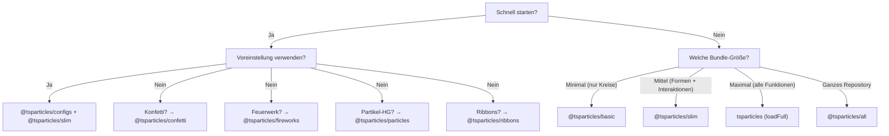

# Bundle-Anleitung

tsParticles ist modular. Das Paket `@tsparticles/engine` enthält nur die Kern-Engine; um sichtbare Effekte zu erzielen, musst du **Formen** (was gezeichnet wird), **Aktualisierer** (wie animiert wird), **Interaktionen** (Reaktion auf Maus/Touch) und **Plugins** (zusätzliche Funktionen) registrieren. All dies geschieht über **Bundles**.

## Bundle-Kategorien

| Kategorie       | Bundle                                                                                              | API                                         |
| --------------- | --------------------------------------------------------------------------------------------------- | ------------------------------------------- |
| Engine + Loader | `@tsparticles/basic`, `@tsparticles/slim`, `tsparticles`, `@tsparticles/all`                        | `tsParticles.load({ id, options })`         |
| Dedizierte API  | `@tsparticles/confetti`, `@tsparticles/fireworks`, `@tsparticles/particles`, `@tsparticles/ribbons` | `confetti({...})`, `fireworks({...})`, etc. |

## Vollständiger Funktionsvergleich

Legende: ● = enthalten, ○ = nicht enthalten

| Funktion                                                                                            | basic | slim | full (`tsparticles`) | all                |
| --------------------------------------------------------------------------------------------------- | ----- | ---- | -------------------- | ------------------ |
| **Formen**                                                                                          |       |      |                      |                    |
| Kreis                                                                                               | ●     | ●    | ●                    | ●                  |
| Quadrat                                                                                             | ○     | ●    | ●                    | ●                  |
| Stern                                                                                               | ○     | ●    | ●                    | ●                  |
| Polygon                                                                                             | ○     | ●    | ●                    | ●                  |
| Linie                                                                                               | ○     | ●    | ●                    | ●                  |
| Bild                                                                                                | ○     | ●    | ●                    | ●                  |
| Emoji                                                                                               | ○     | ●    | ●                    | ●                  |
| Text                                                                                                | ○     | ○    | ●                    | ●                  |
| Karten (Farben)                                                                                     | ○     | ○    | ○                    | ●                  |
| Herz                                                                                                | ○     | ○    | ○                    | ●                  |
| Pfeil                                                                                               | ○     | ○    | ○                    | ●                  |
| Abgerundetes Rechteck                                                                               | ○     | ○    | ○                    | ●                  |
| Abgerundetes Polygon                                                                                | ○     | ○    | ○                    | ●                  |
| Spirale                                                                                             | ○     | ○    | ○                    | ●                  |
| Squircle                                                                                            | ○     | ○    | ○                    | ●                  |
| Zahnrad                                                                                             | ○     | ○    | ○                    | ●                  |
| Unendlichkeit                                                                                       | ○     | ○    | ○                    | ●                  |
| Matrix                                                                                              | ○     | ○    | ○                    | ●                  |
| Pfad                                                                                                | ○     | ○    | ○                    | ●                  |
| Ribbon                                                                                              | ○     | ○    | ○                    | ●                  |
| **Externe Interaktionen (Maus/Touch)**                                                              |       |      |                      |                    |
| Anziehen                                                                                            | ○     | ●    | ●                    | ●                  |
| Abprallen                                                                                           | ○     | ●    | ●                    | ●                  |
| Blase                                                                                               | ○     | ●    | ●                    | ●                  |
| Verbinden                                                                                           | ○     | ●    | ●                    | ●                  |
| Zerstören                                                                                           | ○     | ●    | ●                    | ●                  |
| Greifen                                                                                             | ○     | ●    | ●                    | ●                  |
| Parallaxe                                                                                           | ○     | ●    | ●                    | ●                  |
| Pausieren                                                                                           | ○     | ●    | ●                    | ●                  |
| Schieben                                                                                            | ○     | ●    | ●                    | ●                  |
| Entfernen                                                                                           | ○     | ●    | ●                    | ●                  |
| Abstoßen                                                                                            | ○     | ●    | ●                    | ●                  |
| Verlangsamen                                                                                        | ○     | ●    | ●                    | ●                  |
| Ziehen                                                                                              | ○     | ○    | ●                    | ●                  |
| Spur                                                                                                | ○     | ○    | ●                    | ●                  |
| Kanone                                                                                              | ○     | ○    | ○                    | ●                  |
| Partikel                                                                                            | ○     | ○    | ○                    | ●                  |
| Pop                                                                                                 | ○     | ○    | ○                    | ●                  |
| Licht                                                                                               | ○     | ○    | ○                    | ●                  |
| **Partikel-Interaktionen**                                                                          |       |      |                      |                    |
| Verbindungen                                                                                        | ○     | ●    | ●                    | ●                  |
| Kollisionen                                                                                         | ○     | ●    | ●                    | ●                  |
| Anziehen                                                                                            | ○     | ●    | ●                    | ●                  |
| Abstoßen                                                                                            | ○     | ○    | ○                    | ●                  |
| **Aktualisierer (Animationen)**                                                                     |       |      |                      |                    |
| Opazität                                                                                            | ●     | ●    | ●                    | ●                  |
| Größe                                                                                               | ●     | ●    | ●                    | ●                  |
| Aus-Modi                                                                                            | ●     | ●    | ●                    | ●                  |
| Farbe                                                                                               | ●     | ●    | ●                    | ●                  |
| Drehen                                                                                              | ○     | ●    | ●                    | ●                  |
| Lebenszyklus                                                                                        | ○     | ●    | ●                    | ●                  |
| Zerstören                                                                                           | ○     | ○    | ●                    | ●                  |
| Rollen                                                                                              | ○     | ○    | ●                    | ●                  |
| Neigen                                                                                              | ○     | ○    | ●                    | ●                  |
| Funkeln                                                                                             | ○     | ○    | ●                    | ●                  |
| Wackeln                                                                                             | ○     | ○    | ●                    | ●                  |
| Farbverlauf                                                                                         | ○     | ○    | ○                    | ●                  |
| Orbit                                                                                               | ○     | ○    | ○                    | ●                  |
| **Plugins**                                                                                         |       |      |                      |                    |
| Bewegung                                                                                            | ●     | ●    | ●                    | ●                  |
| Mischung                                                                                            | ●     | ●    | ●                    | ●                  |
| Emitter                                                                                             | ○     | ○    | ●                    | ●                  |
| Absorber                                                                                            | ○     | ○    | ●                    | ●                  |
| Töne                                                                                                | ○     | ○    | ○                    | ●                  |
| Bewegung (Benutzereinst.)                                                                           | ○     | ○    | ○                    | ●                  |
| Themes                                                                                              | ○     | ○    | ○                    | ●                  |
| Polygon-Maske                                                                                       | ○     | ○    | ○                    | ●                  |
| Canvas-Maske                                                                                        | ○     | ○    | ○                    | ●                  |
| Hintergrundmaske                                                                                    | ○     | ○    | ○                    | ●                  |
| Export (Bild, JSON, Video)                                                                          | ○     | ○    | ○                    | ●                  |
| Manuelle Partikel                                                                                   | ○     | ○    | ○                    | ●                  |
| Responsive                                                                                          | ○     | ○    | ○                    | ●                  |
| Spur                                                                                                | ○     | ○    | ○                    | ●                  |
| Zoom                                                                                                | ○     | ○    | ○                    | ●                  |
| Poisson-Scheibe                                                                                     | ○     | ○    | ○                    | ●                  |
| **Pfade**                                                                                           |       |      |                      |                    |
| Beliebiger Pfad                                                                                     | ○     | ○    | ○                    | ● (14 Generatoren) |
| **Effekte**                                                                                         |       |      |                      |                    |
| Blase, Filter, Schatten, etc.                                                                       | ○     | ○    | ○                    | ● (5 Effekte)      |
| **Easings**                                                                                         |       |      |                      |                    |
| Quad                                                                                                | ○     | ●    | ●                    | ●                  |
| Back, Bounce, Circ, Cubic, Elastic, Expo, Gaussian, Linear, Quart, Quint, Sigmoid, Sine, Smoothstep | ○     | ○    | ○                    | ●                  |
| **Farb-Plugins**                                                                                    |       |      |                      |                    |
| HEX, HSL, RGB                                                                                       | ●     | ●    | ●                    | ●                  |
| HSV, HWB, LAB, LCH, Named, OKLAB, OKLCH                                                             | ○     | ○    | ○                    | ●                  |

### Bundles mit dedizierter API

| Funktion        | confetti                                                  | fireworks               | particles                  | ribbons           |
| --------------- | --------------------------------------------------------- | ----------------------- | -------------------------- | ----------------- |
| Formen          | Kreis, Herz, Karten, Emoji, Bild, Polygon, Quadrat, Stern | Linie                   | (von basic)                | Ribbon            |
| Interaktionen   | —                                                         | —                       | Verbindungen + Kollisionen | —                 |
| Spezial-Plugins | Emitter, Bewegung                                         | Emitter, Töne, Mischung | —                          | Emitter, Bewegung |
| API-Aufruf      | `confetti(opts)`                                          | `fireworks(opts)`       | `particles(opts)`          | `ribbons(opts)`   |

## Auswahlhilfe



**Faustregeln:**

1. Die meisten Projekte beginnen mit `@tsparticles/slim`.
2. Wenn die Bundle-Größe entscheidend ist und du nur Kreise brauchst: `@tsparticles/basic`.
3. Wenn du Emitter, Absorber, Text, Wobble/Tilt/Roll brauchst: `tsparticles` mit `loadFull`.
4. Für schnelles Prototyping mit allen Funktionen: `@tsparticles/all`.
5. Für gezielte Effekte (Konfetti, Feuerwerk, Partikel-HG, Ribbons) mit minimalem Setup: dedizierte API-Bundles.

## Schnellinstallation

| Bundle                   | npm-Befehl                                        | Loader-Funktion          | CDN-URL                                                        |
| ------------------------ | ------------------------------------------------- | ------------------------ | -------------------------------------------------------------- |
| `@tsparticles/basic`     | `pnpm add @tsparticles/engine @tsparticles/basic` | `loadBasic(tsParticles)` | `@tsparticles/basic@4/tsparticles.basic.bundle.min.js`         |
| `@tsparticles/slim`      | `pnpm add @tsparticles/engine @tsparticles/slim`  | `loadSlim(tsParticles)`  | `@tsparticles/slim@4/tsparticles.slim.bundle.min.js`           |
| `tsparticles` (full)     | `pnpm add @tsparticles/engine tsparticles`        | `loadFull(tsParticles)`  | `tsparticles@4/tsparticles.bundle.min.js`                      |
| `@tsparticles/all`       | `pnpm add @tsparticles/engine @tsparticles/all`   | `loadAll(tsParticles)`   | `@tsparticles/all@4/tsparticles.all.bundle.min.js`             |
| `@tsparticles/confetti`  | `pnpm add @tsparticles/confetti`                  | `confetti(opts)`         | `@tsparticles/confetti@4/tsparticles.confetti.bundle.min.js`   |
| `@tsparticles/fireworks` | `pnpm add @tsparticles/fireworks`                 | `fireworks(opts)`        | `@tsparticles/fireworks@4/tsparticles.fireworks.bundle.min.js` |
| `@tsparticles/particles` | `pnpm add @tsparticles/particles`                 | `particles(opts)`        | `@tsparticles/particles@4/tsparticles.particles.bundle.min.js` |
| `@tsparticles/ribbons`   | `pnpm add @tsparticles/ribbons`                   | `ribbons(opts)`          | `@tsparticles/ribbons@4/tsparticles.ribbons.bundle.min.js`     |

**Hinweis:** Bei basic/slim/full/all-Bundles musst du `load*` VOR `tsParticles.load()` aufrufen. CDN-Dateien machen die Loader-Funktion global verfügbar, rufen sie aber NICHT automatisch auf. Die Confetti/Fireworks/Particles/Ribbons-Bundles haben eigenständige APIs — rufe `confetti()`, `fireworks()` etc. direkt auf.

CDN-Beispiel für `@tsparticles/slim`:

```html
<script src="https://cdn.jsdelivr.net/npm/@tsparticles/engine@4/tsparticles.engine.min.js"></script>
<script src="https://cdn.jsdelivr.net/npm/@tsparticles/slim@4/tsparticles.slim.bundle.min.js"></script>
<script>
  (async () => {
    await loadSlim(tsParticles);
    await tsParticles.load({ id: "tsparticles", options: { ... } });
  })();
</script>
```

CDN-Beispiel für `@tsparticles/confetti`:

```html
<script src="https://cdn.jsdelivr.net/npm/@tsparticles/confetti@4/tsparticles.confetti.bundle.min.js"></script>
<script>
  confetti({ particleCount: 100 });
</script>
```

Siehe auch die [Installationsanleitung](/de/guide/installation) für CDN-, npm-, yarn- und Datei-Details.

## Verwandte Seiten

- [Erste Schritte](/de/guide/getting-started)
- [Installationsanleitung](/de/guide/installation)
- [Voreinstellungskatalog](/de/demos/presets)
- [Palettenkatalog](/de/demos/palettes)
- [Formenkatalog](/de/demos/shapes)
