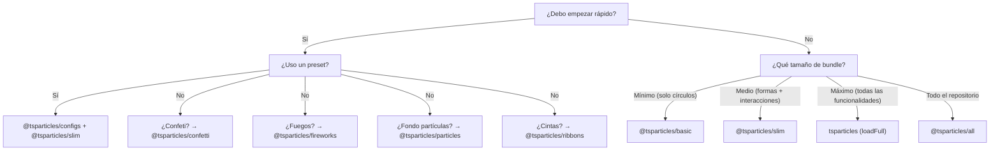

# Guía de bundles

tsParticles es modular. El paquete `@tsparticles/engine` contiene solo el motor base; para tener efectos visibles debes registrar **formas** (qué dibujar), **updaters** (cómo animar), **interacciones** (cómo reaccionar a mouse/touch) y **plugins** (funcionalidades extra). Todo esto ocurre a través de los **bundles**.

## Categorías de bundles

| Categoría       | Bundle                                                                                              | API                                         |
| --------------- | --------------------------------------------------------------------------------------------------- | ------------------------------------------- |
| Engine + loader | `@tsparticles/basic`, `@tsparticles/slim`, `tsparticles`, `@tsparticles/all`                        | `tsParticles.load({ id, options })`         |
| API dedicada    | `@tsparticles/confetti`, `@tsparticles/fireworks`, `@tsparticles/particles`, `@tsparticles/ribbons` | `confetti({...})`, `fireworks({...})`, etc. |

## Tabla comparativa completa

Leyenda: ● = incluido, ○ = no incluido

| Funcionalidad                                                                                       | basic | slim | full (`tsparticles`) | all                |
| --------------------------------------------------------------------------------------------------- | ----- | ---- | -------------------- | ------------------ |
| **Formas (shape)**                                                                                  |       |      |                      |                    |
| Círculo (circle)                                                                                    | ●     | ●    | ●                    | ●                  |
| Cuadrado (square)                                                                                   | ○     | ●    | ●                    | ●                  |
| Estrella (star)                                                                                     | ○     | ●    | ●                    | ●                  |
| Polígono (polygon)                                                                                  | ○     | ●    | ●                    | ●                  |
| Línea (line)                                                                                        | ○     | ●    | ●                    | ●                  |
| Imagen (image)                                                                                      | ○     | ●    | ●                    | ●                  |
| Emoji                                                                                               | ○     | ●    | ●                    | ●                  |
| Texto (text)                                                                                        | ○     | ○    | ●                    | ●                  |
| Cartas (cards)                                                                                      | ○     | ○    | ○                    | ●                  |
| Corazón (heart)                                                                                     | ○     | ○    | ○                    | ●                  |
| Flechas (arrow)                                                                                     | ○     | ○    | ○                    | ●                  |
| Rounded rect                                                                                        | ○     | ○    | ○                    | ●                  |
| Rounded polygon                                                                                     | ○     | ○    | ○                    | ●                  |
| Espiral (spiral)                                                                                    | ○     | ○    | ○                    | ●                  |
| Squircle                                                                                            | ○     | ○    | ○                    | ●                  |
| Cog (engranaje)                                                                                     | ○     | ○    | ○                    | ●                  |
| Infinito (infinity)                                                                                 | ○     | ○    | ○                    | ●                  |
| Matriz (matrix)                                                                                     | ○     | ○    | ○                    | ●                  |
| Path                                                                                                | ○     | ○    | ○                    | ●                  |
| Ribbon                                                                                              | ○     | ○    | ○                    | ●                  |
| **Interacciones externas (mouse/touch)**                                                            |       |      |                      |                    |
| Attract                                                                                             | ○     | ●    | ●                    | ●                  |
| Bounce                                                                                              | ○     | ●    | ●                    | ●                  |
| Bubble                                                                                              | ○     | ●    | ●                    | ●                  |
| Connect                                                                                             | ○     | ●    | ●                    | ●                  |
| Destroy                                                                                             | ○     | ●    | ●                    | ●                  |
| Grab                                                                                                | ○     | ●    | ●                    | ●                  |
| Parallax                                                                                            | ○     | ●    | ●                    | ●                  |
| Pause                                                                                               | ○     | ●    | ●                    | ●                  |
| Push                                                                                                | ○     | ●    | ●                    | ●                  |
| Remove                                                                                              | ○     | ●    | ●                    | ●                  |
| Repulse                                                                                             | ○     | ●    | ●                    | ●                  |
| Slow                                                                                                | ○     | ●    | ●                    | ●                  |
| Drag                                                                                                | ○     | ○    | ●                    | ●                  |
| Trail                                                                                               | ○     | ○    | ●                    | ●                  |
| Cannon                                                                                              | ○     | ○    | ○                    | ●                  |
| Particle                                                                                            | ○     | ○    | ○                    | ●                  |
| Pop                                                                                                 | ○     | ○    | ○                    | ●                  |
| Light                                                                                               | ○     | ○    | ○                    | ●                  |
| **Interacciones entre partículas**                                                                  |       |      |                      |                    |
| Links (enlaces)                                                                                     | ○     | ●    | ●                    | ●                  |
| Collisions (colisiones)                                                                             | ○     | ●    | ●                    | ●                  |
| Attract                                                                                             | ○     | ●    | ●                    | ●                  |
| Repulse                                                                                             | ○     | ○    | ○                    | ●                  |
| **Updaters (animaciones)**                                                                          |       |      |                      |                    |
| Opacidad                                                                                            | ●     | ●    | ●                    | ●                  |
| Tamaño (size)                                                                                       | ●     | ●    | ●                    | ●                  |
| Out modes (salida pantalla)                                                                         | ●     | ●    | ●                    | ●                  |
| Paint (color)                                                                                       | ●     | ●    | ●                    | ●                  |
| Rotación (rotate)                                                                                   | ○     | ●    | ●                    | ●                  |
| Life (vida/ciclo)                                                                                   | ○     | ●    | ●                    | ●                  |
| Destroy (destrucción)                                                                               | ○     | ○    | ●                    | ●                  |
| Roll (rodamiento)                                                                                   | ○     | ○    | ●                    | ●                  |
| Tilt (inclinación)                                                                                  | ○     | ○    | ●                    | ●                  |
| Twinkle (centelleo)                                                                                 | ○     | ○    | ●                    | ●                  |
| Wobble (oscilación)                                                                                 | ○     | ○    | ●                    | ●                  |
| Gradient                                                                                            | ○     | ○    | ○                    | ●                  |
| Orbit                                                                                               | ○     | ○    | ○                    | ●                  |
| **Plugins**                                                                                         |       |      |                      |                    |
| Move (movimiento)                                                                                   | ●     | ●    | ●                    | ●                  |
| Blend (mezcla)                                                                                      | ●     | ●    | ●                    | ●                  |
| Emisores (emitters)                                                                                 | ○     | ○    | ●                    | ●                  |
| Absorbedores (absorbers)                                                                            | ○     | ○    | ●                    | ●                  |
| Sonidos (sounds)                                                                                    | ○     | ○    | ○                    | ●                  |
| Motion (preferencias usuario)                                                                       | ○     | ○    | ○                    | ●                  |
| Temas (themes)                                                                                      | ○     | ○    | ○                    | ●                  |
| Polygon mask                                                                                        | ○     | ○    | ○                    | ●                  |
| Canvas mask                                                                                         | ○     | ○    | ○                    | ●                  |
| Background mask                                                                                     | ○     | ○    | ○                    | ●                  |
| Export (imagen, json, video)                                                                        | ○     | ○    | ○                    | ●                  |
| Manual particles                                                                                    | ○     | ○    | ○                    | ●                  |
| Responsive                                                                                          | ○     | ○    | ○                    | ●                  |
| Trail                                                                                               | ○     | ○    | ○                    | ●                  |
| Zoom                                                                                                | ○     | ○    | ○                    | ●                  |
| Poisson disc                                                                                        | ○     | ○    | ○                    | ●                  |
| **Rutas (path)**                                                                                    |       |      |                      |                    |
| Cualquier path                                                                                      | ○     | ○    | ○                    | ● (14 generadores) |
| **Efectos**                                                                                         |       |      |                      |                    |
| Bubble, Filter, Shadow, etc.                                                                        | ○     | ○    | ○                    | ● (5 efectos)      |
| **Easing**                                                                                          |       |      |                      |                    |
| Quad                                                                                                | ○     | ●    | ●                    | ●                  |
| Back, Bounce, Circ, Cubic, Elastic, Expo, Gaussian, Linear, Quart, Quint, Sigmoid, Sine, Smoothstep | ○     | ○    | ○                    | ●                  |
| **Plugins de color**                                                                                |       |      |                      |                    |
| HEX, HSL, RGB                                                                                       | ●     | ●    | ●                    | ●                  |
| HSV, HWB, LAB, LCH, Named, OKLAB, OKLCH                                                             | ○     | ○    | ○                    | ●                  |

### Bundles con API dedicada

| Funcionalidad      | confetti                                                              | fireworks                | particles          | ribbons          |
| ------------------ | --------------------------------------------------------------------- | ------------------------ | ------------------ | ---------------- |
| Formas             | círculo, corazón, cartas, emoji, imagen, polígono, cuadrado, estrella | línea                    | (de basic)         | ribbon           |
| Interacciones      | —                                                                     | —                        | links + colisiones | —                |
| Plugins especiales | emisores, motion                                                      | emisores, sonidos, blend | —                  | emisores, motion |
| API llamada        | `confetti(opts)`                                                      | `fireworks(opts)`        | `particles(opts)`  | `ribbons(opts)`  |

## Guía de selección



**Reglas prácticas:**

1. La mayoría de proyectos parten de `@tsparticles/slim`.
2. Si el tamaño del bundle es crítico y solo se necesitan círculos que se muevan: `@tsparticles/basic`.
3. Si se necesitan emisores, absorbedores, texto, wobble/tilt/roll: `tsparticles` con `loadFull`.
4. Para prototipado rápido con todas las funcionalidades: `@tsparticles/all`.
5. Para efectos específicos (confeti, fuegos, partículas, cintas) con configuración mínima: bundles con API dedicada.

## Instalación rápida

| Bundle                   | Comando npm                                       | Función loader           | URL CDN                                                        |
| ------------------------ | ------------------------------------------------- | ------------------------ | -------------------------------------------------------------- |
| `@tsparticles/basic`     | `pnpm add @tsparticles/engine @tsparticles/basic` | `loadBasic(tsParticles)` | `@tsparticles/basic@4/tsparticles.basic.bundle.min.js`         |
| `@tsparticles/slim`      | `pnpm add @tsparticles/engine @tsparticles/slim`  | `loadSlim(tsParticles)`  | `@tsparticles/slim@4/tsparticles.slim.bundle.min.js`           |
| `tsparticles` (full)     | `pnpm add @tsparticles/engine tsparticles`        | `loadFull(tsParticles)`  | `tsparticles@4/tsparticles.bundle.min.js`                      |
| `@tsparticles/all`       | `pnpm add @tsparticles/engine @tsparticles/all`   | `loadAll(tsParticles)`   | `@tsparticles/all@4/tsparticles.all.bundle.min.js`             |
| `@tsparticles/confetti`  | `pnpm add @tsparticles/confetti`                  | `confetti(opts)`         | `@tsparticles/confetti@4/tsparticles.confetti.bundle.min.js`   |
| `@tsparticles/fireworks` | `pnpm add @tsparticles/fireworks`                 | `fireworks(opts)`        | `@tsparticles/fireworks@4/tsparticles.fireworks.bundle.min.js` |
| `@tsparticles/particles` | `pnpm add @tsparticles/particles`                 | `particles(opts)`        | `@tsparticles/particles@4/tsparticles.particles.bundle.min.js` |
| `@tsparticles/ribbons`   | `pnpm add @tsparticles/ribbons`                   | `ribbons(opts)`          | `@tsparticles/ribbons@4/tsparticles.ribbons.bundle.min.js`     |

**Nota:** con los bundles basic/slim/full/all DEBES llamar a `load*` antes de `tsParticles.load()`. Los archivos CDN exponen la función loader globalmente pero NO la llaman automáticamente. Los bundles confetti/fireworks/particles/ribbons tienen API autónoma — llama directamente a `confetti()`, `fireworks()`, etc.

Ejemplo CDN para `@tsparticles/slim`:

```html
<script src="https://cdn.jsdelivr.net/npm/@tsparticles/engine@4/tsparticles.engine.min.js"></script>
<script src="https://cdn.jsdelivr.net/npm/@tsparticles/slim@4/tsparticles.slim.bundle.min.js"></script>
<script>
  (async () => {
    await loadSlim(tsParticles);
    await tsParticles.load({ id: "tsparticles", options: { ... } });
  })();
</script>
```

Ejemplo CDN para `@tsparticles/confetti`:

```html
<script src="https://cdn.jsdelivr.net/npm/@tsparticles/confetti@4/tsparticles.confetti.bundle.min.js"></script>
<script>
  confetti({ particleCount: 100 });
</script>
```

Ver también la [guía de instalación](/es/guide/installation) para CDN, npm, yarn, y detalles sobre archivos.

## Páginas relacionadas

- [Guía para empezar](/es/guide/getting-started)
- [Guía de instalación](/es/guide/installation)
- [Catálogo de presets](/demos/presets)
- [Catálogo de paletas](/demos/palettes)
- [Catálogo de formas](/demos/shapes)
