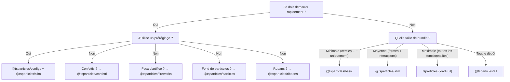

# Guide des bundles

tsParticles est modulaire. Le package `@tsparticles/engine` contient seulement le moteur de base ; pour avoir des effets visibles, vous devez enregistrer des **formes** (quoi dessiner), des **updaters** (comment animer), des **interactions** (comment réagir à la souris/au tactile) et des **plugins** (fonctionnalités supplémentaires). Tout cela se fait via les **bundles**.

## Catégories de bundles

| Catégorie | Bundle | API |
|---|---|---|
| Engine + loader | `@tsparticles/basic`, `@tsparticles/slim`, `tsparticles`, `@tsparticles/all` | `tsParticles.load({ id, options })` |
| API dédiée | `@tsparticles/confetti`, `@tsparticles/fireworks`, `@tsparticles/particles`, `@tsparticles/ribbons` | `confetti({...})`, `fireworks({...})`, etc. |

## Tableau comparatif complet

Légende : ● = inclus, ○ = non inclus

| Fonctionnalité | basic | slim | full (`tsparticles`) | all |
|---|---|---|---|---|
| **Formes (shapes)** | | | | |
| Cercle (circle) | ● | ● | ● | ● |
| Carré (square) | ○ | ● | ● | ● |
| Étoile (star) | ○ | ● | ● | ● |
| Polygone (polygon) | ○ | ● | ● | ● |
| Ligne (line) | ○ | ● | ● | ● |
| Image (image) | ○ | ● | ● | ● |
| Emoji | ○ | ● | ● | ● |
| Texte (text) | ○ | ○ | ● | ● |
| Cartes (cards) | ○ | ○ | ○ | ● |
| Cœur (heart) | ○ | ○ | ○ | ● |
| Flèches (arrow) | ○ | ○ | ○ | ● |
| Rounded rect | ○ | ○ | ○ | ● |
| Rounded polygon | ○ | ○ | ○ | ● |
| Spirale (spiral) | ○ | ○ | ○ | ● |
| Squircle | ○ | ○ | ○ | ● |
| Cog (engrenage) | ○ | ○ | ○ | ● |
| Infini (infinity) | ○ | ○ | ○ | ● |
| Matrice (matrix) | ○ | ○ | ○ | ● |
| Path | ○ | ○ | ○ | ● |
| Ruban (ribbon) | ○ | ○ | ○ | ● |
| **Interactions externes (souris/tactile)** | | | | |
| Attract | ○ | ● | ● | ● |
| Bounce | ○ | ● | ● | ● |
| Bubble | ○ | ● | ● | ● |
| Connect | ○ | ● | ● | ● |
| Destroy | ○ | ● | ● | ● |
| Grab | ○ | ● | ● | ● |
| Parallax | ○ | ● | ● | ● |
| Pause | ○ | ● | ● | ● |
| Push | ○ | ● | ● | ● |
| Remove | ○ | ● | ● | ● |
| Repulse | ○ | ● | ● | ● |
| Slow | ○ | ● | ● | ● |
| Drag | ○ | ○ | ● | ● |
| Trail | ○ | ○ | ● | ● |
| Cannon | ○ | ○ | ○ | ● |
| Particle | ○ | ○ | ○ | ● |
| Pop | ○ | ○ | ○ | ● |
| Light | ○ | ○ | ○ | ● |
| **Interactions entre particules** | | | | |
| Links (liens) | ○ | ● | ● | ● |
| Collisions (collisions) | ○ | ● | ● | ● |
| Attract | ○ | ● | ● | ● |
| Repulse | ○ | ○ | ○ | ● |
| **Updaters (animations)** | | | | |
| Opacité | ● | ● | ● | ● |
| Taille (size) | ● | ● | ● | ● |
| Out modes (sortie d'écran) | ● | ● | ● | ● |
| Paint (couleur) | ● | ● | ● | ● |
| Rotation (rotate) | ○ | ● | ● | ● |
| Life (vie/cycle) | ○ | ● | ● | ● |
| Destroy (destruction) | ○ | ○ | ● | ● |
| Roll (roulement) | ○ | ○ | ● | ● |
| Tilt (inclinaison) | ○ | ○ | ● | ● |
| Twinkle (scintillement) | ○ | ○ | ● | ● |
| Wobble (oscillation) | ○ | ○ | ● | ● |
| Gradient | ○ | ○ | ○ | ● |
| Orbit | ○ | ○ | ○ | ● |
| **Plugins** | | | | |
| Move (mouvement) | ● | ● | ● | ● |
| Blend (mélange) | ● | ● | ● | ● |
| Émetteurs (emitters) | ○ | ○ | ● | ● |
| Absorbeurs (absorbers) | ○ | ○ | ● | ● |
| Sons (sounds) | ○ | ○ | ○ | ● |
| Motion (préférences utilisateur) | ○ | ○ | ○ | ● |
| Thèmes (themes) | ○ | ○ | ○ | ● |
| Polygon mask | ○ | ○ | ○ | ● |
| Canvas mask | ○ | ○ | ○ | ● |
| Background mask | ○ | ○ | ○ | ● |
| Export (image, json, video) | ○ | ○ | ○ | ● |
| Manual particles | ○ | ○ | ○ | ● |
| Responsive | ○ | ○ | ○ | ● |
| Trail | ○ | ○ | ○ | ● |
| Zoom | ○ | ○ | ○ | ● |
| Poisson disc | ○ | ○ | ○ | ● |
| **Chemins (path)** | | | | |
| Tous les paths | ○ | ○ | ○ | ● (14 générateurs) |
| **Effets** | | | | |
| Bubble, Filter, Shadow, etc. | ○ | ○ | ○ | ● (5 effets) |
| **Easing** | | | | |
| Quad | ○ | ● | ● | ● |
| Back, Bounce, Circ, Cubic, Elastic, Expo, Gaussian, Linear, Quart, Quint, Sigmoid, Sine, Smoothstep | ○ | ○ | ○ | ● |
| **Plugins couleur** | | | | |
| HEX, HSL, RGB | ● | ● | ● | ● |
| HSV, HWB, LAB, LCH, Named, OKLAB, OKLCH | ○ | ○ | ○ | ● |

### Bundles à API dédiée

| Fonctionnalité | confetti | fireworks | particles | ribbons |
|---|---|---|---|---|
| Formes | cercle, cœur, cartes, emoji, image, polygone, carré, étoile | ligne | (de basic) | ruban |
| Interactions | — | — | links + collisions | — |
| Plugins spéciaux | émetteurs, motion | émetteurs, sons, blend | — | émetteurs, motion |
| API d'appel | `confetti(opts)` | `fireworks(opts)` | `particles(opts)` | `ribbons(opts)` |

## Guide de sélection



**Règles pratiques :**
1. La plupart des projets partent de `@tsparticles/slim`.
2. Si la taille du bundle est critique et que seuls des cercles qui bougent suffisent : `@tsparticles/basic`.
3. S'il faut des émetteurs, absorbeurs, texte, wobble/tilt/roll : `tsparticles` avec `loadFull`.
4. Pour le prototypage rapide avec toutes les fonctionnalités : `@tsparticles/all`.
5. Pour des effets ciblés (confettis, feux d'artifice, particules, rubans) avec configuration minimale : bundles à API dédiée.

## Installation rapide

| Bundle | Commande npm | Fonction loader | URL CDN |
|---|---|---|---|
| `@tsparticles/basic` | `pnpm add @tsparticles/engine @tsparticles/basic` | `loadBasic(tsParticles)` | `@tsparticles/basic@4/tsparticles.basic.bundle.min.js` |
| `@tsparticles/slim` | `pnpm add @tsparticles/engine @tsparticles/slim` | `loadSlim(tsParticles)` | `@tsparticles/slim@4/tsparticles.slim.bundle.min.js` |
| `tsparticles` (full) | `pnpm add @tsparticles/engine tsparticles` | `loadFull(tsParticles)` | `tsparticles@4/tsparticles.bundle.min.js` |
| `@tsparticles/all` | `pnpm add @tsparticles/engine @tsparticles/all` | `loadAll(tsParticles)` | `@tsparticles/all@4/tsparticles.all.bundle.min.js` |
| `@tsparticles/confetti` | `pnpm add @tsparticles/confetti` | `confetti(opts)` | `@tsparticles/confetti@4/tsparticles.confetti.bundle.min.js` |
| `@tsparticles/fireworks` | `pnpm add @tsparticles/fireworks` | `fireworks(opts)` | `@tsparticles/fireworks@4/tsparticles.fireworks.bundle.min.js` |
| `@tsparticles/particles` | `pnpm add @tsparticles/particles` | `particles(opts)` | `@tsparticles/particles@4/tsparticles.particles.bundle.min.js` |
| `@tsparticles/ribbons` | `pnpm add @tsparticles/ribbons` | `ribbons(opts)` | `@tsparticles/ribbons@4/tsparticles.ribbons.bundle.min.js` |

**Remarque :** avec les bundles basic/slim/full/all, vous DEVEZ appeler `load*` avant `tsParticles.load()`. Les fichiers CDN exposent la fonction loader globalement mais NE l'appellent PAS automatiquement. Les bundles confetti/fireworks/particles/ribbons ont une API autonome — appelez directement `confetti()`, `fireworks()`, etc.

Exemple CDN pour `@tsparticles/slim` :
```html
<script src="https://cdn.jsdelivr.net/npm/@tsparticles/engine@4/tsparticles.engine.min.js"></script>
<script src="https://cdn.jsdelivr.net/npm/@tsparticles/slim@4/tsparticles.slim.bundle.min.js"></script>
<script>
  (async () => {
    await loadSlim(tsParticles);
    await tsParticles.load({ id: "tsparticles", options: { ... } });
  })();
</script>
```

Exemple CDN pour `@tsparticles/confetti` :
```html
<script src="https://cdn.jsdelivr.net/npm/@tsparticles/confetti@4/tsparticles.confetti.bundle.min.js"></script>
<script>confetti({ particleCount: 100 });</script>
```

Voir aussi le [guide d'installation](/fr/guide/installation) pour CDN, npm, yarn et les détails sur les fichiers.

## Pages associées

- [Guide pour démarrer](/fr/guide/getting-started)
- [Guide d'installation](/fr/guide/installation)
- [Catalogue de préréglages](/demos/presets)
- [Catalogue de palettes](/demos/palettes)
- [Catalogue de formes](/demos/shapes)
