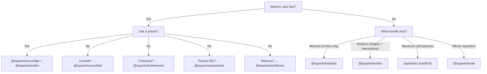

# Bundle Guide

tsParticles is modular. The `@tsparticles/engine` package contains only the core engine; to get visible effects you must register **shapes** (what to draw), **updaters** (how to animate), **interactions** (how to react to mouse/touch), and **plugins** (extra features). All this happens through **bundles**.

## Bundle categories

| Category        | Bundle                                                                                              | API                                         |
| --------------- | --------------------------------------------------------------------------------------------------- | ------------------------------------------- |
| Engine + loader | `@tsparticles/basic`, `@tsparticles/slim`, `tsparticles`, `@tsparticles/all`                        | `tsParticles.load({ id, options })`         |
| Dedicated API   | `@tsparticles/confetti`, `@tsparticles/fireworks`, `@tsparticles/particles`, `@tsparticles/ribbons` | `confetti({...})`, `fireworks({...})`, etc. |

## Complete feature comparison

Legend: ● = included, ○ = not included

| Feature                                                                                             | basic | slim | full (`tsparticles`) | all               |
| --------------------------------------------------------------------------------------------------- | ----- | ---- | -------------------- | ----------------- |
| **Shapes**                                                                                          |       |      |                      |                   |
| Circle                                                                                              | ●     | ●    | ●                    | ●                 |
| Square                                                                                              | ○     | ●    | ●                    | ●                 |
| Star                                                                                                | ○     | ●    | ●                    | ●                 |
| Polygon                                                                                             | ○     | ●    | ●                    | ●                 |
| Line                                                                                                | ○     | ●    | ●                    | ●                 |
| Image                                                                                               | ○     | ●    | ●                    | ●                 |
| Emoji                                                                                               | ○     | ●    | ●                    | ●                 |
| Text                                                                                                | ○     | ○    | ●                    | ●                 |
| Cards (suits)                                                                                       | ○     | ○    | ○                    | ●                 |
| Heart                                                                                               | ○     | ○    | ○                    | ●                 |
| Arrow                                                                                               | ○     | ○    | ○                    | ●                 |
| Rounded rect                                                                                        | ○     | ○    | ○                    | ●                 |
| Rounded polygon                                                                                     | ○     | ○    | ○                    | ●                 |
| Spiral                                                                                              | ○     | ○    | ○                    | ●                 |
| Squircle                                                                                            | ○     | ○    | ○                    | ●                 |
| Cog                                                                                                 | ○     | ○    | ○                    | ●                 |
| Infinity                                                                                            | ○     | ○    | ○                    | ●                 |
| Matrix                                                                                              | ○     | ○    | ○                    | ●                 |
| Path                                                                                                | ○     | ○    | ○                    | ●                 |
| Ribbon                                                                                              | ○     | ○    | ○                    | ●                 |
| **External interactions (mouse/touch)**                                                             |       |      |                      |                   |
| Attract                                                                                             | ○     | ●    | ●                    | ●                 |
| Bounce                                                                                              | ○     | ●    | ●                    | ●                 |
| Bubble                                                                                              | ○     | ●    | ●                    | ●                 |
| Connect                                                                                             | ○     | ●    | ●                    | ●                 |
| Destroy                                                                                             | ○     | ●    | ●                    | ●                 |
| Grab                                                                                                | ○     | ●    | ●                    | ●                 |
| Parallax                                                                                            | ○     | ●    | ●                    | ●                 |
| Pause                                                                                               | ○     | ●    | ●                    | ●                 |
| Push                                                                                                | ○     | ●    | ●                    | ●                 |
| Remove                                                                                              | ○     | ●    | ●                    | ●                 |
| Repulse                                                                                             | ○     | ●    | ●                    | ●                 |
| Slow                                                                                                | ○     | ●    | ●                    | ●                 |
| Drag                                                                                                | ○     | ○    | ●                    | ●                 |
| Trail                                                                                               | ○     | ○    | ●                    | ●                 |
| Cannon                                                                                              | ○     | ○    | ○                    | ●                 |
| Particle                                                                                            | ○     | ○    | ○                    | ●                 |
| Pop                                                                                                 | ○     | ○    | ○                    | ●                 |
| Light                                                                                               | ○     | ○    | ○                    | ●                 |
| **Particle interactions**                                                                           |       |      |                      |                   |
| Links                                                                                               | ○     | ●    | ●                    | ●                 |
| Collisions                                                                                          | ○     | ●    | ●                    | ●                 |
| Attract                                                                                             | ○     | ●    | ●                    | ●                 |
| Repulse                                                                                             | ○     | ○    | ○                    | ●                 |
| **Updaters (animations)**                                                                           |       |      |                      |                   |
| Opacity                                                                                             | ●     | ●    | ●                    | ●                 |
| Size                                                                                                | ●     | ●    | ●                    | ●                 |
| Out modes                                                                                           | ●     | ●    | ●                    | ●                 |
| Paint (color)                                                                                       | ●     | ●    | ●                    | ●                 |
| Rotate                                                                                              | ○     | ●    | ●                    | ●                 |
| Life                                                                                                | ○     | ●    | ●                    | ●                 |
| Destroy                                                                                             | ○     | ○    | ●                    | ●                 |
| Roll                                                                                                | ○     | ○    | ●                    | ●                 |
| Tilt                                                                                                | ○     | ○    | ●                    | ●                 |
| Twinkle                                                                                             | ○     | ○    | ●                    | ●                 |
| Wobble                                                                                              | ○     | ○    | ●                    | ●                 |
| Gradient                                                                                            | ○     | ○    | ○                    | ●                 |
| Orbit                                                                                               | ○     | ○    | ○                    | ●                 |
| **Plugins**                                                                                         |       |      |                      |                   |
| Move                                                                                                | ●     | ●    | ●                    | ●                 |
| Blend                                                                                               | ●     | ●    | ●                    | ●                 |
| Emitters                                                                                            | ○     | ○    | ●                    | ●                 |
| Absorbers                                                                                           | ○     | ○    | ●                    | ●                 |
| Sounds                                                                                              | ○     | ○    | ○                    | ●                 |
| Motion (user prefs)                                                                                 | ○     | ○    | ○                    | ●                 |
| Themes                                                                                              | ○     | ○    | ○                    | ●                 |
| Polygon mask                                                                                        | ○     | ○    | ○                    | ●                 |
| Canvas mask                                                                                         | ○     | ○    | ○                    | ●                 |
| Background mask                                                                                     | ○     | ○    | ○                    | ●                 |
| Export (image, json, video)                                                                         | ○     | ○    | ○                    | ●                 |
| Manual particles                                                                                    | ○     | ○    | ○                    | ●                 |
| Responsive                                                                                          | ○     | ○    | ○                    | ●                 |
| Trail                                                                                               | ○     | ○    | ○                    | ●                 |
| Zoom                                                                                                | ○     | ○    | ○                    | ●                 |
| Poisson disc                                                                                        | ○     | ○    | ○                    | ●                 |
| **Paths**                                                                                           |       |      |                      |                   |
| Any path                                                                                            | ○     | ○    | ○                    | ● (14 generators) |
| **Effects**                                                                                         |       |      |                      |                   |
| Bubble, Filter, Shadow, etc.                                                                        | ○     | ○    | ○                    | ● (5 effects)     |
| **Easing**                                                                                          |       |      |                      |                   |
| Quad                                                                                                | ○     | ●    | ●                    | ●                 |
| Back, Bounce, Circ, Cubic, Elastic, Expo, Gaussian, Linear, Quart, Quint, Sigmoid, Sine, Smoothstep | ○     | ○    | ○                    | ●                 |
| **Color plugins**                                                                                   |       |      |                      |                   |
| HEX, HSL, RGB                                                                                       | ●     | ●    | ●                    | ●                 |
| HSV, HWB, LAB, LCH, Named, OKLAB, OKLCH                                                             | ○     | ○    | ○                    | ●                 |

### Dedicated API bundles

| Feature         | confetti                                                  | fireworks               | particles          | ribbons          |
| --------------- | --------------------------------------------------------- | ----------------------- | ------------------ | ---------------- |
| Shapes          | circle, heart, cards, emoji, image, polygon, square, star | line                    | (from basic)       | ribbon           |
| Interactions    | —                                                         | —                       | links + collisions | —                |
| Special plugins | emitters, motion                                          | emitters, sounds, blend | —                  | emitters, motion |
| API call        | `confetti(opts)`                                          | `fireworks(opts)`       | `particles(opts)`  | `ribbons(opts)`  |

## Selection guide



**Rules of thumb:**

1. Most projects start with `@tsparticles/slim`.
2. If bundle size is critical and you only need circles: `@tsparticles/basic`.
3. If you need emitters, absorbers, text, wobble/tilt/roll: `tsparticles` with `loadFull`.
4. For quick prototyping with all features: `@tsparticles/all`.
5. For targeted effects (confetti, fireworks, particle BG, ribbons) with minimal setup: dedicated API bundles.

## Quick install

| Bundle                   | npm command                                       | Loader function          | CDN URL                                                        |
| ------------------------ | ------------------------------------------------- | ------------------------ | -------------------------------------------------------------- |
| `@tsparticles/basic`     | `pnpm add @tsparticles/engine @tsparticles/basic` | `loadBasic(tsParticles)` | `@tsparticles/basic@4/tsparticles.basic.bundle.min.js`         |
| `@tsparticles/slim`      | `pnpm add @tsparticles/engine @tsparticles/slim`  | `loadSlim(tsParticles)`  | `@tsparticles/slim@4/tsparticles.slim.bundle.min.js`           |
| `tsparticles` (full)     | `pnpm add @tsparticles/engine tsparticles`        | `loadFull(tsParticles)`  | `tsparticles@4/tsparticles.bundle.min.js`                      |
| `@tsparticles/all`       | `pnpm add @tsparticles/engine @tsparticles/all`   | `loadAll(tsParticles)`   | `@tsparticles/all@4/tsparticles.all.bundle.min.js`             |
| `@tsparticles/confetti`  | `pnpm add @tsparticles/confetti`                  | `confetti(opts)`         | `@tsparticles/confetti@4/tsparticles.confetti.bundle.min.js`   |
| `@tsparticles/fireworks` | `pnpm add @tsparticles/fireworks`                 | `fireworks(opts)`        | `@tsparticles/fireworks@4/tsparticles.fireworks.bundle.min.js` |
| `@tsparticles/particles` | `pnpm add @tsparticles/particles`                 | `particles(opts)`        | `@tsparticles/particles@4/tsparticles.particles.bundle.min.js` |
| `@tsparticles/ribbons`   | `pnpm add @tsparticles/ribbons`                   | `ribbons(opts)`          | `@tsparticles/ribbons@4/tsparticles.ribbons.bundle.min.js`     |

**Note:** for basic/slim/full/all bundles you MUST call `load*` before `tsParticles.load()`. CDN files expose the loader function globally but do NOT auto-call it. The confetti/fireworks/particles/ribbons bundles have self-contained APIs — call `confetti()`, `fireworks()`, etc. directly.

CDN example for `@tsparticles/slim`:

```html
<script src="https://cdn.jsdelivr.net/npm/@tsparticles/engine@4/tsparticles.engine.min.js"></script>
<script src="https://cdn.jsdelivr.net/npm/@tsparticles/slim@4/tsparticles.slim.bundle.min.js"></script>
<script>
  (async () => {
    await loadSlim(tsParticles);
    await tsParticles.load({ id: "tsparticles", options: { ... } });
  })();
</script>
```

CDN example for `@tsparticles/confetti`:

```html
<script src="https://cdn.jsdelivr.net/npm/@tsparticles/confetti@4/tsparticles.confetti.bundle.min.js"></script>
<script>
  confetti({ particleCount: 100 });
</script>
```

See also the [installation guide](/guide/installation) for CDN, npm, yarn, and file details.

## Related pages

- [Getting started](/guide/getting-started)
- [Installation guide](/guide/installation)
- [Presets catalog](/demos/presets)
- [Palettes catalog](/demos/palettes)
- [Shapes catalog](/demos/shapes)
