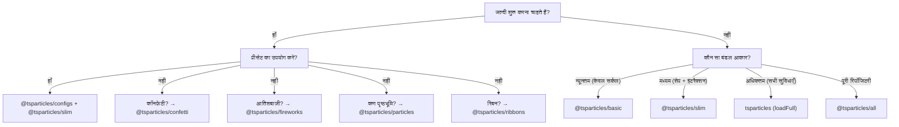

# बंडल गाइड

tsParticles मॉड्यूलर है। `@tsparticles/engine` पैकेज में केवल कोर इंजन है; दृश्य प्रभाव प्राप्त करने के लिए आपको **शेप** (क्या बनाना है), **अपडेटर** (कैसे एनिमेट करना है), **इंटरैक्शन** (माउस/टच पर कैसे प्रतिक्रिया करना है), और **प्लगइन** (अतिरिक्त सुविधाएँ) पंजीकृत करनी होंगी। यह सब **बंडल** के माध्यम से होता है।

## बंडल श्रेणियाँ

| श्रेणी      | बंडल                                                                                                | API                                        |
| ----------- | --------------------------------------------------------------------------------------------------- | ------------------------------------------ |
| इंजन + लोडर | `@tsparticles/basic`, `@tsparticles/slim`, `tsparticles`, `@tsparticles/all`                        | `tsParticles.load({ id, options })`        |
| समर्पित API | `@tsparticles/confetti`, `@tsparticles/fireworks`, `@tsparticles/particles`, `@tsparticles/ribbons` | `confetti({...})`, `fireworks({...})`, आदि |

## पूर्ण सुविधा तुलना

चिह्न: ● = शामिल, ○ = शामिल नहीं

| सुविधा                                                                                              | basic | slim | full (`tsparticles`) | all           |
| --------------------------------------------------------------------------------------------------- | ----- | ---- | -------------------- | ------------- |
| **शेप**                                                                                             |       |      |                      |               |
| Circle                                                                                              | ●     | ●    | ●                    | ●             |
| Square                                                                                              | ○     | ●    | ●                    | ●             |
| Star                                                                                                | ○     | ●    | ●                    | ●             |
| Polygon                                                                                             | ○     | ●    | ●                    | ●             |
| Line                                                                                                | ○     | ●    | ●                    | ●             |
| Image                                                                                               | ○     | ●    | ●                    | ●             |
| Emoji                                                                                               | ○     | ●    | ●                    | ●             |
| Text                                                                                                | ○     | ○    | ●                    | ●             |
| Cards (सूट)                                                                                         | ○     | ○    | ○                    | ●             |
| Heart                                                                                               | ○     | ○    | ○                    | ●             |
| Arrow                                                                                               | ○     | ○    | ○                    | ●             |
| Rounded rect                                                                                        | ○     | ○    | ○                    | ●             |
| Rounded polygon                                                                                     | ○     | ○    | ○                    | ●             |
| Spiral                                                                                              | ○     | ○    | ○                    | ●             |
| Squircle                                                                                            | ○     | ○    | ○                    | ●             |
| Cog                                                                                                 | ○     | ○    | ○                    | ●             |
| Infinity                                                                                            | ○     | ○    | ○                    | ●             |
| Matrix                                                                                              | ○     | ○    | ○                    | ●             |
| Path                                                                                                | ○     | ○    | ○                    | ●             |
| Ribbon                                                                                              | ○     | ○    | ○                    | ●             |
| **बाहरी इंटरैक्शन (माउस/टच)**                                                                       |       |      |                      |               |
| Attract                                                                                             | ○     | ●    | ●                    | ●             |
| Bounce                                                                                              | ○     | ●    | ●                    | ●             |
| Bubble                                                                                              | ○     | ●    | ●                    | ●             |
| Connect                                                                                             | ○     | ●    | ●                    | ●             |
| Destroy                                                                                             | ○     | ●    | ●                    | ●             |
| Grab                                                                                                | ○     | ●    | ●                    | ●             |
| Parallax                                                                                            | ○     | ●    | ●                    | ●             |
| Pause                                                                                               | ○     | ●    | ●                    | ●             |
| Push                                                                                                | ○     | ●    | ●                    | ●             |
| Remove                                                                                              | ○     | ●    | ●                    | ●             |
| Repulse                                                                                             | ○     | ●    | ●                    | ●             |
| Slow                                                                                                | ○     | ●    | ●                    | ●             |
| Drag                                                                                                | ○     | ○    | ●                    | ●             |
| Trail                                                                                               | ○     | ○    | ●                    | ●             |
| Cannon                                                                                              | ○     | ○    | ○                    | ●             |
| Particle                                                                                            | ○     | ○    | ○                    | ●             |
| Pop                                                                                                 | ○     | ○    | ○                    | ●             |
| Light                                                                                               | ○     | ○    | ○                    | ●             |
| **कण इंटरैक्शन**                                                                                    |       |      |                      |               |
| Links                                                                                               | ○     | ●    | ●                    | ●             |
| Collisions                                                                                          | ○     | ●    | ●                    | ●             |
| Attract                                                                                             | ○     | ●    | ●                    | ●             |
| Repulse                                                                                             | ○     | ○    | ○                    | ●             |
| **अपडेटर (एनिमेशन)**                                                                                |       |      |                      |               |
| Opacity                                                                                             | ●     | ●    | ●                    | ●             |
| Size                                                                                                | ●     | ●    | ●                    | ●             |
| Out modes                                                                                           | ●     | ●    | ●                    | ●             |
| Paint (रंग)                                                                                         | ●     | ●    | ●                    | ●             |
| Rotate                                                                                              | ○     | ●    | ●                    | ●             |
| Life                                                                                                | ○     | ●    | ●                    | ●             |
| Destroy                                                                                             | ○     | ○    | ●                    | ●             |
| Roll                                                                                                | ○     | ○    | ●                    | ●             |
| Tilt                                                                                                | ○     | ○    | ●                    | ●             |
| Twinkle                                                                                             | ○     | ○    | ●                    | ●             |
| Wobble                                                                                              | ○     | ○    | ●                    | ●             |
| Gradient                                                                                            | ○     | ○    | ○                    | ●             |
| Orbit                                                                                               | ○     | ○    | ○                    | ●             |
| **प्लगइन**                                                                                          |       |      |                      |               |
| Move                                                                                                | ●     | ●    | ●                    | ●             |
| Blend                                                                                               | ●     | ●    | ●                    | ●             |
| Emitters                                                                                            | ○     | ○    | ●                    | ●             |
| Absorbers                                                                                           | ○     | ○    | ●                    | ●             |
| Sounds                                                                                              | ○     | ○    | ○                    | ●             |
| Motion (उपयोगकर्ता प्राथमिकताएँ)                                                                    | ○     | ○    | ○                    | ●             |
| Themes                                                                                              | ○     | ○    | ○                    | ●             |
| Polygon mask                                                                                        | ○     | ○    | ○                    | ●             |
| Canvas mask                                                                                         | ○     | ○    | ○                    | ●             |
| Background mask                                                                                     | ○     | ○    | ○                    | ●             |
| Export (इमेज, JSON, वीडियो)                                                                         | ○     | ○    | ○                    | ●             |
| Manual particles                                                                                    | ○     | ○    | ○                    | ●             |
| Responsive                                                                                          | ○     | ○    | ○                    | ●             |
| Trail                                                                                               | ○     | ○    | ○                    | ●             |
| Zoom                                                                                                | ○     | ○    | ○                    | ●             |
| Poisson disc                                                                                        | ○     | ○    | ○                    | ●             |
| **पथ**                                                                                              |       |      |                      |               |
| कोई भी पथ                                                                                           | ○     | ○    | ○                    | ● (14 जनरेटर) |
| **इफ़ेक्ट**                                                                                         |       |      |                      |               |
| Bubble, Filter, Shadow, आदि                                                                         | ○     | ○    | ○                    | ● (5 इफ़ेक्ट) |
| **ईज़िंग**                                                                                          |       |      |                      |               |
| Quad                                                                                                | ○     | ●    | ●                    | ●             |
| Back, Bounce, Circ, Cubic, Elastic, Expo, Gaussian, Linear, Quart, Quint, Sigmoid, Sine, Smoothstep | ○     | ○    | ○                    | ●             |
| **रंग प्लगइन**                                                                                      |       |      |                      |               |
| HEX, HSL, RGB                                                                                       | ●     | ●    | ●                    | ●             |
| HSV, HWB, LAB, LCH, Named, OKLAB, OKLCH                                                             | ○     | ○    | ○                    | ●             |

### समर्पित API बंडल

| सुविधा       | confetti                                                  | fireworks               | particles          | ribbons          |
| ------------ | --------------------------------------------------------- | ----------------------- | ------------------ | ---------------- |
| शेप          | circle, heart, cards, emoji, image, polygon, square, star | line                    | (basic से)         | ribbon           |
| इंटरैक्शन    | —                                                         | —                       | links + collisions | —                |
| विशेष प्लगइन | emitters, motion                                          | emitters, sounds, blend | —                  | emitters, motion |
| API कॉल      | `confetti(opts)`                                          | `fireworks(opts)`       | `particles(opts)`  | `ribbons(opts)`  |

## चयन गाइड



**सामान्य नियम:**

1. अधिकांश प्रोजेक्ट `@tsparticles/slim` से शुरू करें।
2. यदि बंडल आकार महत्वपूर्ण है और आपको केवल सर्कल चाहिए: `@tsparticles/basic`।
3. यदि आपको एमिटर, एब्ज़ॉर्बर, टेक्स्ट, वॉबल/टिल्ट/रोल चाहिए: `tsparticles` `loadFull` के साथ।
4. सभी सुविधाओं के साथ त्वरित प्रोटोटाइप के लिए: `@tsparticles/all`।
5. न्यूनतम सेटअप के साथ लक्षित प्रभावों (कॉनफ़ेटी, आतिशबाज़ी, कण पृष्ठभूमि, रिबन) के लिए: समर्पित API बंडल।

## त्वरित इंस्टॉल

| बंडल                     | npm कमांड                                         | लोडर फ़ंक्शन             | CDN URL                                                        |
| ------------------------ | ------------------------------------------------- | ------------------------ | -------------------------------------------------------------- |
| `@tsparticles/basic`     | `pnpm add @tsparticles/engine @tsparticles/basic` | `loadBasic(tsParticles)` | `@tsparticles/basic@4/tsparticles.basic.bundle.min.js`         |
| `@tsparticles/slim`      | `pnpm add @tsparticles/engine @tsparticles/slim`  | `loadSlim(tsParticles)`  | `@tsparticles/slim@4/tsparticles.slim.bundle.min.js`           |
| `tsparticles` (full)     | `pnpm add @tsparticles/engine tsparticles`        | `loadFull(tsParticles)`  | `tsparticles@4/tsparticles.bundle.min.js`                      |
| `@tsparticles/all`       | `pnpm add @tsparticles/engine @tsparticles/all`   | `loadAll(tsParticles)`   | `@tsparticles/all@4/tsparticles.all.bundle.min.js`             |
| `@tsparticles/confetti`  | `pnpm add @tsparticles/confetti`                  | `confetti(opts)`         | `@tsparticles/confetti@4/tsparticles.confetti.bundle.min.js`   |
| `@tsparticles/fireworks` | `pnpm add @tsparticles/fireworks`                 | `fireworks(opts)`        | `@tsparticles/fireworks@4/tsparticles.fireworks.bundle.min.js` |
| `@tsparticles/particles` | `pnpm add @tsparticles/particles`                 | `particles(opts)`        | `@tsparticles/particles@4/tsparticles.particles.bundle.min.js` |
| `@tsparticles/ribbons`   | `pnpm add @tsparticles/ribbons`                   | `ribbons(opts)`          | `@tsparticles/ribbons@4/tsparticles.ribbons.bundle.min.js`     |

**नोट:** basic/slim/full/all बंडल के लिए आपको `tsParticles.load()` से पहले `load*` कॉल करना होगा। CDN फ़ाइलें लोडर फ़ंक्शन को ग्लोबली एक्सपोज़ करती हैं लेकिन इसे ऑटो-कॉल नहीं करतीं। confetti/fireworks/particles/ribbons बंडल में स्व-निहित API है — सीधे `confetti()`, `fireworks()`, आदि कॉल करें।

`@tsparticles/slim` के लिए CDN उदाहरण:

```html
<script src="https://cdn.jsdelivr.net/npm/@tsparticles/engine@4/tsparticles.engine.min.js"></script>
<script src="https://cdn.jsdelivr.net/npm/@tsparticles/slim@4/tsparticles.slim.bundle.min.js"></script>
<script>
  (async () => {
    await loadSlim(tsParticles);
    await tsParticles.load({ id: "tsparticles", options: { ... } });
  })();
</script>
```

`@tsparticles/confetti` के लिए CDN उदाहरण:

```html
<script src="https://cdn.jsdelivr.net/npm/@tsparticles/confetti@4/tsparticles.confetti.bundle.min.js"></script>
<script>
  confetti({ particleCount: 100 });
</script>
```

इंस्टॉलेशन गाइड भी देखें: [`/hi/guide/installation`](/hi/guide/installation)।

## संबंधित पेज

- [आरंभ करना](/hi/guide/getting-started)
- [इंस्टॉलेशन गाइड](/hi/guide/installation)
- [प्रीसेट कैटलॉग](/hi/demos/presets)
- [पैलेट कैटलॉग](/hi/demos/palettes)
- [शेप कैटलॉग](/hi/demos/shapes)
