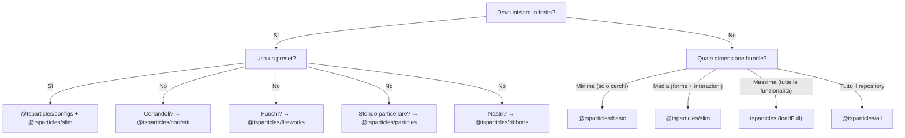

# Guida ai bundle

tsParticles è modulare. Il pacchetto `@tsparticles/engine` contiene solo il motore base; per avere effetti visibili devi registrare **forme** (cosa disegnare), **updater** (come animare), **interazioni** (come reagire a mouse/touch) e **plugin** (funzionalità extra). Tutto questo avviene attraverso i **bundle**.

## Categorie di bundle

| Categoria       | Bundle                                                                                              | API                                         |
| --------------- | --------------------------------------------------------------------------------------------------- | ------------------------------------------- |
| Engine + loader | `@tsparticles/basic`, `@tsparticles/slim`, `tsparticles`, `@tsparticles/all`                        | `tsParticles.load({ id, options })`         |
| API dedicata    | `@tsparticles/confetti`, `@tsparticles/fireworks`, `@tsparticles/particles`, `@tsparticles/ribbons` | `confetti({...})`, `fireworks({...})`, ecc. |

## Tabella comparativa completa

Legenda: ● = incluso, ○ = non incluso

| Funzionalità                                                                                        | basic | slim | full (`tsparticles`) | all               |
| --------------------------------------------------------------------------------------------------- | ----- | ---- | -------------------- | ----------------- |
| **Forme (shape)**                                                                                   |       |      |                      |                   |
| Cerchio (circle)                                                                                    | ●     | ●    | ●                    | ●                 |
| Quadrato (square)                                                                                   | ○     | ●    | ●                    | ●                 |
| Stella (star)                                                                                       | ○     | ●    | ●                    | ●                 |
| Poligono (polygon)                                                                                  | ○     | ●    | ●                    | ●                 |
| Linea (line)                                                                                        | ○     | ●    | ●                    | ●                 |
| Immagine (image)                                                                                    | ○     | ●    | ●                    | ●                 |
| Emoji                                                                                               | ○     | ●    | ●                    | ●                 |
| Testo (text)                                                                                        | ○     | ○    | ●                    | ●                 |
| Carte (cards)                                                                                       | ○     | ○    | ○                    | ●                 |
| Cuore (heart)                                                                                       | ○     | ○    | ○                    | ●                 |
| Frecce (arrow)                                                                                      | ○     | ○    | ○                    | ●                 |
| Rounded rect                                                                                        | ○     | ○    | ○                    | ●                 |
| Rounded polygon                                                                                     | ○     | ○    | ○                    | ●                 |
| Spirale (spiral)                                                                                    | ○     | ○    | ○                    | ●                 |
| Squircle                                                                                            | ○     | ○    | ○                    | ●                 |
| Cog (ingranaggio)                                                                                   | ○     | ○    | ○                    | ●                 |
| Infinito (infinity)                                                                                 | ○     | ○    | ○                    | ●                 |
| Matrice (matrix)                                                                                    | ○     | ○    | ○                    | ●                 |
| Path                                                                                                | ○     | ○    | ○                    | ●                 |
| Ribbon                                                                                              | ○     | ○    | ○                    | ●                 |
| **Interazioni esterne (mouse/touch)**                                                               |       |      |                      |                   |
| Attract                                                                                             | ○     | ●    | ●                    | ●                 |
| Bounce                                                                                              | ○     | ●    | ●                    | ●                 |
| Bubble                                                                                              | ○     | ●    | ●                    | ●                 |
| Connect                                                                                             | ○     | ●    | ●                    | ●                 |
| Destroy                                                                                             | ○     | ●    | ●                    | ●                 |
| Grab                                                                                                | ○     | ●    | ●                    | ●                 |
| Parallax                                                                                            | ○     | ●    | ●                    | ●                 |
| Pause                                                                                               | ○     | ●    | ●                    | ●                 |
| Push                                                                                                | ○     | ●    | ●                    | ●                 |
| Remove                                                                                              | ○     | ●    | ●                    | ●                 |
| Repulse                                                                                             | ○     | ●    | ●                    | ●                 |
| Slow                                                                                                | ○     | ●    | ●                    | ●                 |
| Drag                                                                                                | ○     | ○    | ●                    | ●                 |
| Trail                                                                                               | ○     | ○    | ●                    | ●                 |
| Cannon                                                                                              | ○     | ○    | ○                    | ●                 |
| Particle                                                                                            | ○     | ○    | ○                    | ●                 |
| Pop                                                                                                 | ○     | ○    | ○                    | ●                 |
| Light                                                                                               | ○     | ○    | ○                    | ●                 |
| **Interazioni tra particelle**                                                                      |       |      |                      |                   |
| Links (collegamenti)                                                                                | ○     | ●    | ●                    | ●                 |
| Collisions (collisioni)                                                                             | ○     | ●    | ●                    | ●                 |
| Attract                                                                                             | ○     | ●    | ●                    | ●                 |
| Repulse                                                                                             | ○     | ○    | ○                    | ●                 |
| **Updater (animazioni)**                                                                            |       |      |                      |                   |
| Opacità                                                                                             | ●     | ●    | ●                    | ●                 |
| Dimensione (size)                                                                                   | ●     | ●    | ●                    | ●                 |
| Out modes (uscita schermo)                                                                          | ●     | ●    | ●                    | ●                 |
| Paint (colore)                                                                                      | ●     | ●    | ●                    | ●                 |
| Rotazione (rotate)                                                                                  | ○     | ●    | ●                    | ●                 |
| Life (vita/ ciclo)                                                                                  | ○     | ●    | ●                    | ●                 |
| Destroy (distruzione)                                                                               | ○     | ○    | ●                    | ●                 |
| Roll (rotolamento)                                                                                  | ○     | ○    | ●                    | ●                 |
| Tilt (inclinazione)                                                                                 | ○     | ○    | ●                    | ●                 |
| Twinkle (scintillio)                                                                                | ○     | ○    | ●                    | ●                 |
| Wobble (oscillazione)                                                                               | ○     | ○    | ●                    | ●                 |
| Gradient                                                                                            | ○     | ○    | ○                    | ●                 |
| Orbit                                                                                               | ○     | ○    | ○                    | ●                 |
| **Plugin**                                                                                          |       |      |                      |                   |
| Move (movimento)                                                                                    | ●     | ●    | ●                    | ●                 |
| Blend (miscelazione)                                                                                | ●     | ●    | ●                    | ●                 |
| Emettitori (emitters)                                                                               | ○     | ○    | ●                    | ●                 |
| Assorbitori (absorbers)                                                                             | ○     | ○    | ●                    | ●                 |
| Suoni (sounds)                                                                                      | ○     | ○    | ○                    | ●                 |
| Motion (preferenze utente)                                                                          | ○     | ○    | ○                    | ●                 |
| Temi (themes)                                                                                       | ○     | ○    | ○                    | ●                 |
| Polygon mask                                                                                        | ○     | ○    | ○                    | ●                 |
| Canvas mask                                                                                         | ○     | ○    | ○                    | ●                 |
| Background mask                                                                                     | ○     | ○    | ○                    | ●                 |
| Export (immagine, json, video)                                                                      | ○     | ○    | ○                    | ●                 |
| Manual particles                                                                                    | ○     | ○    | ○                    | ●                 |
| Responsive                                                                                          | ○     | ○    | ○                    | ●                 |
| Trail                                                                                               | ○     | ○    | ○                    | ●                 |
| Zoom                                                                                                | ○     | ○    | ○                    | ●                 |
| Poisson disc                                                                                        | ○     | ○    | ○                    | ●                 |
| **Percorsi (path)**                                                                                 |       |      |                      |                   |
| Qualsiasi path                                                                                      | ○     | ○    | ○                    | ● (14 generatori) |
| **Effetti**                                                                                         |       |      |                      |                   |
| Bubble, Filter, Shadow, ecc.                                                                        | ○     | ○    | ○                    | ● (5 effetti)     |
| **Easing**                                                                                          |       |      |                      |                   |
| Quad                                                                                                | ○     | ●    | ●                    | ●                 |
| Back, Bounce, Circ, Cubic, Elastic, Expo, Gaussian, Linear, Quart, Quint, Sigmoid, Sine, Smoothstep | ○     | ○    | ○                    | ●                 |
| **Plugin colore**                                                                                   |       |      |                      |                   |
| HEX, HSL, RGB                                                                                       | ●     | ●    | ●                    | ●                 |
| HSV, HWB, LAB, LCH, Named, OKLAB, OKLCH                                                             | ○     | ○    | ○                    | ●                 |

### Bundle ad API dedicata

| Funzionalità    | confetti                                                           | fireworks                | particles          | ribbons            |
| --------------- | ------------------------------------------------------------------ | ------------------------ | ------------------ | ------------------ |
| Forme           | cerchio, cuore, carte, emoji, immagine, poligono, quadrato, stella | linea                    | (da basic)         | ribbon             |
| Interazioni     | —                                                                  | —                        | links + collisioni | —                  |
| Plugin speciali | emettitori, motion                                                 | emettitori, suoni, blend | —                  | emettitori, motion |
| API chiamata    | `confetti(opts)`                                                   | `fireworks(opts)`        | `particles(opts)`  | `ribbons(opts)`    |

## Guida alla scelta



**Regole pratiche:**

1. La maggior parte dei progetti parte da `@tsparticles/slim`.
2. Se la dimensione del bundle è critica e servono solo cerchi che si muovono: `@tsparticles/basic`.
3. Se servono emettitori, assorbitori, testo, wobble/tilt/roll: `tsparticles` con `loadFull`.
4. Per prototipazione rapida con tutte le funzionalità: `@tsparticles/all`.
5. Per effetti mirati (coriandoli, fuochi, particelle, nastri) con setup minimo: bundle ad API dedicata.

## Installazione rapida

| Bundle                   | Comando npm                                       | Funzione loader          | CDN URL                                                        |
| ------------------------ | ------------------------------------------------- | ------------------------ | -------------------------------------------------------------- |
| `@tsparticles/basic`     | `pnpm add @tsparticles/engine @tsparticles/basic` | `loadBasic(tsParticles)` | `@tsparticles/basic@4/tsparticles.basic.bundle.min.js`         |
| `@tsparticles/slim`      | `pnpm add @tsparticles/engine @tsparticles/slim`  | `loadSlim(tsParticles)`  | `@tsparticles/slim@4/tsparticles.slim.bundle.min.js`           |
| `tsparticles` (full)     | `pnpm add @tsparticles/engine tsparticles`        | `loadFull(tsParticles)`  | `tsparticles@4/tsparticles.bundle.min.js`                      |
| `@tsparticles/all`       | `pnpm add @tsparticles/engine @tsparticles/all`   | `loadAll(tsParticles)`   | `@tsparticles/all@4/tsparticles.all.bundle.min.js`             |
| `@tsparticles/confetti`  | `pnpm add @tsparticles/confetti`                  | `confetti(opts)`         | `@tsparticles/confetti@4/tsparticles.confetti.bundle.min.js`   |
| `@tsparticles/fireworks` | `pnpm add @tsparticles/fireworks`                 | `fireworks(opts)`        | `@tsparticles/fireworks@4/tsparticles.fireworks.bundle.min.js` |
| `@tsparticles/particles` | `pnpm add @tsparticles/particles`                 | `particles(opts)`        | `@tsparticles/particles@4/tsparticles.particles.bundle.min.js` |
| `@tsparticles/ribbons`   | `pnpm add @tsparticles/ribbons`                   | `ribbons(opts)`          | `@tsparticles/ribbons@4/tsparticles.ribbons.bundle.min.js`     |

**Nota:** con i bundle basic/slim/full/all devi SEMPRE chiamare `load*` prima di `tsParticles.load()`. I file CDN espongono la funzione loader globalmente ma NON la chiamano automaticamente. I bundle confetti/fireworks/particles/ribbons invece hanno API autonoma: chiami direttamente `confetti()`, `fireworks()`, ecc.

Esempio CDN per `@tsparticles/slim`:

```html
<script src="https://cdn.jsdelivr.net/npm/@tsparticles/engine@4/tsparticles.engine.min.js"></script>
<script src="https://cdn.jsdelivr.net/npm/@tsparticles/slim@4/tsparticles.slim.bundle.min.js"></script>
<script>
  (async () => {
    await loadSlim(tsParticles);
    await tsParticles.load({ id: "tsparticles", options: { ... } });
  })();
</script>
```

Esempio CDN per `@tsparticles/confetti`:

```html
<script src="https://cdn.jsdelivr.net/npm/@tsparticles/confetti@4/tsparticles.confetti.bundle.min.js"></script>
<script>
  confetti({ particleCount: 100 });
</script>
```

Vedi anche la [guida all'installazione](/it/guide/installation) per CDN, npm, yarn, e dettagli sui file.

Vedi anche la [guida all'installazione](/it/guide/installation) per CDN, npm, yarn, e dettagli sui file.

## Pagine correlate

- [Guida per iniziare](/it/guide/getting-started)
- [Guida all'installazione](/it/guide/installation)
- [Catalogo preset](/demos/presets)
- [Catalogo palette](/demos/palettes)
- [Catalogo forme](/demos/shapes)
