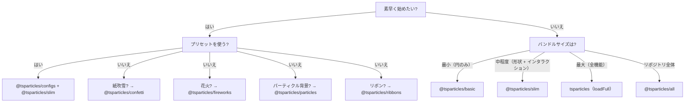

# バンドルガイド

tsParticles はモジュール式です。`@tsparticles/engine` パッケージはコアエンジンのみを含みます。視覚効果を得るには、**形状**（何を描画するか）、**アップデーター**（アニメーション方法）、**インタラクション**（マウス/タッチへの反応）、**プラグイン**（追加機能）を登録する必要があります。これらはすべて**バンドル**を通じて行われます。

## バンドルのカテゴリ

| カテゴリ | バンドル | API |
|---|---|---|
| エンジン + ローダー | `@tsparticles/basic`、`@tsparticles/slim`、`tsparticles`、`@tsparticles/all` | `tsParticles.load({ id, options })` |
| 専用 API | `@tsparticles/confetti`、`@tsparticles/fireworks`、`@tsparticles/particles`、`@tsparticles/ribbons` | `confetti({...})`、`fireworks({...})` など |

## 機能比較

凡例: ● = 含む、○ = 含まない

| 機能 | basic | slim | full（`tsparticles`） | all |
|---|---|---|---|---|
| **形状** | | | | |
| 円 | ● | ● | ● | ● |
| 四角 | ○ | ● | ● | ● |
| 星 | ○ | ● | ● | ● |
| 多角形 | ○ | ● | ● | ● |
| 線 | ○ | ● | ● | ● |
| 画像 | ○ | ● | ● | ● |
| 絵文字 | ○ | ● | ● | ● |
| テキスト | ○ | ○ | ● | ● |
| カード（スート） | ○ | ○ | ○ | ● |
| ハート | ○ | ○ | ○ | ● |
| 矢印 | ○ | ○ | ○ | ● |
| 角丸四角 | ○ | ○ | ○ | ● |
| 角丸多角形 | ○ | ○ | ○ | ● |
| スパイラル | ○ | ○ | ○ | ● |
| スクワークル | ○ | ○ | ○ | ● |
| Cog | ○ | ○ | ○ | ● |
| Infinity | ○ | ○ | ○ | ● |
| Matrix | ○ | ○ | ○ | ● |
| Path | ○ | ○ | ○ | ● |
| リボン | ○ | ○ | ○ | ● |
| **外部インタラクション（マウス/タッチ）** | | | | |
| Attract | ○ | ● | ● | ● |
| Bounce | ○ | ● | ● | ● |
| Bubble | ○ | ● | ● | ● |
| Connect | ○ | ● | ● | ● |
| Destroy | ○ | ● | ● | ● |
| Grab | ○ | ● | ● | ● |
| Parallax | ○ | ● | ● | ● |
| Pause | ○ | ● | ● | ● |
| Push | ○ | ● | ● | ● |
| Remove | ○ | ● | ● | ● |
| Repulse | ○ | ● | ● | ● |
| Slow | ○ | ● | ● | ● |
| Drag | ○ | ○ | ● | ● |
| Trail | ○ | ○ | ● | ● |
| Cannon | ○ | ○ | ○ | ● |
| Particle | ○ | ○ | ○ | ● |
| Pop | ○ | ○ | ○ | ● |
| Light | ○ | ○ | ○ | ● |
| **パーティクルインタラクション** | | | | |
| リンク | ○ | ● | ● | ● |
| 衝突 | ○ | ● | ● | ● |
| Attract | ○ | ● | ● | ● |
| Repulse | ○ | ○ | ○ | ● |
| **アップデーター（アニメーション）** | | | | |
| 不透明度 | ● | ● | ● | ● |
| サイズ | ● | ● | ● | ● |
| Out modes | ● | ● | ● | ● |
| 色（Paint） | ● | ● | ● | ● |
| 回転 | ○ | ● | ● | ● |
| Life | ○ | ● | ● | ● |
| Destroy | ○ | ○ | ● | ● |
| Roll | ○ | ○ | ● | ● |
| Tilt | ○ | ○ | ● | ● |
| Twinkle | ○ | ○ | ● | ● |
| Wobble | ○ | ○ | ● | ● |
| Gradient | ○ | ○ | ○ | ● |
| Orbit | ○ | ○ | ○ | ● |
| **プラグイン** | | | | |
| Move | ● | ● | ● | ● |
| Blend | ● | ● | ● | ● |
| エミッター | ○ | ○ | ● | ● |
| アブソーバー | ○ | ○ | ● | ● |
| Sounds | ○ | ○ | ○ | ● |
| Motion（ユーザー設定） | ○ | ○ | ○ | ● |
| Themes | ○ | ○ | ○ | ● |
| ポリゴンマスク | ○ | ○ | ○ | ● |
| キャンバスマスク | ○ | ○ | ○ | ● |
| 背景マスク | ○ | ○ | ○ | ● |
| エクスポート（画像、JSON、動画） | ○ | ○ | ○ | ● |
| Manual particles | ○ | ○ | ○ | ● |
| Responsive | ○ | ○ | ○ | ● |
| Trail | ○ | ○ | ○ | ● |
| Zoom | ○ | ○ | ○ | ● |
| Poisson disc | ○ | ○ | ○ | ● |
| **パス** | | | | |
| 任意のパス | ○ | ○ | ○ | ●（14 ジェネレーター） |
| **エフェクト** | | | | |
| バブル、フィルター、シャドウなど | ○ | ○ | ○ | ●（5 エフェクト） |
| **イージング** | | | | |
| Quad | ○ | ● | ● | ● |
| Back、Bounce、Circ、Cubic、Elastic、Expo、Gaussian、Linear、Quart、Quint、Sigmoid、Sine、Smoothstep | ○ | ○ | ○ | ● |
| **カラープラグイン** | | | | |
| HEX、HSL、RGB | ● | ● | ● | ● |
| HSV、HWB、LAB、LCH、Named、OKLAB、OKLCH | ○ | ○ | ○ | ● |

### 専用 API バンドル

| 機能 | confetti | fireworks | particles | ribbons |
|---|---|---|---|---|
| 形状 | 円、ハート、カード、絵文字、画像、多角形、四角、星 | 線 |（basic から） | リボン |
| インタラクション | — | — | リンク + 衝突 | — |
| 特殊プラグイン | エミッター、motion | エミッター、sounds、blend | — | エミッター、motion |
| API 呼び出し | `confetti(opts)` | `fireworks(opts)` | `particles(opts)` | `ribbons(opts)` |

## 選択ガイド



**経験則:**
1. ほとんどのプロジェクトは `@tsparticles/slim` から始めます。
2. バンドルサイズが重要で円のみ必要な場合: `@tsparticles/basic`。
3. エミッター、アブソーバー、テキスト、ウィブル/ティルト/ロールが必要な場合: `tsparticles` で `loadFull`。
4. 全機能を使った迅速なプロトタイピング: `@tsparticles/all`。
5. 最小セットアップで目的別エフェクト（紙吹雪、花火、パーティクル背景、リボン）: 専用 API バンドル。

## クイックインストール

| バンドル | npm コマンド | ローダー関数 | CDN URL |
|---|---|---|---|
| `@tsparticles/basic` | `pnpm add @tsparticles/engine @tsparticles/basic` | `loadBasic(tsParticles)` | `@tsparticles/basic@4/tsparticles.basic.bundle.min.js` |
| `@tsparticles/slim` | `pnpm add @tsparticles/engine @tsparticles/slim` | `loadSlim(tsParticles)` | `@tsparticles/slim@4/tsparticles.slim.bundle.min.js` |
| `tsparticles`（full） | `pnpm add @tsparticles/engine tsparticles` | `loadFull(tsParticles)` | `tsparticles@4/tsparticles.bundle.min.js` |
| `@tsparticles/all` | `pnpm add @tsparticles/engine @tsparticles/all` | `loadAll(tsParticles)` | `@tsparticles/all@4/tsparticles.all.bundle.min.js` |
| `@tsparticles/confetti` | `pnpm add @tsparticles/confetti` | `confetti(opts)` | `@tsparticles/confetti@4/tsparticles.confetti.bundle.min.js` |
| `@tsparticles/fireworks` | `pnpm add @tsparticles/fireworks` | `fireworks(opts)` | `@tsparticles/fireworks@4/tsparticles.fireworks.bundle.min.js` |
| `@tsparticles/particles` | `pnpm add @tsparticles/particles` | `particles(opts)` | `@tsparticles/particles@4/tsparticles.particles.bundle.min.js` |
| `@tsparticles/ribbons` | `pnpm add @tsparticles/ribbons` | `ribbons(opts)` | `@tsparticles/ribbons@4/tsparticles.ribbons.bundle.min.js` |

**注意:** basic/slim/full/all バンドルでは、`tsParticles.load()` の前に `load*` を呼び出す必要があります。CDN ファイルはローダー関数をグローバルに公開しますが、自動実行はしません。confetti/fireworks/particles/ribbons バンドルは自己完結型 API を持ち、`confetti()`、`fireworks()` などを直接呼び出します。

`@tsparticles/slim` の CDN 例:
```html
<script src="https://cdn.jsdelivr.net/npm/@tsparticles/engine@4/tsparticles.engine.min.js"></script>
<script src="https://cdn.jsdelivr.net/npm/@tsparticles/slim@4/tsparticles.slim.bundle.min.js"></script>
<script>
  (async () => {
    await loadSlim(tsParticles);
    await tsParticles.load({ id: "tsparticles", options: { ... } });
  })();
</script>
```

`@tsparticles/confetti` の CDN 例:
```html
<script src="https://cdn.jsdelivr.net/npm/@tsparticles/confetti@4/tsparticles.confetti.bundle.min.js"></script>
<script>confetti({ particleCount: 100 });</script>
```

インストールの詳細は[インストールガイド](/ja/guide/installation)を参照してください。

## 関連ページ

- [はじめに](/ja/guide/getting-started)
- [インストールガイド](/ja/guide/installation)
- [プリセットカタログ](/ja/demos/presets)
- [パレットカタログ](/ja/demos/palettes)
- [形状カタログ](/ja/demos/shapes)
