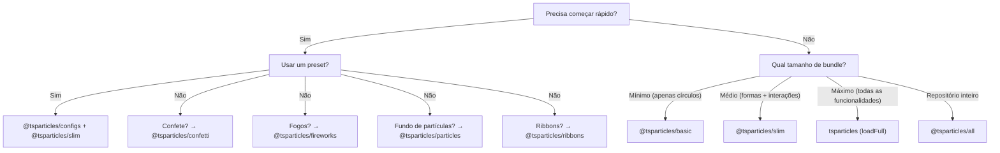

# Guia de bundles

O tsParticles é modular. O pacote `@tsparticles/engine` contém apenas o núcleo do motor; para obter efeitos visíveis você deve registrar **formas** (o que desenhar), **atualizadores** (como animar), **interações** (como reagir ao mouse/toque) e **plugins** (funcionalidades extras). Tudo isso acontece através de **bundles**.

## Categorias de bundles

| Categoria | Bundle | API |
|---|---|---|
| Motor + loader | `@tsparticles/basic`, `@tsparticles/slim`, `tsparticles`, `@tsparticles/all` | `tsParticles.load({ id, options })` |
| API dedicada | `@tsparticles/confetti`, `@tsparticles/fireworks`, `@tsparticles/particles`, `@tsparticles/ribbons` | `confetti({...})`, `fireworks({...})`, etc. |

## Comparação completa de funcionalidades

Legenda: ● = incluído, ○ = não incluído

| Funcionalidade | basic | slim | full (`tsparticles`) | all |
|---|---|---|---|---|
| **Formas** | | | | |
| Círculo | ● | ● | ● | ● |
| Quadrado | ○ | ● | ● | ● |
| Estrela | ○ | ● | ● | ● |
| Polígono | ○ | ● | ● | ● |
| Linha | ○ | ● | ● | ● |
| Imagem | ○ | ● | ● | ● |
| Emoji | ○ | ● | ● | ● |
| Texto | ○ | ○ | ● | ● |
| Cartas (naipes) | ○ | ○ | ○ | ● |
| Coração | ○ | ○ | ○ | ● |
| Seta | ○ | ○ | ○ | ● |
| Retângulo arredondado | ○ | ○ | ○ | ● |
| Polígono arredondado | ○ | ○ | ○ | ● |
| Espiral | ○ | ○ | ○ | ● |
| Squircle | ○ | ○ | ○ | ● |
| Engrenagem | ○ | ○ | ○ | ● |
| Infinito | ○ | ○ | ○ | ● |
| Matrix | ○ | ○ | ○ | ● |
| Caminho | ○ | ○ | ○ | ● |
| Ribbon | ○ | ○ | ○ | ● |
| **Interações externas (mouse/toque)** | | | | |
| Attract | ○ | ● | ● | ● |
| Bounce | ○ | ● | ● | ● |
| Bubble | ○ | ● | ● | ● |
| Connect | ○ | ● | ● | ● |
| Destroy | ○ | ● | ● | ● |
| Grab | ○ | ● | ● | ● |
| Parallax | ○ | ● | ● | ● |
| Pause | ○ | ● | ● | ● |
| Push | ○ | ● | ● | ● |
| Remove | ○ | ● | ● | ● |
| Repulse | ○ | ● | ● | ● |
| Slow | ○ | ● | ● | ● |
| Drag | ○ | ○ | ● | ● |
| Trail | ○ | ○ | ● | ● |
| Cannon | ○ | ○ | ○ | ● |
| Particle | ○ | ○ | ○ | ● |
| Pop | ○ | ○ | ○ | ● |
| Light | ○ | ○ | ○ | ● |
| **Interações entre partículas** | | | | |
| Links | ○ | ● | ● | ● |
| Colisões | ○ | ● | ● | ● |
| Attract | ○ | ● | ● | ● |
| Repulse | ○ | ○ | ○ | ● |
| **Atualizadores (animações)** | | | | |
| Opacidade | ● | ● | ● | ● |
| Tamanho | ● | ● | ● | ● |
| Modos de saída | ● | ● | ● | ● |
| Pintura (cor) | ● | ● | ● | ● |
| Rotação | ○ | ● | ● | ● |
| Vida | ○ | ● | ● | ● |
| Destroy | ○ | ○ | ● | ● |
| Roll | ○ | ○ | ● | ● |
| Tilt | ○ | ○ | ● | ● |
| Twinkle | ○ | ○ | ● | ● |
| Wobble | ○ | ○ | ● | ● |
| Gradiente | ○ | ○ | ○ | ● |
| Órbita | ○ | ○ | ○ | ● |
| **Plugins** | | | | |
| Movimento | ● | ● | ● | ● |
| Blend | ● | ● | ● | ● |
| Emissores | ○ | ○ | ● | ● |
| Absorvedores | ○ | ○ | ● | ● |
| Sons | ○ | ○ | ○ | ● |
| Motion (preferências do usuário) | ○ | ○ | ○ | ● |
| Temas | ○ | ○ | ○ | ● |
| Máscara de polígono | ○ | ○ | ○ | ● |
| Máscara de canvas | ○ | ○ | ○ | ● |
| Máscara de fundo | ○ | ○ | ○ | ● |
| Exportação (imagem, json, vídeo) | ○ | ○ | ○ | ● |
| Partículas manuais | ○ | ○ | ○ | ● |
| Responsivo | ○ | ○ | ○ | ● |
| Trail | ○ | ○ | ○ | ● |
| Zoom | ○ | ○ | ○ | ● |
| Poisson disc | ○ | ○ | ○ | ● |
| **Caminhos** | | | | |
| Qualquer caminho | ○ | ○ | ○ | ● (14 geradores) |
| **Efeitos** | | | | |
| Bolha, Filtro, Sombra, etc. | ○ | ○ | ○ | ● (5 efeitos) |
| **Easing** | | | | |
| Quad | ○ | ● | ● | ● |
| Back, Bounce, Circ, Cubic, Elastic, Expo, Gaussian, Linear, Quart, Quint, Sigmoid, Sine, Smoothstep | ○ | ○ | ○ | ● |
| **Plugins de cor** | | | | |
| HEX, HSL, RGB | ● | ● | ● | ● |
| HSV, HWB, LAB, LCH, Named, OKLAB, OKLCH | ○ | ○ | ○ | ● |

### Bundles com API dedicada

| Funcionalidade | confetti | fireworks | particles | ribbons |
|---|---|---|---|---|
| Formas | círculo, coração, cartas, emoji, imagem, polígono, quadrado, estrela | linha | (do basic) | ribbon |
| Interações | — | — | links + colisões | — |
| Plugins especiais | emissores, motion | emissores, sons, blend | — | emissores, motion |
| Chamada de API | `confetti(opts)` | `fireworks(opts)` | `particles(opts)` | `ribbons(opts)` |

## Guia de seleção



**Regras práticas:**
1. A maioria dos projetos começa com `@tsparticles/slim`.
2. Se o tamanho do bundle é crítico e você só precisa de círculos: `@tsparticles/basic`.
3. Se você precisa de emissores, absorvedores, texto, wobble/tilt/roll: `tsparticles` com `loadFull`.
4. Para prototipagem rápida com todas as funcionalidades: `@tsparticles/all`.
5. Para efeitos específicos (confete, fogos, fundo de partículas, ribbons) com configuração mínima: bundles com API dedicada.

## Instalação rápida

| Bundle | Comando npm | Função de carga | URL CDN |
|---|---|---|---|
| `@tsparticles/basic` | `pnpm add @tsparticles/engine @tsparticles/basic` | `loadBasic(tsParticles)` | `@tsparticles/basic@4/tsparticles.basic.bundle.min.js` |
| `@tsparticles/slim` | `pnpm add @tsparticles/engine @tsparticles/slim` | `loadSlim(tsParticles)` | `@tsparticles/slim@4/tsparticles.slim.bundle.min.js` |
| `tsparticles` (full) | `pnpm add @tsparticles/engine tsparticles` | `loadFull(tsParticles)` | `tsparticles@4/tsparticles.bundle.min.js` |
| `@tsparticles/all` | `pnpm add @tsparticles/engine @tsparticles/all` | `loadAll(tsParticles)` | `@tsparticles/all@4/tsparticles.all.bundle.min.js` |
| `@tsparticles/confetti` | `pnpm add @tsparticles/confetti` | `confetti(opts)` | `@tsparticles/confetti@4/tsparticles.confetti.bundle.min.js` |
| `@tsparticles/fireworks` | `pnpm add @tsparticles/fireworks` | `fireworks(opts)` | `@tsparticles/fireworks@4/tsparticles.fireworks.bundle.min.js` |
| `@tsparticles/particles` | `pnpm add @tsparticles/particles` | `particles(opts)` | `@tsparticles/particles@4/tsparticles.particles.bundle.min.js` |
| `@tsparticles/ribbons` | `pnpm add @tsparticles/ribbons` | `ribbons(opts)` | `@tsparticles/ribbons@4/tsparticles.ribbons.bundle.min.js` |

**Nota:** para os bundles basic/slim/full/all você DEVE chamar `load*` antes de `tsParticles.load()`. Os arquivos CDN expõem a função de carga globalmente, mas NÃO a chamam automaticamente. Os bundles confetti/fireworks/particles/ribbons têm APIs autocontidas — chame `confetti()`, `fireworks()`, etc. diretamente.

Exemplo CDN para `@tsparticles/slim`:
```html
<script src="https://cdn.jsdelivr.net/npm/@tsparticles/engine@4/tsparticles.engine.min.js"></script>
<script src="https://cdn.jsdelivr.net/npm/@tsparticles/slim@4/tsparticles.slim.bundle.min.js"></script>
<script>
  (async () => {
    await loadSlim(tsParticles);
    await tsParticles.load({ id: "tsparticles", options: { ... } });
  })();
</script>
```

Exemplo CDN para `@tsparticles/confetti`:
```html
<script src="https://cdn.jsdelivr.net/npm/@tsparticles/confetti@4/tsparticles.confetti.bundle.min.js"></script>
<script>confetti({ particleCount: 100 });</script>
```

Consulte também o [guia de instalação](/pt/guide/installation) para detalhes sobre CDN, npm, yarn e arquivos.

## Páginas relacionadas

- [Primeiros passos](/pt/guide/getting-started)
- [Guia de instalação](/pt/guide/installation)
- [Catálogo de presets](/pt/demos/presets)
- [Catálogo de paletas](/pt/demos/palettes)
- [Catálogo de formas](/pt/demos/shapes)
