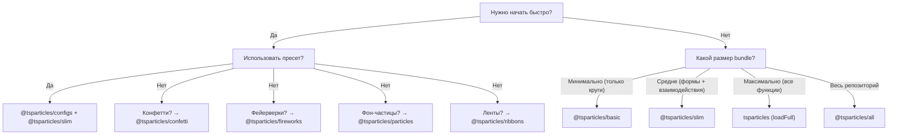

# Руководство по bundle

tsParticles модульна. Пакет `@tsparticles/engine` содержит только ядро; чтобы получить видимые эффекты, необходимо зарегистрировать **формы** (что рисовать), **обновления** (как анимировать), **взаимодействия** (как реагировать на мышь/тач) и **плагины** (дополнительные функции). Всё это делается через **bundle**.

## Категории bundle

| Категория          | Bundle                                                                                              | API                                          |
| ------------------ | --------------------------------------------------------------------------------------------------- | -------------------------------------------- |
| Движок + загрузчик | `@tsparticles/basic`, `@tsparticles/slim`, `tsparticles`, `@tsparticles/all`                        | `tsParticles.load({ id, options })`          |
| Выделенное API     | `@tsparticles/confetti`, `@tsparticles/fireworks`, `@tsparticles/particles`, `@tsparticles/ribbons` | `confetti({...})`, `fireworks({...})` и т.д. |

## Полное сравнение возможностей

Легенда: ● = включено, ○ = не включено

| Возможность                                                                                         | basic | slim | full (`tsparticles`) | all                |
| --------------------------------------------------------------------------------------------------- | ----- | ---- | -------------------- | ------------------ |
| **Формы**                                                                                           |       |      |                      |                    |
| Круг                                                                                                | ●     | ●    | ●                    | ●                  |
| Квадрат                                                                                             | ○     | ●    | ●                    | ●                  |
| Звезда                                                                                              | ○     | ●    | ●                    | ●                  |
| Полигон                                                                                             | ○     | ●    | ●                    | ●                  |
| Линия                                                                                               | ○     | ●    | ●                    | ●                  |
| Изображение                                                                                         | ○     | ●    | ●                    | ●                  |
| Эмодзи                                                                                              | ○     | ●    | ●                    | ●                  |
| Текст                                                                                               | ○     | ○    | ●                    | ●                  |
| Карты (масти)                                                                                       | ○     | ○    | ○                    | ●                  |
| Сердце                                                                                              | ○     | ○    | ○                    | ●                  |
| Стрелка                                                                                             | ○     | ○    | ○                    | ●                  |
| Скруглённый прямоугольник                                                                           | ○     | ○    | ○                    | ●                  |
| Скруглённый полигон                                                                                 | ○     | ○    | ○                    | ●                  |
| Спираль                                                                                             | ○     | ○    | ○                    | ●                  |
| Squircle                                                                                            | ○     | ○    | ○                    | ●                  |
| Cog                                                                                                 | ○     | ○    | ○                    | ●                  |
| Бесконечность                                                                                       | ○     | ○    | ○                    | ●                  |
| Матрица                                                                                             | ○     | ○    | ○                    | ●                  |
| Путь                                                                                                | ○     | ○    | ○                    | ●                  |
| Лента                                                                                               | ○     | ○    | ○                    | ●                  |
| **Внешние взаимодействия (мышь/тач)**                                                               |       |      |                      |                    |
| Attract                                                                                             | ○     | ●    | ●                    | ●                  |
| Bounce                                                                                              | ○     | ●    | ●                    | ●                  |
| Bubble                                                                                              | ○     | ●    | ●                    | ●                  |
| Connect                                                                                             | ○     | ●    | ●                    | ●                  |
| Destroy                                                                                             | ○     | ●    | ●                    | ●                  |
| Grab                                                                                                | ○     | ●    | ●                    | ●                  |
| Parallax                                                                                            | ○     | ●    | ●                    | ●                  |
| Pause                                                                                               | ○     | ●    | ●                    | ●                  |
| Push                                                                                                | ○     | ●    | ●                    | ●                  |
| Remove                                                                                              | ○     | ●    | ●                    | ●                  |
| Repulse                                                                                             | ○     | ●    | ●                    | ●                  |
| Slow                                                                                                | ○     | ●    | ●                    | ●                  |
| Drag                                                                                                | ○     | ○    | ●                    | ●                  |
| Trail                                                                                               | ○     | ○    | ●                    | ●                  |
| Cannon                                                                                              | ○     | ○    | ○                    | ●                  |
| Particle                                                                                            | ○     | ○    | ○                    | ●                  |
| Pop                                                                                                 | ○     | ○    | ○                    | ●                  |
| Light                                                                                               | ○     | ○    | ○                    | ●                  |
| **Взаимодействия частиц**                                                                           |       |      |                      |                    |
| Связи (links)                                                                                       | ○     | ●    | ●                    | ●                  |
| Коллизии                                                                                            | ○     | ●    | ●                    | ●                  |
| Attract                                                                                             | ○     | ●    | ●                    | ●                  |
| Repulse                                                                                             | ○     | ○    | ○                    | ●                  |
| **Обновления (анимации)**                                                                           |       |      |                      |                    |
| Прозрачность                                                                                        | ●     | ●    | ●                    | ●                  |
| Размер                                                                                              | ●     | ●    | ●                    | ●                  |
| Out modes                                                                                           | ●     | ●    | ●                    | ●                  |
| Paint (цвет)                                                                                        | ●     | ●    | ●                    | ●                  |
| Вращение                                                                                            | ○     | ●    | ●                    | ●                  |
| Жизнь                                                                                               | ○     | ●    | ●                    | ●                  |
| Destroy                                                                                             | ○     | ○    | ●                    | ●                  |
| Roll                                                                                                | ○     | ○    | ●                    | ●                  |
| Tilt                                                                                                | ○     | ○    | ●                    | ●                  |
| Twinkle                                                                                             | ○     | ○    | ●                    | ●                  |
| Wobble                                                                                              | ○     | ○    | ●                    | ●                  |
| Градиент                                                                                            | ○     | ○    | ○                    | ●                  |
| Orbit                                                                                               | ○     | ○    | ○                    | ●                  |
| **Плагины**                                                                                         |       |      |                      |                    |
| Move                                                                                                | ●     | ●    | ●                    | ●                  |
| Blend                                                                                               | ●     | ●    | ●                    | ●                  |
| Эмиттеры                                                                                            | ○     | ○    | ●                    | ●                  |
| Абсорберы                                                                                           | ○     | ○    | ●                    | ●                  |
| Звуки                                                                                               | ○     | ○    | ○                    | ●                  |
| Motion (предпочтения пользователя)                                                                  | ○     | ○    | ○                    | ●                  |
| Темы                                                                                                | ○     | ○    | ○                    | ●                  |
| Полигональная маска                                                                                 | ○     | ○    | ○                    | ●                  |
| Canvas-маска                                                                                        | ○     | ○    | ○                    | ●                  |
| Маска фона                                                                                          | ○     | ○    | ○                    | ●                  |
| Экспорт (изображение, json, видео)                                                                  | ○     | ○    | ○                    | ●                  |
| Ручные частицы                                                                                      | ○     | ○    | ○                    | ●                  |
| Responsive                                                                                          | ○     | ○    | ○                    | ●                  |
| Trail                                                                                               | ○     | ○    | ○                    | ●                  |
| Zoom                                                                                                | ○     | ○    | ○                    | ●                  |
| Poisson disc                                                                                        | ○     | ○    | ○                    | ●                  |
| **Пути**                                                                                            |       |      |                      |                    |
| Любой путь                                                                                          | ○     | ○    | ○                    | ● (14 генераторов) |
| **Эффекты**                                                                                         |       |      |                      |                    |
| Bubble, Filter, Shadow и т.д.                                                                       | ○     | ○    | ○                    | ● (5 эффектов)     |
| **Easing**                                                                                          |       |      |                      |                    |
| Quad                                                                                                | ○     | ●    | ●                    | ●                  |
| Back, Bounce, Circ, Cubic, Elastic, Expo, Gaussian, Linear, Quart, Quint, Sigmoid, Sine, Smoothstep | ○     | ○    | ○                    | ●                  |
| **Цветовые плагины**                                                                                |       |      |                      |                    |
| HEX, HSL, RGB                                                                                       | ●     | ●    | ●                    | ●                  |
| HSV, HWB, LAB, LCH, Named, OKLAB, OKLCH                                                             | ○     | ○    | ○                    | ●                  |

### Bundle с выделенным API

| Возможность         | confetti                                                           | fireworks              | particles         | ribbons          |
| ------------------- | ------------------------------------------------------------------ | ---------------------- | ----------------- | ---------------- |
| Формы               | круг, сердце, карты, эмодзи, изображение, полигон, квадрат, звезда | линия                  | (из basic)        | лента            |
| Взаимодействия      | —                                                                  | —                      | связи + коллизии  | —                |
| Специальные плагины | эмиттеры, motion                                                   | эмиттеры, звуки, blend | —                 | эмиттеры, motion |
| Вызов API           | `confetti(opts)`                                                   | `fireworks(opts)`      | `particles(opts)` | `ribbons(opts)`  |

## Руководство по выбору



**Правила выбора:**

1. Большинство проектов начинают с `@tsparticles/slim`.
2. Если размер bundle критичен и нужны только круги: `@tsparticles/basic`.
3. Если нужны эмиттеры, абсорберы, текст, wobble/tilt/roll: `tsparticles` с `loadFull`.
4. Для быстрого прототипирования со всеми функциями: `@tsparticles/all`.
5. Для целевых эффектов (конфетти, фейерверки, фон-частицы, ленты) с минимальной настройкой: bundle с выделенным API.

## Быстрая установка

| Bundle                   | Команда npm                                       | Функция загрузки         | CDN URL                                                        |
| ------------------------ | ------------------------------------------------- | ------------------------ | -------------------------------------------------------------- |
| `@tsparticles/basic`     | `pnpm add @tsparticles/engine @tsparticles/basic` | `loadBasic(tsParticles)` | `@tsparticles/basic@4/tsparticles.basic.bundle.min.js`         |
| `@tsparticles/slim`      | `pnpm add @tsparticles/engine @tsparticles/slim`  | `loadSlim(tsParticles)`  | `@tsparticles/slim@4/tsparticles.slim.bundle.min.js`           |
| `tsparticles` (full)     | `pnpm add @tsparticles/engine tsparticles`        | `loadFull(tsParticles)`  | `tsparticles@4/tsparticles.bundle.min.js`                      |
| `@tsparticles/all`       | `pnpm add @tsparticles/engine @tsparticles/all`   | `loadAll(tsParticles)`   | `@tsparticles/all@4/tsparticles.all.bundle.min.js`             |
| `@tsparticles/confetti`  | `pnpm add @tsparticles/confetti`                  | `confetti(opts)`         | `@tsparticles/confetti@4/tsparticles.confetti.bundle.min.js`   |
| `@tsparticles/fireworks` | `pnpm add @tsparticles/fireworks`                 | `fireworks(opts)`        | `@tsparticles/fireworks@4/tsparticles.fireworks.bundle.min.js` |
| `@tsparticles/particles` | `pnpm add @tsparticles/particles`                 | `particles(opts)`        | `@tsparticles/particles@4/tsparticles.particles.bundle.min.js` |
| `@tsparticles/ribbons`   | `pnpm add @tsparticles/ribbons`                   | `ribbons(opts)`          | `@tsparticles/ribbons@4/tsparticles.ribbons.bundle.min.js`     |

**Примечание:** для basic/slim/full/all bundle необходимо вызвать `load*` перед `tsParticles.load()`. CDN-файлы выставляют функцию загрузки глобально, но не вызывают её автоматически. Bundle confetti/fireworks/particles/ribbons имеют самодостаточное API — вызывайте `confetti()`, `fireworks()` и т.д. напрямую.

CDN-пример для `@tsparticles/slim`:

```html
<script src="https://cdn.jsdelivr.net/npm/@tsparticles/engine@4/tsparticles.engine.min.js"></script>
<script src="https://cdn.jsdelivr.net/npm/@tsparticles/slim@4/tsparticles.slim.bundle.min.js"></script>
<script>
  (async () => {
    await loadSlim(tsParticles);
    await tsParticles.load({ id: "tsparticles", options: { ... } });
  })();
</script>
```

CDN-пример для `@tsparticles/confetti`:

```html
<script src="https://cdn.jsdelivr.net/npm/@tsparticles/confetti@4/tsparticles.confetti.bundle.min.js"></script>
<script>
  confetti({ particleCount: 100 });
</script>
```

См. также [руководство по установке](/ru/guide/installation) для CDN, npm, yarn и подробностей о файлах.

## Связанные страницы

- [Начало работы](/ru/guide/getting-started)
- [Руководство по установке](/ru/guide/installation)
- [Каталог пресетов](/ru/demos/presets)
- [Каталог палитр](/ru/demos/palettes)
- [Каталог форм](/ru/demos/shapes)
