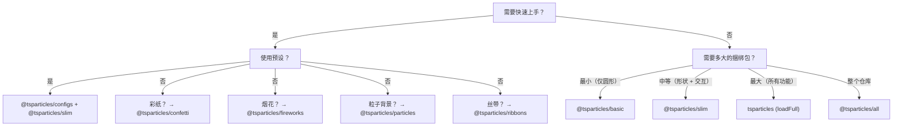

# 捆绑包指南

tsParticles 是模块化的。`@tsparticles/engine` 包只包含核心引擎；要获得可见效果，你必须注册**形状**（绘制什么）、**更新器**（如何动画）、**交互**（如何响应鼠标/触摸）和**插件**（额外功能）。这一切都通过**捆绑包**完成。

## 捆绑包分类

| 类别          | 捆绑包                                                                                              | API                                      |
| ------------- | --------------------------------------------------------------------------------------------------- | ---------------------------------------- |
| 引擎 + 加载器 | `@tsparticles/basic`、`@tsparticles/slim`、`tsparticles`、`@tsparticles/all`                        | `tsParticles.load({ id, options })`      |
| 专用 API      | `@tsparticles/confetti`、`@tsparticles/fireworks`、`@tsparticles/particles`、`@tsparticles/ribbons` | `confetti({...})`、`fireworks({...})` 等 |

## 完整功能对比

图例：● = 包含，○ = 不包含

| 功能                                                                                                | basic | slim | full (`tsparticles`) | all              |
| --------------------------------------------------------------------------------------------------- | ----- | ---- | -------------------- | ---------------- |
| **形状**                                                                                            |       |      |                      |                  |
| 圆形                                                                                                | ●     | ●    | ●                    | ●                |
| 方形                                                                                                | ○     | ●    | ●                    | ●                |
| 星形                                                                                                | ○     | ●    | ●                    | ●                |
| 多边形                                                                                              | ○     | ●    | ●                    | ●                |
| 线条                                                                                                | ○     | ●    | ●                    | ●                |
| 图片                                                                                                | ○     | ●    | ●                    | ●                |
| Emoji                                                                                               | ○     | ●    | ●                    | ●                |
| 文本                                                                                                | ○     | ○    | ●                    | ●                |
| 扑克花色                                                                                            | ○     | ○    | ○                    | ●                |
| 心形                                                                                                | ○     | ○    | ○                    | ●                |
| 箭头                                                                                                | ○     | ○    | ○                    | ●                |
| 圆角矩形                                                                                            | ○     | ○    | ○                    | ●                |
| 圆角多边形                                                                                          | ○     | ○    | ○                    | ●                |
| 螺旋                                                                                                | ○     | ○    | ○                    | ●                |
| 圆方角形                                                                                            | ○     | ○    | ○                    | ●                |
| 齿轮                                                                                                | ○     | ○    | ○                    | ●                |
| 无穷                                                                                                | ○     | ○    | ○                    | ●                |
| 矩阵                                                                                                | ○     | ○    | ○                    | ●                |
| 路径                                                                                                | ○     | ○    | ○                    | ●                |
| 丝带                                                                                                | ○     | ○    | ○                    | ●                |
| **外部交互（鼠标/触摸）**                                                                           |       |      |                      |                  |
| 吸引                                                                                                | ○     | ●    | ●                    | ●                |
| 弹跳                                                                                                | ○     | ●    | ●                    | ●                |
| 气泡                                                                                                | ○     | ●    | ●                    | ●                |
| 连接                                                                                                | ○     | ●    | ●                    | ●                |
| 销毁                                                                                                | ○     | ●    | ●                    | ●                |
| 抓取                                                                                                | ○     | ●    | ●                    | ●                |
| 视差                                                                                                | ○     | ●    | ●                    | ●                |
| 暂停                                                                                                | ○     | ●    | ●                    | ●                |
| 推动                                                                                                | ○     | ●    | ●                    | ●                |
| 移除                                                                                                | ○     | ●    | ●                    | ●                |
| 排斥                                                                                                | ○     | ●    | ●                    | ●                |
| 减速                                                                                                | ○     | ●    | ●                    | ●                |
| 拖拽                                                                                                | ○     | ○    | ●                    | ●                |
| 拖尾                                                                                                | ○     | ○    | ●                    | ●                |
| 加农炮                                                                                              | ○     | ○    | ○                    | ●                |
| 粒子                                                                                                | ○     | ○    | ○                    | ●                |
| 弹出                                                                                                | ○     | ○    | ○                    | ●                |
| 灯光                                                                                                | ○     | ○    | ○                    | ●                |
| **粒子交互**                                                                                        |       |      |                      |                  |
| 连线                                                                                                | ○     | ●    | ●                    | ●                |
| 碰撞                                                                                                | ○     | ●    | ●                    | ●                |
| 吸引                                                                                                | ○     | ●    | ●                    | ●                |
| 排斥                                                                                                | ○     | ○    | ○                    | ●                |
| **更新器（动画）**                                                                                  |       |      |                      |                  |
| 透明度                                                                                              | ●     | ●    | ●                    | ●                |
| 大小                                                                                                | ●     | ●    | ●                    | ●                |
| 离开模式                                                                                            | ●     | ●    | ●                    | ●                |
| 绘制（颜色）                                                                                        | ●     | ●    | ●                    | ●                |
| 旋转                                                                                                | ○     | ●    | ●                    | ●                |
| 生命周期                                                                                            | ○     | ●    | ●                    | ●                |
| 销毁                                                                                                | ○     | ○    | ●                    | ●                |
| 滚动                                                                                                | ○     | ○    | ●                    | ●                |
| 倾斜                                                                                                | ○     | ○    | ●                    | ●                |
| 闪烁                                                                                                | ○     | ○    | ●                    | ●                |
| 摆动                                                                                                | ○     | ○    | ●                    | ●                |
| 渐变                                                                                                | ○     | ○    | ○                    | ●                |
| 轨道                                                                                                | ○     | ○    | ○                    | ●                |
| **插件**                                                                                            |       |      |                      |                  |
| 移动                                                                                                | ●     | ●    | ●                    | ●                |
| 混合                                                                                                | ●     | ●    | ●                    | ●                |
| 发射器                                                                                              | ○     | ○    | ●                    | ●                |
| 吸收器                                                                                              | ○     | ○    | ●                    | ●                |
| 声音                                                                                                | ○     | ○    | ○                    | ●                |
| 动效（用户偏好）                                                                                    | ○     | ○    | ○                    | ●                |
| 主题                                                                                                | ○     | ○    | ○                    | ●                |
| 多边形遮罩                                                                                          | ○     | ○    | ○                    | ●                |
| 画布遮罩                                                                                            | ○     | ○    | ○                    | ●                |
| 背景遮罩                                                                                            | ○     | ○    | ○                    | ●                |
| 导出（图片、JSON、视频）                                                                            | ○     | ○    | ○                    | ●                |
| 手动粒子                                                                                            | ○     | ○    | ○                    | ●                |
| 响应式                                                                                              | ○     | ○    | ○                    | ●                |
| 拖尾                                                                                                | ○     | ○    | ○                    | ●                |
| 缩放                                                                                                | ○     | ○    | ○                    | ●                |
| Poisson disc                                                                                        | ○     | ○    | ○                    | ●                |
| **路径**                                                                                            |       |      |                      |                  |
| 任意路径                                                                                            | ○     | ○    | ○                    | ●（14 种生成器） |
| **效果**                                                                                            |       |      |                      |                  |
| 气泡、滤镜、阴影等                                                                                  | ○     | ○    | ○                    | ●（5 种效果）    |
| **缓动**                                                                                            |       |      |                      |                  |
| Quad                                                                                                | ○     | ●    | ●                    | ●                |
| Back、Bounce、Circ、Cubic、Elastic、Expo、Gaussian、Linear、Quart、Quint、Sigmoid、Sine、Smoothstep | ○     | ○    | ○                    | ●                |
| **颜色插件**                                                                                        |       |      |                      |                  |
| HEX、HSL、RGB                                                                                       | ●     | ●    | ●                    | ●                |
| HSV、HWB、LAB、LCH、Named、OKLAB、OKLCH                                                             | ○     | ○    | ○                    | ●                |

### 专用 API 捆绑包

| 功能     | confetti                                              | fireworks          | particles         | ribbons         |
| -------- | ----------------------------------------------------- | ------------------ | ----------------- | --------------- |
| 形状     | 圆形、心形、扑克花色、emoji、图片、多边形、方形、星形 | 线条               | （来自 basic）    | 丝带            |
| 交互     | —                                                     | —                  | 连线 + 碰撞       | —               |
| 特殊插件 | 发射器、动效                                          | 发射器、声音、混合 | —                 | 发射器、动效    |
| API 调用 | `confetti(opts)`                                      | `fireworks(opts)`  | `particles(opts)` | `ribbons(opts)` |

## 选择指南



**经验法则：**

1. 大多数项目从 `@tsparticles/slim` 开始。
2. 如果捆绑包大小至关重要且你只需要圆形：`@tsparticles/basic`。
3. 如果需要发射器、吸收器、文本、摆动/倾斜/滚动：`tsparticles` 配合 `loadFull`。
4. 需要所有功能快速原型设计：`@tsparticles/all`。
5. 针对特定效果（彩纸、烟花、粒子背景、丝带）且设置最简：专用 API 捆绑包。

## 快速安装

| 捆绑包                   | npm 命令                                          | 加载器函数               | CDN URL                                                        |
| ------------------------ | ------------------------------------------------- | ------------------------ | -------------------------------------------------------------- |
| `@tsparticles/basic`     | `pnpm add @tsparticles/engine @tsparticles/basic` | `loadBasic(tsParticles)` | `@tsparticles/basic@4/tsparticles.basic.bundle.min.js`         |
| `@tsparticles/slim`      | `pnpm add @tsparticles/engine @tsparticles/slim`  | `loadSlim(tsParticles)`  | `@tsparticles/slim@4/tsparticles.slim.bundle.min.js`           |
| `tsparticles`（full）    | `pnpm add @tsparticles/engine tsparticles`        | `loadFull(tsParticles)`  | `tsparticles@4/tsparticles.bundle.min.js`                      |
| `@tsparticles/all`       | `pnpm add @tsparticles/engine @tsparticles/all`   | `loadAll(tsParticles)`   | `@tsparticles/all@4/tsparticles.all.bundle.min.js`             |
| `@tsparticles/confetti`  | `pnpm add @tsparticles/confetti`                  | `confetti(opts)`         | `@tsparticles/confetti@4/tsparticles.confetti.bundle.min.js`   |
| `@tsparticles/fireworks` | `pnpm add @tsparticles/fireworks`                 | `fireworks(opts)`        | `@tsparticles/fireworks@4/tsparticles.fireworks.bundle.min.js` |
| `@tsparticles/particles` | `pnpm add @tsparticles/particles`                 | `particles(opts)`        | `@tsparticles/particles@4/tsparticles.particles.bundle.min.js` |
| `@tsparticles/ribbons`   | `pnpm add @tsparticles/ribbons`                   | `ribbons(opts)`          | `@tsparticles/ribbons@4/tsparticles.ribbons.bundle.min.js`     |

**注意：** 对于 basic/slim/full/all 捆绑包，你**必须**在 `tsParticles.load()` 之前调用 `load*` 函数。CDN 文件会全局暴露加载器函数，但**不会自动调用它**。confetti/fireworks/particles/ribbons 捆绑包拥有独立的 API——直接调用 `confetti()`、`fireworks()` 等即可。

`@tsparticles/slim` 的 CDN 示例：

```html
<script src="https://cdn.jsdelivr.net/npm/@tsparticles/engine@4/tsparticles.engine.min.js"></script>
<script src="https://cdn.jsdelivr.net/npm/@tsparticles/slim@4/tsparticles.slim.bundle.min.js"></script>
<script>
  (async () => {
    await loadSlim(tsParticles);
    await tsParticles.load({ id: "tsparticles", options: { ... } });
  })();
</script>
```

`@tsparticles/confetti` 的 CDN 示例：

```html
<script src="https://cdn.jsdelivr.net/npm/@tsparticles/confetti@4/tsparticles.confetti.bundle.min.js"></script>
<script>
  confetti({ particleCount: 100 });
</script>
```

另请参阅[安装指南](/zh/guide/installation)了解 CDN、npm、yarn 和文件详情。

## 相关页面

- [开始使用](/zh/guide/getting-started)
- [安装指南](/zh/guide/installation)
- [预设目录](/zh/demos/presets)
- [调色板目录](/zh/demos/palettes)
- [形状目录](/zh/demos/shapes)
